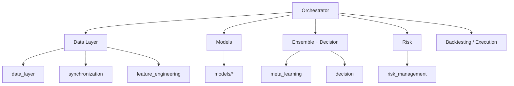

# 3.10 Реализация архитектуры программного обеспечения

Интеллектуальная торговая система (ИТС) реализована как **модульный монолит** на языке Python 3.11: логически выделенные пакеты с явными контрактами данных, единый оркестратор сквозного пайплайна и иерархическая система конфигурации YAML. Ниже приведены структура репозитория, назначение модулей, схема взаимодействия, применяемые проектные паттерны и организация конфигураций.

## 3.10.1. Структура репозитория

Проект размещён в корневом каталоге `IST/`. Исходный код сгруппирован по слоям обработки данных и принятия решений; артефакты обучения, сырые parquet-файлы и журналы бэктестов вынесены в отдельные каталоги.

**Рисунок 3.32 — Дерево проекта ИТС (фрагмент, уровни 1–3)**

Полное дерево каталогов (без `data/`, `artifacts/`, кэшей) подготовлено в файле `docs/figures/3_10/project_tree.txt` и воспроизводится ниже в сокращённом виде. При оформлении дипломной работы рекомендуется вставить **скриншот проводника IDE** (VS Code / Cursor) с корнем `IST` или распечатку полного `project_tree.txt`.

```
IST/
|-- backtesting/           # тестирование на истории, метрики, WFO
|-- config/                # профили YAML, per-symbol overrides
|-- data_layer/            # загрузка OHLCV (OKX, ccxt)
|-- decision/              # BUY / SELL / HOLD, DecisionPipeline
|-- feature_engineering/   # индикаторы, FeatureEngine
|-- meta_learning/         # dynamic weighting, ensemble
|-- models/                # LGB, XGB, GRU, CNN, regime
|-- orchestration/         # TrainingOrchestrator, CLI, glue
|-- risk_management/       # ATR stop, position sizing
|-- synchronization/       # MTF merge
|-- execution/             # paper trading (расширение)
|-- gui/                   # графический интерфейс
|-- rl_layer/              # RL risk overlay (опционально)
|-- tests/                 # unit / integration tests
|-- scripts/               # ablation, отчёты, генерация рисунков
|-- docs/                  # документация ВКР, figures, journal
|-- config.yaml            # корневой конфиг приложения
|-- requirements.txt
+-- ist.py                 # эталонный research-скрипт (Colab lineage)
```

Каталоги `data/ohlcv/`, `data/features/`, `artifacts/` содержат данные и сериализованные модели; в дереве исходников они опущены для компактности.

## 3.10.2. Таблица модулей

**Таблица 3.29 — Модули ИТС и их назначение**

| Module | Purpose |
|--------|---------|
| `data_layer` | Загрузка исторических OHLCV с биржи OKX (REST, ccxt), валидация, сохранение Parquet |
| `synchronization` | Синхронизация мультитаймфреймовых рядов (15m, 4h → 1h), MTF-признаки |
| `feature_engineering` | Расчёт технических индикаторов и матрицы признаков для ML/DL |
| `models` | Реализации предикторов: LightGBM, XGBoost, GRU, CNN, детектор режима |
| `meta_learning` | Режимно-адаптивное взвешивание (`DynamicMetaWeighting`), сбор сигналов |
| `decision` | Пороговая логика BUY / SELL / HOLD (`DecisionPipeline`) |
| `risk_management` | ATR trailing stop, position sizing, `RiskPipeline` |
| `orchestration` | Сквозной оркестратор обучения и инференса, фабрика моделей, CLI |
| `backtesting` | Walk-forward, симуляция сделок, критерии приёмки, журнал прогонов |
| `execution` | Контур бумажной / live-торговли (интеграция с OKX) |
| `gui` | Визуализация сигналов, режимов, бэктестов |
| `rl_layer` | Динамический множитель риска (DQN), опциональный overlay |
| `utils` | Предотвращение утечки данных, логирование, вспомогательные функции |
| `config` | Профили эксперимента (`canonical_4model`), overrides по символам |
| `tests` | Автоматизированная проверка модулей и пайплайна |

## 3.10.3. UML-подобная схема архитектуры

Центральным координирующим компонентом выступает **Orchestrator** (`TrainingOrchestrator`, `InferenceOrchestrator`). Он не дублирует бизнес-логику слоёв, а задаёт порядок вызовов и единый контракт данных.

**Рисунок 3.33 — Логическая архитектура (UML-подобная схема)**

```
Orchestrator
├── Data
│     data_layer          → OHLCV
│     synchronization     → MTF features
│     feature_engineering → X_t
│
├── Models
│     models.lgb / xgb / gru / cnn
│     models.regime       → r_t
│
├── Ensemble
│     meta_learning.DynamicMetaWeighting  → P̂_t
│     decision.DecisionPipeline           → s_t
│
├── Risk
│     risk_management.RiskPipeline        → Q_t, stop
│
└── Backtesting / Execution
      backtesting.Backtester
      execution (paper loop)
```



**Контракт пайплайна** (зафиксирован в `orchestration/README.md`):

```text
features[t] → regime[t] → {p_lgb, p_gru, p_xgb, p_cnn}[t]
            → meta_mgmt[t] → direction_soft[t] → decision → risk → backtest
```

## 3.10.4. Проектные паттерны

В реализации ИТС используются типовые паттерны проектирования, обеспечивающие расширяемость и тестируемость.

**Таблица 3.30 — Паттерны проектирования в ИТС**

| Pattern | Usage |
|---------|--------|
| **Pipeline** | Последовательная обработка: data → features → models → ensemble → decision → risk (`RiskPipeline`, `DecisionPipeline`, WFO) |
| **Factory** | Создание моделей по ключам конфигурации: `build_orchestration_models()` (`orchestration/model_factory.py`) |
| **Strategy** | Переключаемые режимы ансамбля: `regime_adaptive`, `fixed_trend`, `fixed_range` (`ensemble_mode`) |
| **Adapter** | Приведение risk API к оркестратору: `OrchestratorRiskBridge` |
| **Facade** | Единая точка входа CLI: `python -m orchestration` (`__main__.py`) |
| **Configuration** | Иерархия YAML + dataclass `OrchestratorConfig`, валидация `validate-config` |
| **Template Method** | Общий каркас WFO в `TrainingOrchestrator.walk_forward_optimization` |
| **Dependency Injection** | Передача `regime_detector`, `decision_pipeline`, `risk_manager` в конструктор оркестратора |

Паттерн **Repository** реализуется неявно через слой хранения Parquet (`data_layer.storage`, каталоги `data/`).

## 3.10.5. Система конфигурации

Конфигурация ИТС **декларативна**: параметры эксперимента задаются в YAML и загружаются без перекомпиляции кода.

| Уровень | Файл | Назначение |
|---------|------|------------|
| Корень | `config.yaml` | Приложение, data_layer, orchestration, backtesting |
| Профиль | `config/profiles/canonical_4model.yaml` | Канонический 4-model pipeline для ВКР |
| Символ | `config/symbols/BTC-USDT_1h.yaml` | Overrides после тюнинга по BTC 1h |
| Архив | `config/archive/discussion/` | Экспериментальные профили (не default) |

Загрузка:

```python
from orchestration.orchestrator_config import OrchestratorConfig
cfg = OrchestratorConfig.from_yaml("config/profiles/canonical_4model.yaml")
```

Секреты API (`OKX_API_KEY`, `OKX_SECRET_KEY`) подставляются через переменные окружения `${OKX_API_KEY}`.

**Рисунок 3.34 — Фрагмент системы конфигурации (YAML)**

При оформлении диплома рекомендуется скриншот редактора с открытыми файлами `config.yaml` и `config/profiles/canonical_4model.yaml`. Ниже — репрезентативный фрагмент:

```yaml
orchestration:
  model_keys: [lgb, gru, xgb, cnn]
  ensemble_mode: regime_adaptive
  direction_threshold: 0.52
  feature_window_size: 24
  prediction_horizon: 12
  trend_weights:
    lgb: 0.10
    gru: 0.45
    xgb: 0.10
    cnn: 0.35
  range_weights:
    lgb: 0.55
    gru: 0.10
    xgb: 0.25
    cnn: 0.10

backtesting:
  walk_forward:
    train_window: 252
    test_window: 63
  simulation:
    commission: 0.0006
    slippage: 0.0002
```

Полный сниппет: `docs/figures/3_10/config_system_snippet.txt`.

## 3.10.6. Технологический стек

| Компонент | Технология |
|-----------|------------|
| Язык | Python 3.11 |
| Табличные ML | LightGBM, XGBoost, scikit-learn |
| Deep Learning | TensorFlow / Keras (GRU, CNN) |
| Данные | pandas, NumPy, Parquet (pyarrow) |
| Конфигурация | YAML, Pydantic (dataclasses) |
| Тестирование | pytest |
| Визуализация | matplotlib |

## 3.10.7. Выводы по разделу

Архитектура ИТС построена как слоистый модульный монолит с явным оркестратором и декларативной конфигурацией. Дерево проекта отражает разделение ответственности (data, models, ensemble, risk, backtesting); UML-подобная схема фиксирует поток данных от котировок до сделки. Применение паттернов Pipeline, Factory и Strategy обеспечивает расширяемость (добавление моделей, режимов ансамбля) без нарушения сквозного контракта пайплайна, описанного в разделах 3.1–3.9.
