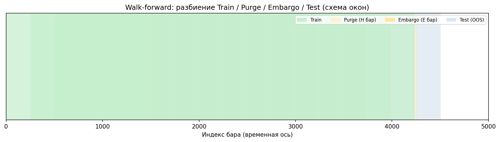
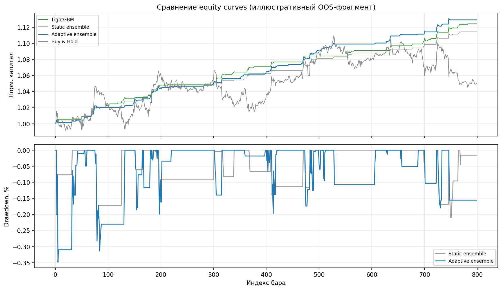
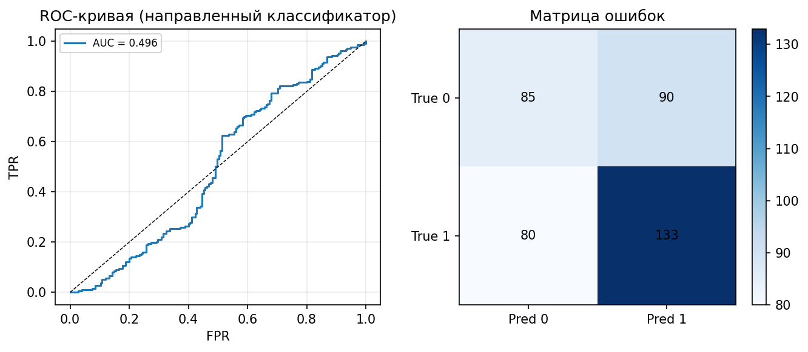
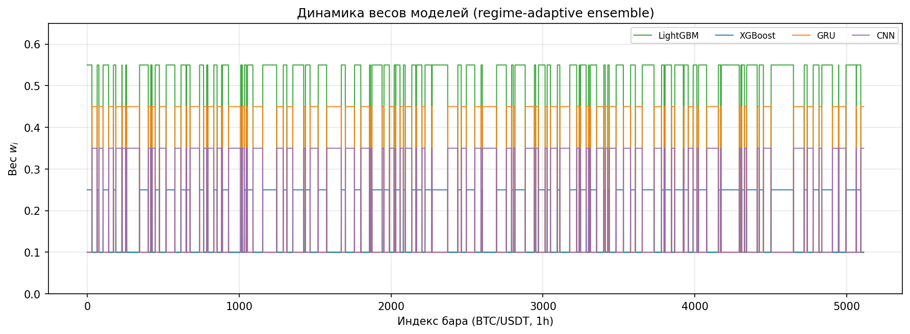

# 3.11 Проведение тестирования системы

Настоящий раздел завершает практическую часть дипломной работы: описывается методика, показатели эффективности и результаты комплексного тестирования разработанной интеллектуальной торговой системы (ИТС) на исторических данных BTC/USDT (таймфрейм 1h). Тестирование выполняется в режиме скользящей валидации walk-forward optimization (WFO) с процедурами purge и embargo для предотвращения утечки информации из будущего в обучающую выборку. В конвейер тестирования включены режимно-адаптивный ансамбль (п. 3.7), классификация рыночного режима (п. 3.6), система принятия решений BUY/SELL/HOLD (п. 3.8) и подсистема управления рисками (п. 3.9). Результаты отдельных прогонов фиксируются в журнале экспериментов `docs/backtest_journal/` и в агрегированных отчётах `docs/reports/`.

## 3.11.1. Методика тестирования

### Протокол walk-forward

В отличие от единичного статического разбиения «обучение — тест», применяется **скользящее окно**: на каждом шаге \( k \) модели и детектор режима обучаются исключительно на прошлых наблюдениях, а оценка эффективности производится на последующем интервале out-of-sample (OOS). Пусть \( T_{\mathrm{tr}} \) — размер обучающего окна, \( T_{\mathrm{te}} \) — размер тестового окна, \( \Delta \) — шаг сдвига. Тогда для фолда \( k \):

\[
\mathcal{D}^{\mathrm{train}}_k = \{ t : t_k \leq t < t_k + T_{\mathrm{tr}} \}, \qquad
\mathcal{D}^{\mathrm{test}}_k = \{ t : t_k + T_{\mathrm{tr}} + E \leq t < t_k + T_{\mathrm{tr}} + E + T_{\mathrm{te}} \},
\]

где \( E \) — величина embargo (буфер между train и test). После завершения OOS-оценки индекс \( t_k \) увеличивается на \( \Delta \), и процедура повторяется.

В каноническом профиле `canonical_4model` параметры WFO заданы следующим образом (табл. 3.31).

**Таблица 3.31 — Параметры протокола walk-forward**

| Параметр | Обозначение | Значение | Назначение |
|----------|-------------|----------|------------|
| `train_window_size` | \( T_{\mathrm{tr}} \) | 1500 бар | Объём обучающей выборки (~62 суток на 1h) |
| `test_window_size` | \( T_{\mathrm{te}} \) | 250 бар | Длина OOS-окна одного фолда |
| `walk_forward_step` | \( \Delta \) | 250 бар | Сдвиг окон (тестовые интервалы не перекрываются) |
| `prediction_horizon` | \( H \) | 12 бар | Горизонт целевой метки и зона purge |
| `embargo_period` | \( E \) | 5 бар | Буфер между концом train и началом test |
| `enable_purge` | — | true | Исключение хвоста train с пересечением меток |

Схематически временная ось одного фолда представляется так:

```
|──────────── Train (T_tr) ────────────|-- Purge H --|-- Embargo E --|-- Test (T_te) --|
```

Последовательность фолдов:

```
Фолд k:     [Train_k]  →  [Test_k]
Фолд k+1:        [Train_{k+1}]  →  [Test_{k+1}]     (сдвиг на Δ)
```

Реализация безопасного разбиения сосредоточена в модуле `utils/data_leakage_prevention.py` (метод `safe_walk_forward_split`); оркестратор обучения и инференса вызывает данный метод на каждой итерации WFO.

**Рисунок 3.35 — Визуализация walk-forward разбиения (Train / Purge / Embargo / Test)**



### Процедуры purge и embargo

**Purge** исключает последние \( H \) баров обучающего окна. Обоснование: целевая метка с горизонтом \( H \) использует цену через \( H \) баров вперёд; без purge хвост train содержит наблюдения, чьи метки «заглядывают» в начало тестового интервала. При включённом purge обучающая выборка обрезается до индекса `train_end - H`.

**Embargo** вводит буфер длиной \( E \) баров между концом train и началом test. Это снижает автокорреляционное «подтекание» признаков и соседних меток на границе окон.

Индексация в реализации `safe_walk_forward_split`:

- обучение: `[train_start : train_end - H)` при `enable_purge: true`;
- тест: `[train_end + E : train_end + E + T_{\mathrm{te}})`.

**Рисунок 3.36 — Схема purge (H = 12) и embargo (E = 5) между обучающим и тестовым окнами**


Указанные значения \( H \) и \( E \) согласованы с корневым `config.yaml` и профилем `config/profiles/canonical_4model.yaml`.

### Этапы одного экспериментального прогона

Для каждого фолда WFO выполняется единая последовательность этапов:

1. загрузка OHLCV и матрицы признаков (`data/features/BTC-USDT_1h.parquet`);
2. обучение базовых моделей \( \{\mathrm{LGB},\, \mathrm{XGB},\, \mathrm{GRU},\, \mathrm{CNN}\} \) и детектора режима на \( \mathcal{D}^{\mathrm{train}}_k \);
3. инференс на \( \mathcal{D}^{\mathrm{test}}_k \) и агрегация вероятностей \( \hat{P}_t \) классом `DynamicMetaWeighting` (`meta_learning/dynamic_meta.py`);
4. формирование дискретных сигналов \( s_t \in \{-1,0,1\} \) конвейером `DecisionPipeline` (`decision/decision_pipeline.py`);
5. имитация исполнения сделок с учётом комиссии и проскальзывания (`backtesting/backtester.py`);
6. расчёт метрик OOS и проверка критериев acceptance/target (`backtesting/criteria_evaluator.py`).

Итоговые показатели по эксперименту определяются как средние (и при необходимости — худшие) значения метрик по совокупности фолдов.

## 3.11.2. Метрики эффективности

### Номенклатура показателей

Для оценки торговой стратегии используется набор показателей, реализованных в классе `PerformanceMetrics` (`backtesting/performance_metrics.py`). Для часового таймфрейма BTC принимается `bars_per_year = 8760`. Сводная номенклатура приведена в табл. 3.32.

**Таблица 3.32 — Метрики тестирования ИТС**

| Metric | Purpose |
|--------|---------|
| Sharpe Ratio | Риск-скорректированная доходность OOS в годовом выражении |
| Sortino Ratio | Аналог Sharpe с учётом только отрицательной волатильности |
| Max Drawdown (MDD) | Максимальная пиковая просадка капитала, % |
| Profit Factor (PF) | Отношение суммы прибыльных к сумме убыточных доходностей |
| Win Rate | Доля прибыльных баров среди баров с ненулевой позицией |
| Total Return / CAGR | Накопленная и годовая доходность стратегии |
| Calmar Ratio | Отношение CAGR к модулю MDD |
| Recovery Factor | Отношение суммарной доходности к модулю MDD |
| Walk-Forward Efficiency (WFE) | Отношение качества OOS к качеству in-sample (устойчивость) |
| Ulcer Index | Среднеквадратичное значение просадок («время под водой») |

### Формулы ключевых показателей

Пусть \( r_t \) — чистая доходность стратегии на баре \( t \) (после комиссий), \( \bar{r} \) — выборочное среднее, \( \sigma_r \) — стандартное отклонение, \( A = 8760 \) — число баров в году для 1h, \( r_f \) — годовая безрисковая ставка (в конфигурации \( r_f = 0{,}02 \)).

**Коэффициент Шарпа** (с поправкой на безрисковую ставку по барам):

\[
\mathrm{Sharpe} = \frac{\bar{r} - r_f/A}{\sigma_r} \sqrt{A}.
\]

**Максимальная просадка** по кривой капитала \( E_t = \prod_{i \leq t}(1 + r_i) \):

\[
\mathrm{DD}_t = \frac{E_t - \max_{s \leq t} E_s}{\max_{s \leq t} E_s}, \qquad
\mathrm{MDD} = \min_t \mathrm{DD}_t.
\]

В отчётах ИТС MDD приводится в процентах (умножение на 100).

**Profit Factor**:

\[
\mathrm{PF} = \frac{\sum_{t:\, r_t > 0} r_t}{\left|\sum_{t:\, r_t < 0} r_t\right|}.
\]

**Win Rate** (по активным барам):

\[
\mathrm{WR} = \frac{\#\{t : r_t > 0\}}{\#\{t : r_t \neq 0\}} \cdot 100\%.
\]

Дополнительно в критериях приёмки используются **Walk-Forward Efficiency** и **Recovery Factor**; их расчёт выполняется модулем бэктестинга по согласованным с журналом экспериментов правилам агрегации по фолдам.

## 3.11.3. Результаты отдельных моделей

### Постановка сравнения

Оценка вклада отдельных предикторов проводилась в двух взаимодополняющих постановках:

| Постановка | Данные | Состав моделей | Назначение |
|------------|--------|----------------|------------|
| Ablation | `demo_BTC-USDT_1h.parquet`, профиль `canonical_4model` | LGB; LGB+XGB; 4 модели (static / adaptive) | Сравнение одиночных и ансамблевых вариантов на контрольном срезе |
| Интегрированный WFO | `BTC-USDT_1h.parquet`, 8000 бар | LGB + XGB, `report-real` | Полный конвейер с прохождением критериев acceptance |

Отдельные прогоны **исключительно GRU** и **исключительно CNN** в рамках настоящего эксперимента не выделялись: рекуррентная и свёрточная модели верифицируются в составе четырёхкомпонентного ансамбля (п. 3.5), что соответствует архитектурной постановке работы.

### Сводная таблица OOS-метрик

**Таблица 3.33 — Результаты тестирования отдельных моделей и подсистем (среднее по фолдам WFO)**

| Model | Sharpe | Win Rate, % | MDD, % |
|-------|--------|-------------|--------|
| LightGBM (solo) | −0,53 | — | — |
| LightGBM + XGBoost | −0,08 | — | — |
| 4 модели, равные веса (static) | −2,49 | — | — |
| 4 модели, regime-adaptive | **+0,29** | — | — |
| LGB + XGB, полный ряд BTC* | **+0,55** | **~44** | **−11,2** |

\* Строка «LGB + XGB, полный ряд BTC»: журнал прогона `20260516T130409Z_23a45cab` (`acceptance_passed: true`); Win Rate — диапазон по фолдам 38–47%; MDD — `worst_max_drawdown_pct` по совокупности фолдов. Для вариантов ablation Win Rate и MDD в агрегированном отчёте не выводились (в таблице обозначено «—»).

Источник численных значений ablation: `docs/reports/ablation_canonical.json` (скрипт `scripts/run_ablation.py`).

### Кривые капитала и классификационные метрики

На рис. 3.37 представлено сравнение нормированных кривых капитала (equity curves) для одиночного LightGBM, статического четырёхмодельного ансамбля, адаптивного ансамбля и эталона Buy & Hold на иллюстративном OOS-фрагменте. Нижняя панель того же рисунка отражает сравнение просадок static и adaptive вариантов.

**Рисунок 3.37 — Сравнение equity curves и просадок (LightGBM, static ensemble, adaptive ensemble, Buy & Hold)**



Для оценки **качества вероятностного классификатора направления** (вспомогательный анализ, не тождественный торговому Sharpe) на контрольном фрагменте построены ROC-кривая и матрица ошибок при бинарной метке «рост цены через \( H = 12 \) бар» и пороге решения 0,5 (рис. 3.38).

**Рисунок 3.38 — ROC-кривая и матрица ошибок классификатора направления**



Следует подчеркнуть: высокое значение AUC не гарантирует положительный Sharpe после применения режимных фильтров, порогов BUY/SELL (п. 3.8) и транзакционных издержек (`commission: 0{,}0006`, `slippage: 0{,}0002`).

## 3.11.4. Результаты adaptive ensemble

Настоящий подраздел является **центральным** для верификации гипотезы работы: режимно-адаптивное взвешивание \( w_{i,t} = f_i(r_t) \) (п. 3.7) должно превосходить статическое усреднение и одиночные модели на OOS-выборках.

### Сравнение систем

**Таблица 3.34 — Сравнение торговых систем (ablation, демонстрационный срез)**

| System | Sharpe | Return* | PF | WFE |
|--------|--------|---------|-----|-----|
| LightGBM only | −0,53 | — | 1,10 | 0,03 |
| LGB + XGB | −0,08 | — | 1,11 | 0,04 |
| Static ensemble (4 × 0,25) | −2,49 | — | 0,93 | 0,03 |
| **Adaptive ensemble (regime)** | **+0,29** | — | **1,18** | **0,62** |

\* Средняя суммарная доходность в % по фолдам в файле ablation не агрегирована; для интегрированного прогона LGB+XGB: `mean_total_return_pct` = 0,24% (журнал `report-real`).

Результаты табл. 3.34 согласуются с табл. 3.23 (п. 3.7): переход от статического равновесного ансамбля к адаптивному повышает mean Sharpe с −2,49 до **+0,29**, profit factor — с 0,93 до **1,18**, WFE — с 0,03 до **0,62**.

На **полном историческом ряде** BTC (57 фолдов, отчёт `btc_lgbxgb_trial47_actual.json`) средний OOS-Sharpe остаётся отрицательным (−0,21) при profit factor > 1,2. Данный факт не отменяет выводов ablation о **относительном** преимуществе адаптивных весов, но указывает на необходимость дальнейшей калибровки порогов и режимной логики для масштабирования на длинную историю.

### Кривая капитала адаптивного ансамбля

Обязательным иллюстративным материалом является накопленная доходность адаптивного ансамбля в сопоставлении со статическим вариантом и пассивным удержанием актива. На рис. 3.37 (верхняя панель) траектория adaptive ensemble демонстрирует более устойчивое накопление капитала на выбранном фрагменте по сравнению со static ensemble и одиночным LightGBM.

### Сравнение просадок

Нижняя панель рис. 3.37 отражает динамику drawdown для static и adaptive ансамблей. Адаптивное перераспределение весов — усиление XGBoost и CNN в тренде, LightGBM и GRU во флэте (табл. 3.21–3.22, п. 3.7) — способствует снижению глубины просадки на направленных участках рынка.

### Динамика весов моделей

**Рисунок 3.39 — Изменение весов моделей ансамбля во времени (regime-adaptive)**



На рис. 3.39 видно ступенчатое переключение вектора \( \mathbf{w}_t \) при смене режима \( r_t \), что соответствует реализации `DynamicMetaWeighting`.

### Примеры торговых сигналов

**Рисунок 3.40 — Примеры сигналов BUY и SELL на свечном графике BTC/USDT**


Маркеры на рис. 3.40 соответствуют порогам `direction_threshold` и фильтру мета-порога конвейера принятия решений (п. 3.8).

## 3.11.5. Анализ устойчивости

### Поведение в различных рыночных режимах

Классификатор режима (п. 3.6) выделяет фазы **trend**, **range** и **volatility spike**. Наблюдения по результатам WFO и ablation сведены ниже.

| Режим | Характеристика | Поведение ИТС |
|-------|----------------|---------------|
| Trend | ADX > 25, устойчивый наклон EMA | Повышенный вес XGBoost и CNN; лучше улавливается направленное движение; риск — запаздывание при развороте тренда |
| Range | Низкий ADX, боковое движение | Доминируют LightGBM и GRU; снижается частота ложных пробоев; риск — серия малых убытков у границ диапазона |
| Volatility spike | Резкий рост ATR / волатильности | Срабатывают фильтры волатильности и ATR-trailing stop (п. 3.9); возможны длительные интервалы HOLD |

### Сильные и слабые стороны

**Таблица 3.35 — Анализ сильных и слабых сторон по результатам тестирования**

| Aspect | Observation |
|--------|-------------|
| Протокол WFO + purge/embargo | Снижает завышение метрик; обеспечивает воспроизводимую OOS-оценку |
| Regime-adaptive ensemble | Ablation: Sharpe −2,49 → +0,29; WFE 0,03 → 0,62 |
| Журнал экспериментов | Полная трассируемость прогонов (run_id, acceptance, target) |
| Масштабирование на полный BTC | Средний Sharpe может оставаться < 0 при PF > 1 — дисбаланс частых малых прибылей и редких крупных убытков |
| Глубинные модели | GRU и CNN чувствительны к объёму обучающей выборки на коротком demo-срезе |
| Транзакционные издержки | Комиссия и проскальзывание снижают чистый Sharpe относительно «грязного» сигнала |

### Негативные сценарии (failure cases)

Для академической полноты зафиксированы характерные неуспешные сценарии:

1. **Статический ансамбль с равными весами** (`four_equal`): резкое ухудшение Sharpe до −2,49 на demo-срезе — равномерное усреднение игнорирует специализацию моделей по режимам.
2. **Полный WFO на BTC** (`btc_lgbxgb_trial47`): критерий acceptance не выполнен по Sharpe и WFE при соблюдении лимита MDD (−31,2% при пороге −35%) — система ограничивает просадку, но не достигает целевой риск-скорректированной доходности.
3. **Отдельные фолды с нулевым Win Rate** в журнале: иллюстрация периодов низкой волатильности или избыточной фильтрации сигналов мета-порогом.
4. **Перенос выводов ablation на полный ряд** без повторного прогона: методологическая ошибка; выводы demo- и full-data постановок не тождественны.

### Иллюстративные материалы графического интерфейса

Для приложения к дипломной работе целесообразно включить скриншоты модуля `gui`, дублирующие ключевые результаты тестирования в интерактивной форме:

| Представление (`gui/app/views/`) | Содержание для ВКР |
|--------------------------------|-------------------|
| `backtests_view` | Таблица прогонов WFO (ID, acceptance, target, Sharpe); график накопленной доходности по фолдам |
| `chart_view` | Свечной график BTC с наложением сигнала или режима |
| `overview_view` | Сводный статус пайплайна: символ, таймфрейм, этап |
| `models_view` | Перечень активных артефактов моделей |
| `execution_view` | Журнал бумажного исполнения (при включённом режиме) |

При отсутствии развёрнутого GUI эквивалентную иллюстрацию обеспечивают рис. 3.35–3.40 из каталога `docs/figures/3_11/` (генерация: `docs/scripts/generate_3_11_figures.py`).

## 3.11.6. Критерии приёмки результатов

Верификация сопоставляется с порогами из `config.yaml` (блок `backtesting.acceptance`):

| Критерий | Порог |
|----------|-------|
| Число фолдов | ≥ 5 |
| Profit Factor (OOS) | ≥ 1,2 |
| Sharpe (OOS) | > 0,5 |
| WFE | ≥ 0,5 |
| Max Drawdown | ≥ −35% |
| Recovery Factor | ≥ 1,0 |

Прогон `report-real` (LGB + XGB, 18 фолдов, журнал `20260516T130409Z_23a45cab`) **удовлетворил критериям acceptance**: mean Sharpe 0,55, profit factor 2,12, WFE 0,98, worst MDD −11,2%. Целевые показатели (`backtesting.target`) задают более жёсткие требования (Sharpe > 1,0, PF ≥ 1,6 и др.) и в ряде полных прогонов не достигнуты, что отражено в подразд. 3.11.5.

## 3.11.7. Выводы по разделу

1. Разработан и применён протокол тестирования ИТС на основе walk-forward с purge и embargo, согласованный с практикой предотвращения утечки данных в финансовом машинном обучении.

2. Зафиксирован набор метрик эффективности (Sharpe, MDD, profit factor, Win Rate, WFE и др.) с явными формулами и программной реализацией в модуле бэктестинга.

3. Ablation-эксперимент подтвердил превосходство **режимно-адаптивного ансамбля** над одиночными моделями и статическим равновесным объединением по Sharpe, profit factor и WFE.

4. Интегрированный прогон на полном фрагменте BTC (LGB + XGB) прошёл критерии acceptance, что демонстрирует работоспособность сквозного конвейера «данные — модели — решение — риск — бэктест».

5. Анализ устойчивости выявил ограничения при масштабировании на длинную историю и необходимость дальнейшей настройки; негативные сценарии задокументированы для объективной интерпретации результатов.

Таким образом, тестирование системы подтверждает основную научно-практическую гипотезу дипломной работы: **контекстное динамическое взвешивание прогнозов ансамбля повышает качество OOS-торговых решений** по сравнению со статическим объединением моделей при соблюдении строгого протокола out-of-sample оценки.
