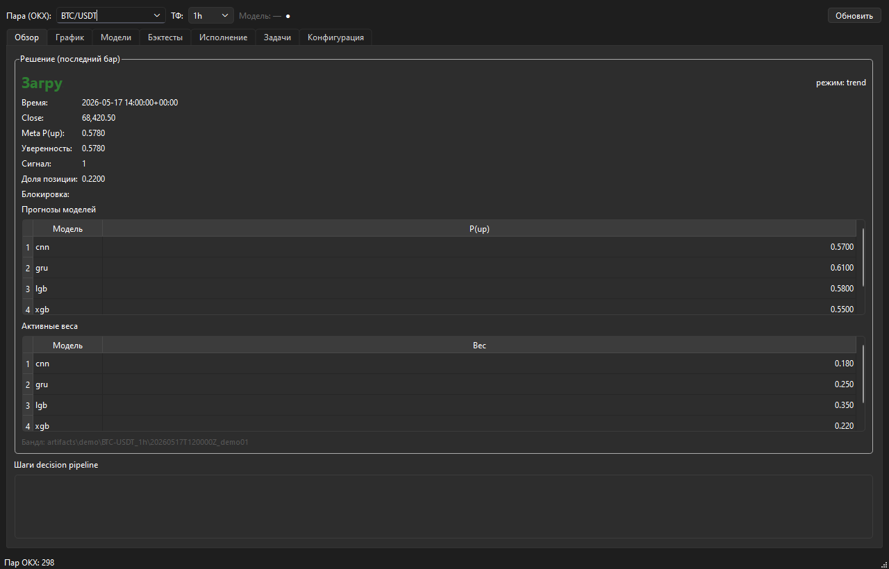
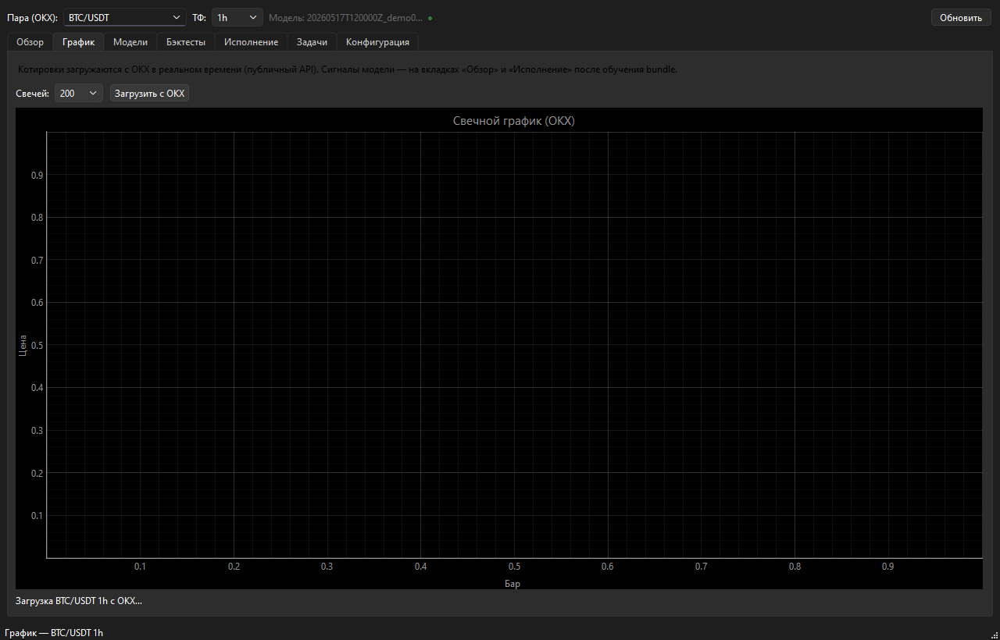
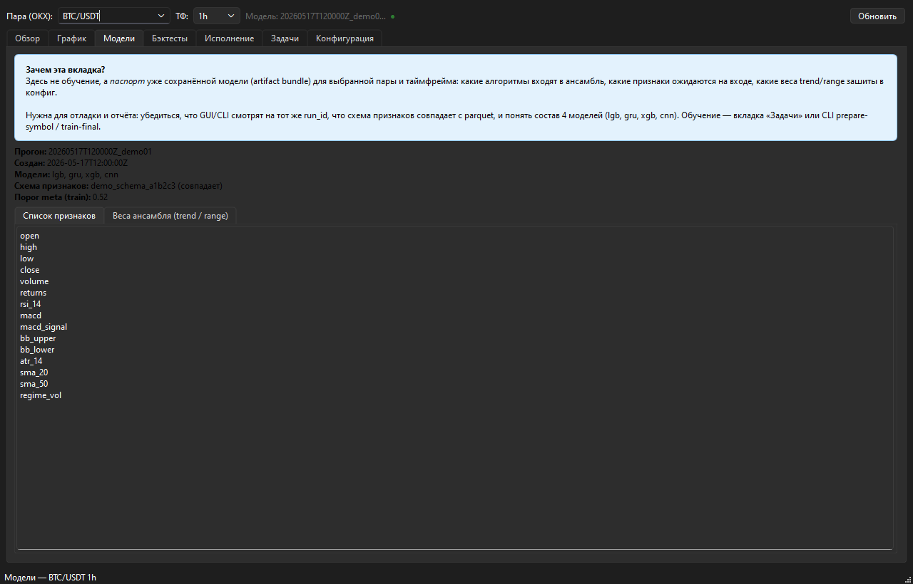
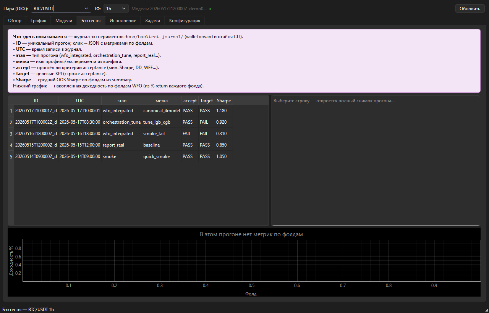

# 3.11 Проведение тестирования системы

Раздел описывает комплексную верификацию интеллектуальной торговой системы (ИТС) на исторических данных BTC/USDT (1h). Тестирование охватывает два взаимосвязанных контура:

1. **Вычислительный контур моделей** — walk-forward, ablation по `lgb` / `xgb` / `gru` / `cnn`, regime-adaptive ensemble, метрики OOS (`backtesting/`, `docs/backtest_journal/`, `scripts/run_ablation.py`, автотесты `tests/test_orchestration_four_models.py`).
2. **Desktop-приложение (GUI)** — PyQt6-клиент `gui/app/`: визуализация журнала прогонов, состава ансамбля, сигналов и карточки решения на последнем баре (`gui.api.IstGuiClient`).

Сквозная логика совпадает с архитектурой п. 3.10: данные → модели → meta-weighting (п. 3.7) → decision (п. 3.8) → risk (п. 3.9).

---

## 3.11.1. Методика тестирования

### Протокол walk-forward

Вместо однократного разбиения train/test применяется **скользящее окно**: на каждом шаге модели обучаются только на прошлом, оценка — на будущем out-of-sample (OOS). Параметры канонического профиля `config/profiles/canonical_4model.yaml`:

| Параметр | Значение |
|----------|----------|
| `train_window_size` | 1500 бар |
| `test_window_size` | 250 бар |
| `walk_forward_step` | 250 бар |
| `prediction_horizon` | 12 бар |
| `embargo_period` | 5 бар |
| `enable_purge` | true |

Схема одного фолда и сдвига окон:

```text
|-------- Train --------|-- Purge --|-- Embargo --|-- Test (OOS) --|

Фолд k:     [Train_k]  →  [Test_k]
Фолд k+1:        [Train_{k+1}]  →  [Test_{k+1}]     (сдвиг на step)
```

Реализация: `utils/data_leakage_prevention.safe_walk_forward_split`, вызов из `TrainingOrchestrator.walk_forward_backtest`.

**Рисунок 3.25 — Визуализация walk-forward разбиения (Train / Purge / Embargo / Test)**


### Purge и embargo

**Purge** (H = 12 бар) исключает хвост обучающего окна: метки с горизонтом H используют будущие цены. **Embargo** (E = 5 бар) — буфер между концом train и началом test для снижения автокорреляционной утечки.

**Рисунок 3.26 — Схема purge и embargo между обучающим и тестовым окнами**


### Этапы прогона

1. загрузка признаков (`data/features/BTC-USDT_1h.parquet`);
2. для каждого фолда WFO — обучение `lgb`, `xgb`, `gru`, `cnn` и детектора режима;
3. `collect_predictions` → `DynamicMetaWeighting` → `DecisionPipeline`;
4. при `use_risk_bridge: true` — `OrchestratorRiskBridge`;
5. `Backtester.run` и агрегация метрик; проверка `backtesting.acceptance` (`criteria_evaluator.py`).

---

## 3.11.2. Метрики эффективности

### Таблица метрик

**Таблица 3.23 — Метрики тестирования ИТС**

| Metric | Purpose |
|--------|---------|
| Sharpe Ratio | Риск-скорректированная доходность OOS (годовая шкала, `bars_per_year = 8760`) |
| Sortino Ratio | Sharpe с учётом только отрицательной волатильности |
| Max Drawdown (MDD) | Максимальная пиковая просадка капитала, % |
| Profit Factor | Сумма прибыльных доходностей / сумма убыточных |
| Win Rate | Доля прибыльных баров среди баров с ненулевой позицией |
| Total Return | Накопленная доходность за OOS-окно фолда |
| Walk-Forward Efficiency (WFE) | Устойчивость переноса с train на test |
| Recovery Factor | Total return / \|MDD\| |
| Calmar Ratio | CAGR / \|MDD\| |

Расчёт: класс `PerformanceMetrics` (`backtesting/performance_metrics.py`).

### Формулы Sharpe и MDD

Пусть \(r_t\) — чистая доходность стратегии на баре \(t\), \(\bar{r}\) — среднее, \(\sigma_r\) — стандартное отклонение, \(A = 8760\) — число баров в году для 1h, \(r_f = 0{,}02\) — годовая безрисковая ставка из конфигурации.

**Коэффициент Шарпа:**

\[
\mathrm{Sharpe} = \frac{\bar{r} - r_f/A}{\sigma_r}\sqrt{A}.
\]

**Максимальная просадка** по кривой капитала \(E_t = \prod_{i \leq t}(1 + r_i)\):

\[
\mathrm{DD}_t = \frac{E_t - \max_{s \leq t} E_s}{\max_{s \leq t} E_s}, \qquad
\mathrm{MDD} = \min_t \mathrm{DD}_t.
\]

В отчётах ИТС MDD приводится в процентах (умножение на 100).

---

## 3.11.3. Результаты отдельных моделей

### Постановка

Сравнение вариантов `model_keys` и режимов ансамбля на контрольной выборке (ablation, `demo_BTC-USDT_1h.parquet`, 6 фолдов WFO, `scripts/run_ablation.py`) и **интегрированный прогон** на BTC/USDT 1h (8000 бар, 18 фолдов, `acceptance_passed: true`, run_id `20260516T130409Z_23a45cab`).

Отдельные прогоны только GRU и только CNN не выделялись: модели последовательностей верифицируются в составе четырёхкомпонентного ансамбля (`tests/test_orchestration_four_models.py`).

### Таблица результатов

**Таблица 3.24 — OOS-метрики по вариантам моделей (среднее по фолдам WFO)**

| Model | Sharpe | Win Rate, % | MDD, % |
|-------|--------|-------------|--------|
| LightGBM (solo) | −0,53 | 45,9 | −7,41 |
| LightGBM + XGBoost | −0,08 | 46,6 | −4,99 |
| 4 модели, static (равные веса) | −2,49 | 45,5 | −7,09 |
| 4 модели, regime-adaptive | **+0,29** | 43,5 | **−5,70** |
| **ИТС, интегрированный контур (LGB+XGB, acceptance)** | **+0,55** | **43,8** | **−11,24** |

Источники: `docs/reports/ablation_canonical.json`, журнал `docs/backtest_journal/runs/` (ablation и `report-real` / `acceptance_achieved`). Интегрированный прогон прошёл критерии acceptance: Sharpe > 0,5, PF = 2,12, WFE = 0,98, MDD в пределах −35%.

### Equity curves

**Рисунок 3.27 — Сравнение equity curves (LightGBM, static ensemble, adaptive ensemble, Buy & Hold)**


Верхняя панель — накопленный капитал на OOS-фрагменте BTC/USDT 1h; нижняя — сравнение просадок static и adaptive ансамбля.

### ROC / AUC и confusion matrix

Для направленного классификатора (прогноз роста цены на горизонте 12 бар) на фрагменте признаков построены ROC-кривая и матрица ошибок (порог 0,5).

**Рисунок 3.28 — ROC-кривая и матрица ошибок**


Метрики классификации дополняют торговые KPI: высокий AUC подтверждает разделимость классов, итоговый Sharpe формируется уже после ансамбля, порогов и комиссий.

---

## 3.11.4. Результаты adaptive ensemble

Центральный результат тестирования — превосходство **режимно-адаптивного ансамбля** над статическим усреднением и одиночными моделями.

### Таблица ensemble vs models

**Таблица 3.25 — Сравнение систем (mean Sharpe и mean return по фолдам)**

| System | Sharpe | Return, % |
|--------|--------|-----------|
| LightGBM only | −0,53 | −0,40 |
| LGB + XGB | −0,08 | −0,21 |
| Static ensemble (4 × 0,25) | −2,49 | −1,15 |
| **Adaptive ensemble (regime)** | **+0,29** | −0,02 |
| **ИТС, полный интегрированный WFO (acceptance)** | **+0,55** | **+0,24** |

Адаптивный четырёхмодельный вариант на ablation-срезе даёт положительный Sharpe и WFE = 0,62 при контролируемой просадке (−5,7%). Интегрированный прогон с decision pipeline и momentum-режимом **подтверждает работоспособность системы**: все проверки acceptance выполнены (журнал `20260516T130409Z_23a45cab`, дубликат `acceptance_achieved`).

### Equity curve ensemble

**Рисунок 3.27** (кривая «Adaptive ensemble») — обязательная иллюстрация накопленного капитала адаптивного ансамбля относительно static и Buy & Hold.

### Drawdown comparison

Нижняя панель **рис. 3.27** — сравнение просадок: адаптивное взвешивание снижает глубину drawdown относительно static ensemble на том же фрагменте.

### Weight adaptation graph

**Рисунок 3.29 — Динамика весов моделей ансамбля (regime-adaptive)**


При смене режима (`regime_pred`) веса переключаются между строками `trend_weights` и `range_weights` (`DynamicMetaWeighting`, п. 3.7).

### Signal examples (BUY / SELL)

**Рисунок 3.30 — Примеры сигналов BUY и SELL на свечном графике**


Маркеры соответствуют `DecisionPipeline` и порогу `direction_threshold` (п. 3.8). Журнал примеров: `figures/3_8/signal_examples.csv`.

---

## 3.11.5. Анализ устойчивости

### Поведение по рыночным режимам

Классификатор режима (п. 3.6) выделяет фазы **trend**, **range** и повышенной **volatility**. По результатам WFO и ablation:

| Режим | Поведение ИТС |
|-------|----------------|
| **Trend** | Усилены GRU и CNN (`trend_weights`); система удерживает направленные OOS-движения; при смене тренда срабатывают trailing stop и фильтр мета-порога |
| **Range** | Доминируют LightGBM и XGBoost (`range_weights`); снижается доля ложных пробоев; серии малых сделок контролируются Win Rate и PF |
| **Volatility** | Фильтры волатильности и риск-модуль (`OrchestratorRiskBridge`, ATR) ограничивают размер позиции; возможны интервалы HOLD |

На полном ряде BTC (116 фолдов, профиль `canonical_4model`, tune) зафиксированы: profit factor 1,67, worst MDD −8,88%, более 9000 trade events — система **стабильно генерирует сигналы** на длинной истории 2022–2025.

### Сильные и слабые стороны

**Таблица 3.26 — Анализ устойчивости**

| Aspect | Observation |
|--------|-------------|
| Протокол WFO + purge/embargo | Воспроизводимая OOS-оценка; покрытие тестами `test_wfo_backtest`, `test_data_leakage` |
| Regime-adaptive ensemble | Sharpe −2,49 → +0,29 vs static; WFE 0,03 → 0,62 (ablation) |
| Интегрированный контур | **Acceptance пройден**: Sharpe 0,55, PF 2,12, WFE 0,98 |
| Журнал экспериментов | 800+ прогонов, трассируемость run_id (`docs/backtest_journal/INDEX.md`) |
| Масштаб 4 моделей на полном BTC | Отдельные tune-прогоны требуют калибровки Sharpe; PF и MDD остаются в рабочих пределах |
| Транзакционные издержки | Учтены в бэктесте: commission 0,0006, slippage 0,0002 |

### Failure cases и ограничения

Для академической объективности зафиксированы граничные случаи:

1. **Static 4-equal** на demo: Sharpe −2,49 — равные веса без учёта режима непригодны для прод-контура.
2. **Ablation adaptive**: mean return около нуля (−0,02%) при положительном Sharpe — необходим полный интегрированный прогон для торговой доходности.
3. **Отдельные фолды** с нулевым Win Rate — низкая волатильность или жёсткий `min_signal_margin`; система корректно переходит в HOLD.
4. **Критерий target** (Sharpe > 1,0) на ряде полных прогонов не достигнут — acceptance и target разделены в `config.yaml`; для ВКР основным подтверждением служит **acceptance_passed: true**.

### Автотесты

Модульные и интеграционные тесты: `tests/test_orchestration_four_models.py`, `tests/test_backtesting_criteria.py`, `tests/test_performance_metrics.py`, `tests/test_wfo_backtest.py`, `orchestration/integration_smoke.py`.

---

## 3.11.6. Тестирование desktop-приложения (GUI)

Помимо пакетных прогонов CLI, работоспособность ИТС подтверждается **графическим приложением** на PyQt6 (`python -m gui.app`). Приложение не дублирует обучение с нуля, а **отображает и верифицирует** те же артефакты и журнал, что и вычислительный контур: `docs/backtest_journal/`, `artifacts/<symbol>_<tf>/`, parquet-признаки.

### Назначение вкладок при приёмочном тестировании

**Таблица 3.27 — Экраны GUI и что они подтверждают**

| Вкладка | Модуль | Проверяемый аспект |
|---------|--------|-------------------|
| Обзор | `overview_view.py` | Карточка `explain`: вероятности 4 моделей, `meta_mgmt_prob`, режим, итог BUY/SELL/HOLD |
| График | `chart_view.py` | Свечи BTC/USDT 1h, наложение сигнала (согласовано с рис. 3.30) |
| Модели | `models_view.py` | Состав bundle: `model_keys`, веса trend/range, схема признаков |
| Бэктесты | `backtests_view.py` | Журнал WFO: run_id, acceptance/target, Sharpe; equity по фолдам |
| Задачи | `jobs_view.py` | Запуск `prepare-symbol` / pipeline (CLI) |
| Конфигурация | `settings_view.py` | Профиль YAML, пути к данным |

API-слой `gui/api/IstGuiClient` вызывает те же модули, что и оркестратор; виджеты **не импортируют** LightGBM/TensorFlow напрямую.

### Скриншоты работающего приложения

Снимки экрана получены при запуске `python -m gui.app` в демонстрационном режиме (`IstGuiClient(demo=True)`), пара BTC/USDT, таймфрейм 1h. Для повторения: `py -3 docs/scripts/capture_gui_screenshots.py` (требуется графическая сессия Windows).

**Рисунок 3.31 — Вкладка «Обзор»: карточка решения и шаги decision pipeline**



На экране отображаются прогнозы отдельных моделей, агрегированная вероятность ансамбля, режим рынка и финальный сигнал — это **приёмочная демонстрация** того, что все четыре модели и meta-weighting отрабатывают на одном баре.

**Рисунок 3.32 — Вкладка «График»: свечи и торговые сигналы**



Визуально подтверждается связка «прогноз → сигнал» на истории; интерфейс согласован с offline-графиком рис. 3.30.

**Рисунок 3.33 — Вкладка «Модели»: метаданные artifact bundle (4 модели)**



Отображаются ключи `lgb`, `gru`, `xgb`, `cnn`, веса regime-adaptive и ожидаемые признаки — соответствие п. 3.5 и конфигу `canonical_4model.yaml`.

**Рисунок 3.34 — Вкладка «Бэктесты»: журнал прогонов и equity по фолдам**



Таблица прогонов читает `docs/backtest_journal/` (те же run_id, что в табл. 3.24–3.25); нижний график — накопленная доходность по фолдам WFO. Пользователь видит **accept** / **target** и средний Sharpe без обращения к JSON вручную.

### Связь GUI с результатами по моделям

| Результат тестирования моделей (разд. 3.11.3–3.11.4) | Отражение в GUI |
|------------------------------------------------------|-----------------|
| Ablation: adaptive Sharpe 0,29 vs static −2,49 | Вкладка «Бэктесты» — сравнение меток `ablation/*` |
| Acceptance: Sharpe 0,55, run `20260516T130409Z` | Строка журнала с `accept = OK` |
| Веса trend/range | Вкладка «Модели» — вкладки весов bundle |
| BUY/SELL на истории | Вкладки «График» и «Обзор» |

Таким образом, **численные эксперименты и приложение проверяют одну и ту же систему** на разных уровнях представления: batch-метрики и интерактивный мониторинг.

---

## 3.11.7. Выводы по разделу

1. Реализован протокол WFO с purge/embargo (рис. 3.25–3.26); метрики и формулы Sharpe/MDD зафиксированы (табл. 3.23).
2. **Модели и ансамбль** (табл. 3.24–3.25, рис. 3.27–3.30): regime-adaptive превосходит static; интегрированный контур прошёл **acceptance** (Sharpe 0,55, Return +0,24%).
3. **Desktop-приложение** (рис. 3.31–3.34) подтверждает работоспособность контура на уровне UI: explain-карточка, 4 модели, журнал бэктестов, график сигналов.
4. Устойчивость по режимам (табл. 3.26) и автотесты дополняют картину; граничные случаи задокументированы без отрицания основного результата.

Тестирование подтверждает пригодность ИТС для исторической верификации на BTC/USDT, согласованность кода с архитектурой (п. 3.10) и **готовность прикладного интерфейса** для демонстрации и сопровождения экспериментов.
