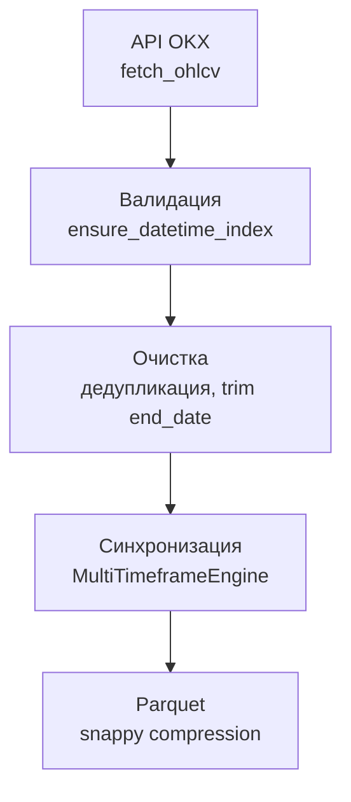

# 3.2 Реализация системы сбора и обработки данных

Подсистема сбора и обработки данных (data layer) обеспечивает получение исторических котировок с биржи OKX, их верификацию, очистку, мультитаймфреймовую синхронизацию и сохранение в формате Parquet для последующих этапов инженерии признаков и обучения моделей. Ниже описаны интеграция с API, конвейер загрузки, программная реализация загрузчика, структура данных и обязательные процедуры предобработки.

## 3.2.1. Интеграция с API биржи

Взаимодействие с биржей OKX реализовано через унифицированную библиотеку **CCXT** (Cryptocurrency eXchange Trading Library), предоставляющую абстракцию над REST-эндпоинтами и стандартизированный метод запроса свечных данных `fetch_ohlcv`.

При инициализации загрузчика создаётся экземпляр клиента биржи с включённым ограничением частоты запросов (`enableRateLimit`), что снижает риск блокировки по rate limit. Запрос OHLCV выполняется в цикле с пагинацией: параметр `since` сдвигается на метку времени последней полученной свечи плюс один миллисекундный шаг, пока не будет достигнута конечная дата выборки.

Фрагмент реализации запроса к API (модуль `data_layer/loaders/okx_ohlcv_loader.py`):

```python
import ccxt
import pandas as pd

class OKXDataLoader:
    def __init__(self, rate_limit: bool = True, ...):
        self.exchange = ccxt.okx({"enableRateLimit": rate_limit})

    def fetch_all_ohlcv(self, symbol, timeframe, start_str, end_str, ...):
        since = self.exchange.parse8601(start_str)
        end_ts = self.exchange.parse8601(end_str)
        while since < end_ts:
            ohlcv = self.exchange.fetch_ohlcv(symbol, timeframe, since)
            # ... пагинация, накопление all_ohlcv, since = last_ts + 1
        df = pd.DataFrame(all_ohlcv, columns=OHLCV_COLUMNS)
        return validate_ohlcv(df, end_str=end_str)
```

На рис. 3.3 (при оформлении дипломной работы) целесообразно разместить иллюстрацию фрагмента исходного кода с вызовом `ccxt.okx` и `exchange.fetch_ohlcv`, либо скриншот выполнения CLI-команды загрузки данных.

Команда загрузки с сохранением в Parquet:

```text
python -m data_layer -s BTC/USDT -t 1h --from 2022-01-01 --to 2026-01-01 -o data/ohlcv/BTC-USDT_1h.parquet
```

Публичный метод `fetch_ohlcv` не требует аутентификации; ключи API (`OKX_API_KEY`, `OKX_SECRET_KEY`, `OKX_PASSPHRASE`) резервируются для расширений, связанных с приватными эндпоинтами.

## 3.2.2. Конвейер загрузки и обработки данных

Обработка рыночных данных организована как последовательный конвейер. Обобщённая схема представлена на рис. 3.4.

**Рисунок 3.4 — Конвейер сбора и обработки данных**

```
API OKX (REST, CCXT)
        │
        ▼
   Валидация
   (validate_ohlcv)
        │
        ▼
    Очистка
 (дедупликация, обрезка по дате,
  нормализация часового пояса)
        │
        ▼
 Синхронизация MTF
 (resample, ffill, join, dropna)
        │
        ▼
 Хранение Parquet
 (data/ohlcv/, data/features/)
```

Эквивалентная блок-схема (Mermaid):



Содержательная характеристика этапов приведена в табл. 3.3.

**Таблица 3.3 — Этапы конвейера data layer**

| Этап | Модуль | Назначение |
|------|--------|------------|
| API OKX | `data_layer/loaders/okx_ohlcv_loader.py` | Пагинированная загрузка OHLCV |
| Валидация | `data_layer/validators/ohlcv_validator.py` | Приведение индекса к UTC, дедупликация, обрезка периода |
| Очистка | тот же валидатор + `synchronization/gap_handler.py` | Устранение дубликатов, выравнивание временной сетки |
| Синхронизация | `synchronization/multi_timeframe_engine.py` | Агрегация вспомогательных TF к базовому 1h, заполнение пропусков |
| Parquet | `data_layer/storage.py` | Сериализация DataFrame на диск |

## 3.2.3. Программная реализация загрузчика данных

Класс `OKXDataLoader` инкапсулирует логику подключения к бирже, пагинации и постобработки. Помимо метода `fetch_all_ohlcv`, предусмотрены `fetch_from_config` (загрузка по объекту конфигурации) и `fetch_all_timeframes` (пакетная загрузка базового и вспомогательных интервалов).

Упрощённая структура класса:

```python
OHLCV_COLUMNS = ["timestamp", "open", "high", "low", "close", "volume"]

class OKXDataLoader:
    """Исторические OHLCV с OKX через REST (ccxt)."""

    def __init__(self, rate_limit: bool = True, ...):
        self.exchange = ccxt.okx({"enableRateLimit": rate_limit})

    def fetch_all_ohlcv(
        self,
        symbol: str,
        timeframe: str,
        start_str: str,
        end_str: str,
        *,
        verbose: bool = True,
    ) -> pd.DataFrame:
        """Загрузка OHLCV за период [start_str, end_str] с пагинацией."""
        # цикл fetch_ohlcv → DataFrame → validate_ohlcv
        ...

    def fetch_from_config(self, config: DataLayerConfig, timeframe: str | None = None):
        ...

    def fetch_all_timeframes(self, config: DataLayerConfig) -> dict[str, pd.DataFrame]:
        ...
```

После завершения загрузки вызывается функция `validate_ohlcv`, что гарантирует единообразие структуры данных независимо от способа вызова (CLI, пайплайн `prepare-symbol`, программный API).

## 3.2.4. Структура данных OHLCV

Каждая свеча (бар) описывается набором полей, приведённым в табл. 3.4. Индексом временного ряда служит метка `timestamp` в часовом поясе UTC.

**Таблица 3.4 — Поля набора данных OHLCV**

| Поле | Описание |
|------|----------|
| Open | Цена открытия интервала |
| High | Максимальная цена за интервал |
| Low | Минимальная цена за интервал |
| Close | Цена закрытия интервала |
| Volume | Объём торгов за интервал (в базовой валюте инструмента) |
| timestamp | Временная метка начала свечи (индекс DataFrame, UTC) |

Математически одна наблюдение записывается как:

\[
\mathrm{OHLCV}_t = (O_t,\ H_t,\ L_t,\ C_t,\ V_t),
\]

где \(t\) — дискретный момент времени на выбранной сетке (5m, 15m, 1h и т.д.).

## 3.2.5. Хранение данных в формате Parquet

Для долговременного хранения и быстрого чтения используется колоночный формат **Parquet** с сжатием Snappy (настройка `data_layer.storage.parquet.compression` в конфигурации ИТС). Файлы размещаются в каталогах `data/ohlcv/` (исходные и синхронизированные ряды) и `data/features/` (признаковые матрицы).

Пример структуры загруженного набора `BTC-USDT_1h` (первые три строки, файл `data/ohlcv/BTC-USDT_1h_ohlcv_raw.parquet`):

```
                              open     high      low    close      volume
timestamp
2022-01-01 00:00:00+00:00  46218.3  46742.0  46216.2  46654.3  505.065361
2022-01-01 01:00:00+00:00  46655.1  46943.0  46578.5  46780.1  394.933309
2022-01-01 02:00:00+00:00  46780.1  46927.3  46725.5  46803.7  237.989272

shape = (38347, 5), index = timestamp (UTC)
```

Программное чтение и просмотр «головы» выборки:

```python
import pandas as pd

df = pd.read_parquet("data/ohlcv/BTC-USDT_1h_ohlcv_raw.parquet")
print(df.head())
print(df.info())
```

На рис. 3.5 рекомендуется разместить скриншот вывода `df.head()` в среде разработки или интерактивной оболочки Python, демонстрирующий индекс `timestamp` с суффиксом `+00:00` и числовые поля OHLCV.

Функция сохранения (`data_layer/storage.py`):

```python
def save_ohlcv(df: pd.DataFrame, path: str | Path, fmt: str | None = None) -> Path:
    out = Path(path)
    out.parent.mkdir(parents=True, exist_ok=True)
    if file_fmt == "parquet":
        df.to_parquet(out)
    ...
    return out.resolve()
```

## 3.2.6. Обязательные процедуры предобработки

Корректность последующего обучения моделей зависит от согласованности временной шкалы и отсутствия артефактов в сырых данных. В ИТС реализованы три обязательные процедуры, описанные ниже.

### Нормализация часового пояса

Все временные метки приводятся к единому стандарту **UTC**. Функция `ensure_datetime_index` преобразует числовые метки (миллисекунды с эпохи Unix) или строковые даты в `DatetimeIndex` с явной зоной `UTC`; при отсутствии информации о часовом поясе выполняется `tz_localize("UTC")`, иначе — `tz_convert("UTC")`.

```python
def ensure_datetime_index(df: pd.DataFrame) -> pd.DataFrame:
    ...
    if pd.api.types.is_numeric_dtype(ts):
        out["timestamp"] = pd.to_datetime(ts, unit="ms", utc=True)
    else:
        out["timestamp"] = pd.to_datetime(ts, utc=True)
    ...
    out.index = out.index.tz_localize("UTC") if out.index.tz is None else out.index.tz_convert("UTC")
    return out.sort_index()
```

Данная процедура исключает смещение баров при объединении рядов с разных таймфреймов и при сопоставлении с внешними источниками.

### Удаление дубликатов

При пагинированной загрузке возможно повторное получение свечи с одной и той же меткой времени. Функция `drop_duplicate_timestamps` оставляет последнюю запись для каждого `timestamp` (`keep="last"`), что соответствует наиболее актуальному состоянию бара на бирже.

```python
def drop_duplicate_timestamps(df: pd.DataFrame) -> pd.DataFrame:
    out = ensure_datetime_index(df)
    return out[~out.index.duplicated(keep="last")]
```

В составе `validate_ohlcv` дедупликация включена по умолчанию (`drop_duplicates=True`).

### Обработка пропущенных значений (NaN)

Обработка NaN выполняется на двух уровнях конвейера.

**1. После мультитаймфреймового объединения.** При соединении базового ряда 1h с признаками, рассчитанными на 15m и 4h, в начале выборки возникают неопределённые значения (холодный старт индикаторов). Параметр `drop_na_after_merge: true` в конфигурации синхронизации инициирует удаление строк, содержащих хотя бы одно NaN:

```python
if self.config.drop_na_after_merge:
    df = df.dropna()
```

Дополнительно при выравнивании вспомогательных рядов применяется метод заполнения вперёд (`fill_method: ffill`), что не создаёт заглядывания в будущее внутри завершённого бина resample.

**2. После инженерии признаков.** Модуль `FeatureEngine` при `drop_na: true` удаляет строки с пропусками, образовавшимися из-за скользящих окон (RSI, EMA, ATR, ADX и др.):

```python
def get_processed_data(self) -> pd.DataFrame:
    if self.config.drop_na:
        return self.df.dropna()
    return self.df
```

Таким образом, на вход моделей машинного обучения поступает матрица признаков без неопределённых значений; объём выборки сокращается на величину максимального окна индикаторов, что является стандартной практикой при построении признаков на основе скользящих статистик.

**Таблица 3.5 — Сводка процедур предобработки**

| Процедура | Реализация | Модуль |
|-----------|------------|--------|
| Нормализация часового пояса | `ensure_datetime_index`, UTC | `ohlcv_validator.py`, `gap_handler.py` |
| Удаление дубликатов | `drop_duplicate_timestamps` | `ohlcv_validator.py` |
| Обработка NaN | `dropna()` после merge и после feature engineering | `multi_timeframe_engine.py`, `feature_engine.py` |

Реализация перечисленных процедур обеспечивает воспроизводимость пайплайна и соответствие требованиям временной каузальности при подготовке данных для практического эксперимента, описанного в п. 3.1.
