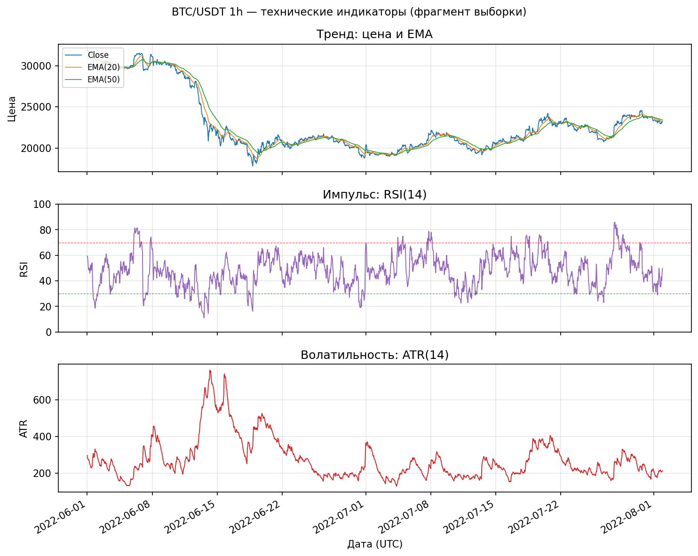
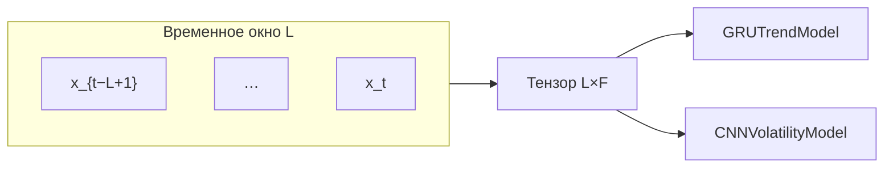
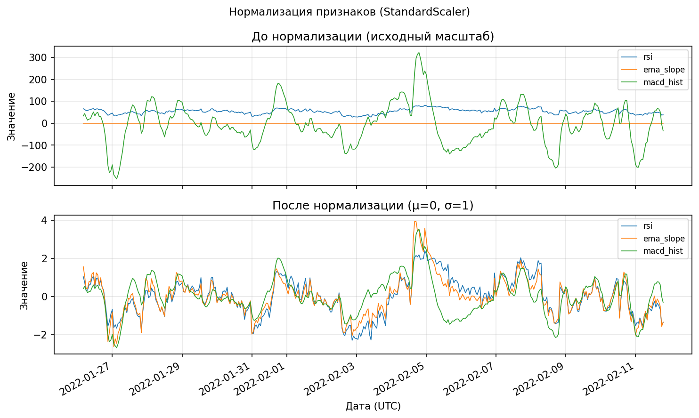
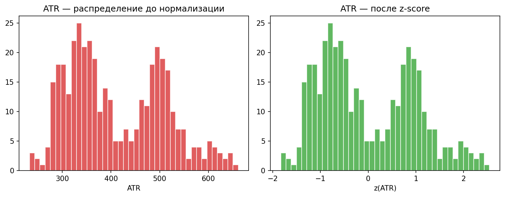

# 3.3 Реализация подсистемы инженерии признаков (feature engineering)

Подсистема инженерии признаков преобразует синхронизированные ряды OHLCV и мультитаймфреймовые (MTF) признаки в матрицу \( \mathbf{X}_t \), пригодную для обучения моделей градиентного бустинга и глубоких нейронных сетей (GRU, CNN). Реализация сосредоточена в модуле `feature_engineering` и включает расчёт технических индикаторов, опциональные признаки микроструктуры рынка, формирование временных окон и нормализацию перед подачей на вход DL-моделей.

## 3.3.1. Каталог признаков

В ИТС различаются **исходные поля котировок**, **базовые индикаторы** (модуль `FeatureEngine`), **MTF-признаки** (подсистема `synchronization`) и **опциональные** признаки стакана заявок. Сводный каталог реализованных и используемых в обучении признаков приведён в табл. 3.6.

**Таблица 3.6 — Каталог признаков подсистемы feature engineering**

| Признак | Тип | Подтип | Таймфрейм | Назначение |
|---------|-----|--------|-----------|------------|
| `open` | цена | OHLCV | базовый (1h) | Цена открытия свечи; исходное поле |
| `high` | цена | OHLCV | 1h | Максимум свечи |
| `low` | цена | OHLCV | 1h | Минимум свечи |
| `close` | цена | OHLCV | 1h | Цена закрытия; база для доходностей и индикаторов |
| `volume` | объём | OHLCV | 1h | Объём торгов за интервал |
| `ema_fast` | тренд | MA | 1h | Быстрая EMA(close, 20); краткосрочный тренд |
| `ema_slow` | тренд | MA | 1h | Медленная EMA(close, 50); среднесрочный тренд |
| `ema_slope` | тренд | производная | 1h | Относительное изменение `ema_fast`; направление и сила тренда |
| `rsi` | импульс | momentum | 1h | RSI(14); перекупленность / перепроданность |
| `macd` | импульс | momentum | 1h | Линия MACD(12, 26, 9) |
| `macd_signal` | импульс | momentum | 1h | Сигнальная линия MACD |
| `macd_hist` | импульс | momentum | 1h | Гистограмма MACD; используется в эталонном наборе Direction/DL |
| `atr` | волатильность | range | 1h | Average True Range(14); амплитуда движения |
| `log_ret` | доходность | returns | 1h | Логарифмическая доходность \( r_t = \ln(C_t/C_{t-1}) \) |
| `volatility` | волатильность | статистика | 1h | Скользящее σ(log_ret) × \( \sqrt{24} \) (часовые бары) |
| `adx` | режим | trend strength | 1h | ADX(14); сила тренда / флэта |
| `rsi_15m` | импульс | MTF | 15m→1h | RSI на 15m, выровненный на сетку 1h |
| `ema_slope_15m` | тренд | MTF | 15m→1h | Наклон EMA(20) на 15m (pct_change) |
| `rsi_4h` | импульс | MTF | 4h→1h | RSI на 4h |
| `adx_4h` | режим | MTF | 4h→1h | ADX на 4h |
| `order_book_imbalance` | микроструктура | L2 | 1h* | Дисбаланс объёмов bid/ask (симуляция или live L2) |
| `bid_ask_spread` | микроструктура | L2 | 1h* | Относительный спред; proxy от волатильности в research-режиме |

\* Колонки микроструктуры добавляются при `microstructure.mode: simulated` (модуль `FeatureManager`); в каноническом профиле обучения Direction/DL — `off`.

**Эталонный вектор признаков** для направленного прогноза и DL (константа `DIRECTION_FEATURE_COLUMNS`):

`rsi`, `macd_hist`, `ema_slope`, `adx`, `rsi_15m`, `ema_slope_15m`, `rsi_4h`, `adx_4h` — всего **8** признаков на временной шаг.

**Таблица 3.7 — Признаки по функциональным группам (краткая выборка из постановки)**

| Признак | Тип | Назначение |
|---------|-----|------------|
| RSI | momentum | Сила и направленность ценового импульса |
| ATR | volatility | Оценка волатильности и диапазона движения |
| EMA slope | trend | Направление и динамика краткосрочного тренда |
| MACD hist | momentum | Расхождение кратко- и долгосрочной EMA |
| ADX | regime | Сила трендового режима |
| log_ret | returns | Мгновенная лог-доходность |
| volatility | volatility | Реализованная волатильность на окне |
| rsi_15m / rsi_4h | MTF momentum | Контекст младшего и старшего TF |
| adx_4h | MTF regime | Макро-режим на 4h |

Перспективные признаки (Bollinger, OBV, VWAP, календарные, skew/kurtosis) зафиксированы в roadmap модуля и в дипломе могут быть упомянуты как направление развития без включения в текущий training set.

## 3.3.2. Математическое описание индикаторов

Ниже приведены формулы, реализованные в `synchronization/indicators.py` и `feature_engineering/indicators.py` (согласованы с классическими определениями Wilder / MACD).

### Логарифмическая доходность (returns)

\[
r_t = \ln\frac{C_t}{C_{t-1}},
\]

где \( C_t \) — цена закрытия в момент \( t \). Реализованная волатильность на окне \( W \):

\[
\hat{\sigma}_t = \mathrm{std}\bigl(r_{t-W+1}, \ldots, r_t\bigr) \cdot \sqrt{24}.
\]

Множитель \( \sqrt{24} \) соответствует годичной шкале для часовых баров (параметр `vol_annualize_factor`).

### Экспоненциальная скользящая средняя (EMA)

\[
\mathrm{EMA}_t = \alpha \, C_t + (1-\alpha)\,\mathrm{EMA}_{t-1}, \qquad \alpha = \frac{2}{L+1},
\]

где \( L \) — период (для `ema_fast`: \( L=20 \), для `ema_slow`: \( L=50 \)). Наклон быстрой EMA:

\[
\mathrm{ema\_slope}_t = \frac{\mathrm{EMA}^{\mathrm{fast}}_t - \mathrm{EMA}^{\mathrm{fast}}_{t-1}}{\mathrm{EMA}^{\mathrm{fast}}_{t-1}}.
\]

### Индекс относительной силы (RSI)

\[
\Delta_t = C_t - C_{t-1}, \quad
G_t = \max(\Delta_t, 0), \quad
D_t = \max(-\Delta_t, 0),
\]

\[
\overline{G}_t = \mathrm{EWM}(G, \alpha), \quad
\overline{D}_t = \mathrm{EWM}(D, \alpha), \quad
\alpha = \frac{1}{14},
\]

\[
\mathrm{RS}_t = \frac{\overline{G}_t}{\overline{D}_t}, \qquad
\mathrm{RSI}_t = 100 - \frac{100}{1 + \mathrm{RS}_t}.
\]

### Average True Range (ATR)

Истинный диапазон:

\[
\mathrm{TR}_t = \max\bigl( H_t - L_t,\; |H_t - C_{t-1}|,\; |L_t - C_{t-1}| \bigr).
\]

Сглаживание по Уайлдеру (эквивалент EWM с \( \alpha = 1/14 \)):

\[
\mathrm{ATR}_t = \mathrm{EWM}(\mathrm{TR}, \alpha).
\]

### MACD

\[
\mathrm{MACD}_t = \mathrm{EMA}_{12}(C)_t - \mathrm{EMA}_{26}(C)_t, \quad
\mathrm{Signal}_t = \mathrm{EMA}_9(\mathrm{MACD})_t, \quad
\mathrm{macd\_hist}_t = \mathrm{MACD}_t - \mathrm{Signal}_t.
\]

### ADX (упрощённая запись)

На основе направленных движений \( +DM \), \( -DM \) и \( \mathrm{TR} \) вычисляются \( +DI \), \( -DI \), затем

\[
\mathrm{DX}_t = 100 \cdot \frac{\bigl|+DI_t - -DI_t\bigr|}{+DI_t + -DI_t}, \qquad
\mathrm{ADX}_t = \mathrm{EWM}(\mathrm{DX}, \alpha).
\]

## 3.3.3. Графическая иллюстрация индикаторов

На рис. 3.6 представлены фрагменты временных рядов BTC/USDT (1h) за период 2022-06 — 2022-08: цена с EMA(20) и EMA(50), RSI(14) с уровнями 30/70, ATR(14).



*Рисунок сгенерирован скриптом `docs/scripts/generate_3_3_figures.py` из файла `data/features/BTC-USDT_1h.parquet`.*

При оформлении дипломной работы допускается замена на скриншот интерактивного графика (matplotlib, TradingView, Jupyter) при сохранении тех же подписей осей.

## 3.3.4. Формирование последовательностей для GRU и CNN

Модели глубокого обучения потребляют тензор размерности \( (N,\, L,\, F) \), где \( L \) — длина временного окна, \( F \) — число признаков. Для момента \( t \) в матрицу входа попадают наблюдения с \( t-L+1 \) по \( t \):

\[
\mathbf{X}_t =
\begin{bmatrix}
\mathbf{x}_{t-L+1}^{\mathsf T} \\
\vdots \\
\mathbf{x}_t^{\mathsf T}
\end{bmatrix}
\in \mathbb{R}^{L \times F},
\qquad
\mathbf{x}_t \in \mathbb{R}^{F}.
\]

**Рисунок 3.7 — Формирование входной последовательности для GRU/CNN**

```
Признаки x_t на сетке 1h
        │
        ▼
┌───────────────────────────────────────┐
│  t−L+1 , t−L+2 , … , t−1 , t          │  ← окно длины L
└───────────────────────────────────────┘
        │
        ▼
  Тензор (L × F)
        │
        ├──────────────┬──────────────┐
        ▼              ▼              ▼
      GRU(64)       CNN Conv1D    LightGBM / XGB
   return_sequences  MaxPool      (вектор x_t)
```



Реализация в классе `GRUTrendModel` (`models/trend/gru_model.py`):

```python
for i in range(len(df) - self.window_size):
    Xs.append(df[self.feature_cols].iloc[i:(i + self.window_size)].values)
    ys.append(y.iloc[i + self.window_size])
```

Параметры по умолчанию в ИТС:

| Параметр | Значение | Источник |
|----------|----------|----------|
| `window_size` (GRU, CNN) | 24 | `GRUTrendModel`, `CNNVolatilityModel` |
| `n_features` | 8 | `DIRECTION_FEATURE_COLUMNS` |
| `feature_window_size` | 24 | `orchestration.orchestrator_config` |
| Расширенное окно (GUI / эксперименты) | 64–512 | интерфейс inference |

В постановочных схемах диплома допустимо использование **\( L = 64 \)** как иллюстрации увеличенного контекста; в каноническом пайплайне обучения применяется **\( L = 24 \)** (24 часа на базовом TF 1h), что согласуется с эталоном `ist.py` (`WINDOW_SIZE = 24`).

Целевая переменная для направленного прогноза задаётся со сдвигом на горизонт \( h \) (в конфигурации `prediction_horizon: 12`):

\[
y_t = \mathbb{1}\bigl[ C_{t+h} > C_t \bigr].
\]

## 3.3.5. Матрица признаков (feature matrix)

После прохождения конвейера `FeatureManager.transform()` формируется таблица размерности «время × признаки». Пример структуры (файл `data/features/BTC-USDT_1h.parquet`, эталонные колонки Direction/DL):

```
                                 rsi  macd_hist  ema_slope        adx    rsi_15m  ema_slope_15m     rsi_4h     adx_4h
timestamp
2022-01-05 08:00:00+00:00  54.662013  45.230411   0.000570  17.458791  63.440813       0.000545  54.177657  24.499629
2022-01-05 09:00:00+00:00  58.373620  67.457749   0.000966  17.279120  69.041980       0.000733  54.177657  24.499629
2022-01-05 10:00:00+00:00  57.364444  75.495705   0.000784  17.473461  61.131482       0.000425  54.177657  24.499629

shape = (38243, 20)  — полная матрица с OHLCV и всеми индикаторами
shape_direction = (38243, 8)  — подматрица DIRECTION_FEATURE_COLUMNS
```

Программное извлечение эталонной матрицы:

```python
from feature_engineering import FeatureManager, DIRECTION_FEATURE_COLUMNS
import pandas as pd

df = pd.read_parquet("data/features/BTC-USDT_1h.parquet")
X = df[DIRECTION_FEATURE_COLUMNS]
print(X.head())
print(X.describe())
```

На рис. 3.8 рекомендуется разместить скриншот вывода `X.head()` / `X.info()` в среде разработки с видимыми именами восьми колонок и типом `float64`.

## 3.3.6. Нормализация признаков (scaling)

Градиентные модели (LightGBM, XGBoost) устойчивы к масштабу признаков; для **GRU** и **CNN** применяется стандартизация **StandardScaler** из библиотеки scikit-learn: по обучающей выборке оцениваются \( \mu_j \) и \( \sigma_j \) для каждого признака \( j \), затем

\[
\tilde{x}_{t,j} = \frac{x_{t,j} - \mu_j}{\sigma_j}.
\]

Нормализация выполняется **после** формирования таблицы признаков и **до** нарезки окон (см. `ist.py`, раздел DL-pipeline):

```python
from sklearn.preprocessing import StandardScaler

scaler = StandardScaler()
X_scaled = pd.DataFrame(
    scaler.fit_transform(X_raw),
    columns=features,
    index=X_raw.index,
)
X_seq, y_seq = create_sequences(X_scaled, y_raw, time_steps=WINDOW_SIZE)
```

Вспомогательная функция `normalize_features` (`models/utils/helpers.py`) поддерживает методы `standard` и `minmax`.

**Рис. 3.9 — Признаки до и после нормализации (StandardScaler)**



На верхней панели — `rsi`, `ema_slope`, `macd_hist` в исходном масштабе; на нижней — те же ряды после приведения к нулевому среднему и единичной дисперсии.

**Рис. 3.9b — Распределение ATR до и после z-score**



Слева — эмпирическое распределение ATR(14); справа — распределение после линейного z-нормирования. Наглядно демонстрируется сжатие масштаба и центрирование, необходимые для устойчивого обучения нейросетевых слоёв.

> **Важно:** параметры `StandardScaler` оцениваются только на **обучающем** временном интервале внутри каждого фолда walk-forward; применение статистик полной выборки к тесту приводит к утечке информации (data leakage).

## 3.3.7. Архитектура подсистемы

Класс `FeatureEngine` выполняет расчёт базовых индикаторов; класс `FeatureManager` объединяет индикаторы, опциональную микроструктуру и метод `direction_features()` для извлечения эталонного подмножества. Конфигурация задаётся секцией `feature_engineering` в YAML (периоды EMA, RSI, ATR, MACD, флаг `drop_na`).

**Таблица 3.8 — Соответствие этапов подсистемы и модулей**

| Этап | Модуль | Результат |
|------|--------|-----------|
| Базовые индикаторы | `feature_engineering/feature_engine.py` | +14 колонок на 1h |
| MTF (вход) | `synchronization/multi_timeframe_engine.py` | `rsi_15m`, `ema_slope_15m`, `rsi_4h`, `adx_4h` |
| Микроструктура | `feature_engineering/feature_manager.py` | OBI, spread (опционально) |
| Удаление NaN | `drop_na: true` | Согласованная матрица без пропусков |
| Нормализация | sklearn / `helpers.normalize_features` | Масштаб для DL |
| Последовательности | `GRUTrendModel.prepare_sequences` | Тензор \( (N, L, F) \) |

Подсистема инженерии признаков замыкает цепочку подготовки данных (п. 3.2) и передаёт матрицу \( \mathbf{X} \) на этап обучения моделей и формирования ансамбля (п. 3.1).

---

*Иллюстрации: `docs/figures/3_3/`. Повторная генерация: `PYTHONPATH=<корень IST> python docs/scripts/generate_3_3_figures.py`.*
