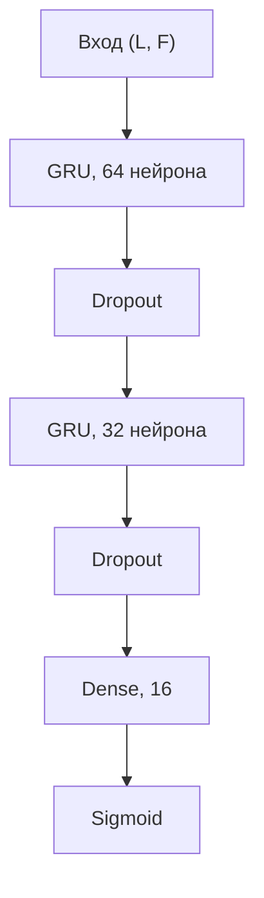

# 3.5 Реализация ансамбля моделей

В составе интеллектуальной торговой системы (далее — ИТС) реализован ансамбль из четырёх прогностических моделей, различающихся по типу представления данных и индуктивной предпосылке: две табличные модели на основе градиентного бустинга (LightGBM, XGBoost) и две модели глубокого обучения для последовательностей (GRU, CNN). На каждом временном шаге \( t \) формируется вектор вероятностей \( \mathbf{p}_t = (p_{\mathrm{lgb},t},\, p_{\mathrm{xgb},t},\, p_{\mathrm{gru},t},\, p_{\mathrm{cnn},t}) \), который агрегируется режимно-адаптивным мета-взвешиванием в зависимости от состояния рынка (тренд / флэт). Ниже описаны архитектура, гиперпараметры, результаты обучения и сравнительная характеристика компонентов ансамбля на данных BTC/USDT, таймфрейм 1h.

## 3.5.1. Общая структура ансамбля

**Таблица 3.8 — Состав ансамбля моделей**

| Модель | Тип | Назначение в системе |
|--------|-----|----------------------|
| LightGBM | градиентный бустинг, табличные признаки | Классификация направления; повышенный вес в режиме флэта |
| XGBoost | градиентный бустинг, табличные признаки | Диверсификация табличного контура; mean-reversion контекст |
| GRU | рекуррентная сеть | Учёт временных зависимостей; доминирующий вес в тренде |
| CNN | свёрточная сеть 1D | Выявление локальных паттернов волатильности |

Обучение и инференс унифицированы: для каждой модели на скользящем окне walk-forward выполняются процедуры `fit` (обучение) и `predict` (выдача вероятности класса «рост»). Входной набор признаков для всех четырёх моделей включает восемь показателей: `rsi`, `macd_hist`, `ema_slope`, `adx`, `rsi_15m`, `ema_slope_15m`, `rsi_4h`, `adx_4h` (см. п. 3.3).

---

## 3.5.2. Модель LightGBM

### Архитектурный принцип

LightGBM (Light Gradient Boosting Machine) реализует метод **градиентного бустинга решающих деревьев** (gradient boosting trees). Ансамбль слабых классификаторов \( h_m(\mathbf{x}) \) строится итеративно путём минимизации логистической функции потерь бинарной классификации. В ИТС модель применяется как **анализатор табличных данных** (tabular analysis): объектом классификации служит вектор признаков \( \mathbf{x}_t \in \mathbb{R}^8 \) на момент \( t \) без явной рекуррентной свёртки; временная информация закодирована в MTF-признаках и индикаторах с памятью.

Используется бинарный классификатор `LGBMClassifier` с балансировкой классов и субсемплированием наблюдений и признаков, что снижает дисперсию оценки на несбалансированных выборках направления цены.

### Гиперпараметры

**Таблица 3.9 — Гиперпараметры LightGBM**

| Параметр | Значение |
|----------|----------|
| `learning_rate` | 0,05 |
| `n_estimators` | 200 |
| `num_leaves` | 31 |
| `max_depth` | не ограничена |
| `min_child_samples` | 20 |
| `subsample` | 0,8 |
| `colsample_bytree` | 0,8 |
| `objective` | binary |
| `class_weight` | balanced |
| Критерий важности признаков | gain |

### Важность признаков

Для интерпретации обученной модели построены диаграммы относительной важности признаков по критерию суммарного снижения функции потерь (gain). Результаты для LightGBM и XGBoost на валидационном срезе представлены на рис. 3.10.


Анализ показывает, что наибольший вклад вносят мультитаймфреймовые признаки `rsi_15m` и `adx_4h`, а также `macd_hist`, что подтверждает обоснованность MTF-расширения признакового пространства (п. 3.3). Дополнительная оценка выполнена на сериализованной модели, сохранённой после полного прогона пайплайна (рис. 3.10а).


### Динамика обучения

В процессе обучения фиксировалась метрика `binary_logloss` на обучающей и валидационной выборках; разбиение выполнялось по времени без перемешивания. Кривые приведены на рис. 3.11. Наблюдается согласованное снижение потерь на обучении и стабилизация на валидации при ранней остановке (20 итераций без улучшения), что свидетельствует об умеренном переобучении в выбранной постановке.


### Примеры прогнозов

Выход модели — оценка апостериорной вероятности роста цены на горизонте \( h = 12 \) баров: \( \hat{p}_t = P(y_t = 1 \mid \mathbf{x}_t) \). Фрагмент прогнозов на отложенном интервале приведён в табл. 3.10.

**Таблица 3.10 — Фрагмент вероятностных прогнозов LightGBM**

| Метка времени (UTC) | Прогноз \( \hat{p}_t \) |
|---------------------|-------------------------|
| 2026-03-12 03:00 | 0,521 |
| 2026-03-12 04:00 | 0,521 |
| 2026-03-12 05:00 | 0,521 |
| 2026-03-12 06:00 | 0,504 |
| 2026-03-12 07:00 | 0,491 |
| 2026-03-12 08:00 | 0,491 |

Значения сосредоточены в окрестности порога 0,5, что соответствует осторожной калибровке вероятностей на волатильном участке выборки.

---

## 3.5.3. Модель XGBoost

### Гиперпараметры

**Таблица 3.11 — Гиперпараметры XGBoost**

| Параметр | Значение |
|----------|----------|
| `n_estimators` | 200 |
| `learning_rate` | 0,05 |
| `max_depth` | 6 |
| `objective` | binary:logistic |
| `eval_metric` | logloss |

XGBoost дополняет LightGBM в табличном контуре: деревья наращиваются по уровням (level-wise) с явным ограничением глубины, что задаёт иную геометрию разделяющих поверхностей в пространстве признаков.

### Результаты обучения

Обучение проводилось на том же признаковом базисе, что и для LightGBM. Качество ранжирования на временной валидации оценивалось по метрике ROC-AUC. Сравнение двух табличных моделей представлено на рис. 3.12; значения AUC близки, различие порядка второго знака после запятой.


### Важность признаков

Распределение gain по признакам для XGBoost приведено на правой панели рис. 3.10. В отличие от LightGBM, вклад признаков более равномерен между `ema_slope` и `rsi`, что усиливает комплементарность предикторов в ансамбле.

### Сравнительный анализ LightGBM и XGBoost

**Таблица 3.12 — Сравнительная характеристика табличных моделей**

| Критерий | LightGBM | XGBoost |
|----------|----------|---------|
| Стратегия роста деревьев | Leaf-wise | Level-wise (`max_depth = 6`) |
| Вычислительная эффективность | Высокая (гистограммный алгоритм) | Средняя |
| ROC-AUC (валидация) | См. рис. 3.12 | См. рис. 3.12 |
| Вес в режиме «флэт» | 0,55 | 0,25 |
| Вес в режиме «тренд» | 0,10 | 0,10 |

Обе модели решают задачу бинарной классификации на идентичном признаковом пространстве; различие алгоритмов построения деревьев обеспечивает **диверсификацию ошибок** при агрегировании. Сопоставимые значения ROC-AUC обосновывают сохранение обеих моделей в ансамбле и передачу выбора вклада режимному взвешиванию, а не отбору единственного табличного предиктора.

---

## 3.5.4. Модель GRU

### Архитектура нейронной сети

Модель на основе управляемого рекуррентного блока (Gated Recurrent Unit, GRU) предназначена для учёта **временных зависимостей** в нормализованной матрице признаков. На вход подаётся тензор \( \mathbf{X}_t \in \mathbb{R}^{L \times F} \), сформированный из \( L \) последовательных наблюдений и \( F = 8 \) признаков; на выходе — скаляр \( \hat{p}_t \in (0, 1) \) после сигмоидальной активации.

**Рисунок 3.13 — Топология GRU-модуля**

```
Вход (L × F)
      │
      ▼
GRU (64 нейрона, return_sequences=True)
      │
      ▼
Dropout (p = 0,2)
      │
      ▼
GRU (32 нейрона)
      │
      ▼
Dropout (p = 0,2)
      │
      ▼
Полносвязный слой (16, ReLU)
      │
      ▼
Полносвязный слой (1, sigmoid)  →  P(y = 1)
```



### Параметризация и сводка архитектуры

**Таблица 3.13 — Гиперпараметры GRU**

| Параметр | Значение |
|----------|----------|
| Длина последовательности \( L \) | 24 |
| Число признаков \( F \) | 8 |
| Число нейронов (слой 1 / слой 2) | 64 / 32 |
| Скорость обучения (Adam) | 0,0005 |
| Dropout | 0,2 |
| Размер батча | 64 |
| Число эпох | 12 (с ранней остановкой) |
| Функция потерь | binary cross-entropy |

Сводка обученной сети (24 161 обучаемый параметр):

| Слой | Выходная размерность | Число параметров |
|------|---------------------|------------------|
| GRU | (24, 64) | 14 208 |
| Dropout | (24, 64) | 0 |
| GRU | (32,) | 9 408 |
| Dropout | (32,) | 0 |
| Dense | (16,) | 528 |
| Dense (sigmoid) | (1,) | 17 |
| **Итого** | | **24 161** |

### Динамика обучения

Обучение выполнялось с временным разбиением: последние 15 % последовательностей отведены под валидацию. На рис. 3.14 (левая панель) приведены кривые функции потерь на обучении и валидации. Снижение `loss` на обучающей выборке сопровождается стабилизацией валидационной ошибки после 6–8 эпох.


### Визуализация входной последовательности

Для иллюстрации структуры входа построена тепловая карта одного окна длины \( L = 24 \) после стандартизации признаков (рис. 3.15). По оси абсцисс отложены лаги \( t - 23, \ldots, t \), по оси ординат — восемь нормализованных признаков. Такое представление наглядно демонстрирует, что рекуррентный блок оперирует не одним вектором, а траекторией состояния рынка.


### Примеры прогнозов

**Таблица 3.14 — Фрагмент вероятностных прогнозов GRU (валидация)**

| № шага | Прогноз \( \hat{p}_t \) |
|--------|-------------------------|
| 1 | 0,457 |
| 2 | 0,442 |
| 3 | 0,425 |
| 4 | 0,414 |
| 5 | 0,408 |

Прогнозы монотонно снижаются на показанном фрагменте, что соответствует локальному медвежьему контексту окна.

---

## 3.5.5. Модель CNN

### Архитектура свёрточной сети

Свёрточная нейронная сеть одномерного типа (Conv1D) предназначена для извлечения **локальных временных шаблонов**, в том числе признаков кластеризации волатильности и предпробойного сжатия диапазона. Топология модуля представлена на рис. 3.16.

**Рисунок 3.16 — Топология CNN-модуля**

```
Вход (L × F)
      │
      ▼
Conv1D (64 фильтра, ядро 3, ReLU)
      │
      ▼
MaxPooling1D (pool = 2)
      │
      ▼
Conv1D (32 фильтра, ядро 3, ReLU)
      │
      ▼
Flatten
      │
      ▼
Dense (16, ReLU) → Dropout (0,4) → Dense (1, sigmoid)
```

### Параметризация

**Таблица 3.15 — Гиперпараметры CNN**

| Параметр | Значение |
|----------|----------|
| Длина последовательности \( L \) | 24 |
| Число признаков \( F \) | 8 |
| Число фильтров Conv1D | 64 → 32 |
| Размер ядра | 3 |
| Размер пулинга | 2 |
| Dropout | 0,4 |
| Скорость обучения (Adam) | 0,0005 |
| Размер батча | 64 |
| Функция потерь | binary cross-entropy |

Общее число обучаемых параметров — 12 417 (48,5 КБ). Сводка слоёв: Conv1D → MaxPooling1D → Conv1D → Flatten → полносвязные слои с сигмоидой на выходе.

### Визуализация ядер свёртки

На рис. 3.17 представлены весовые коэффициенты восьми фильтров первого свёрточного слоя (размер ядра 3). Колебания весов отражают настроенные локальные детекторы коротких импульсов в нормализованном признаковом пространстве.


### Динамика обучения

Кривые функции потерь на обучении и валидации для CNN приведены на рис. 3.14 (правая панель). Поведение согласуется с протоколом обучения GRU: временной сплит, ранняя остановка, бинарная перекрёстная энтропия.

---

## 3.5.6. Агрегирование ансамбля

На каждом баре \( t \) после инференса четырёх моделей вычисляется взвешенная вероятность ансамбля:

\[
\hat{p}_{\mathrm{ens},\,t} = \sum_{k \in \{\mathrm{lgb},\, \mathrm{xgb},\, \mathrm{gru},\, \mathrm{cnn}\}} w_k(r_t) \cdot \hat{p}_{k,t},
\]

где \( r_t \in \{\mathrm{trend},\, \mathrm{range}\} \) — режим рынка, определяемый детектором режимов; \( w_k(r_t) \) — нормированные веса, заданные конфигурацией режимно-адаптивного ансамбля.

**Таблица 3.16 — Режимные веса компонентов ансамбля**

| Модель | Режим «тренд» | Режим «флэт» |
|--------|---------------|--------------|
| LightGBM | 0,10 | 0,55 |
| XGBoost | 0,10 | 0,25 |
| GRU | 0,45 | 0,10 |
| CNN | 0,35 | 0,10 |

В трендовом режиме доминируют последовательные модели (GRU и CNN, суммарный вес 0,80); во флэте — табличные (LightGBM и XGBoost, суммарный вес 0,80). Такое разделение согласуется с назначением компонентов и снижает риск усреднения противоречивых сигналов при смене структуры рынка.

Агрегированная вероятность \( \hat{p}_{\mathrm{ens},\,t} \) передаётся в конвейер принятия торговых решений (пороговая фильтрация, мета-разметка, ограничение риска) и далее — в подсистему тестирования на исторических данных (п. 3.1).

---

## 3.5.7. Выводы по разделу

В рамках раздела 3.5 реализован и обучен четырёхкомпонентный ансамбль, охватывающий табличный и последовательный подходы к прогнозированию. Табличные модели обеспечивают интерпретируемость (важность признаков, кривые logloss) и сопоставимое качество ранжирования; модели GRU и CNN дополняют контур учётом динамики признаков на скользящем окне длины 24. Режимное взвешивание завершает архитектуру ансамбля, адаптируя вклад каждого предиктора к текущей рыночной фазе.
