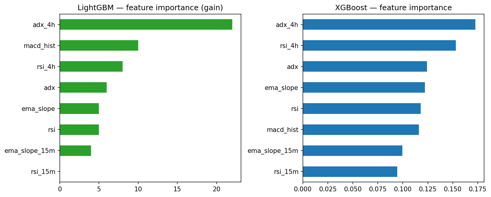
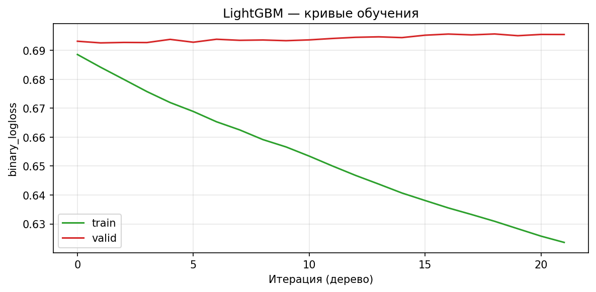
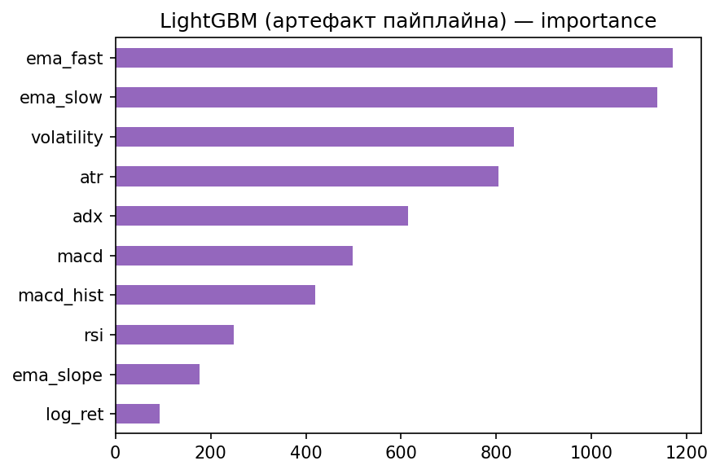
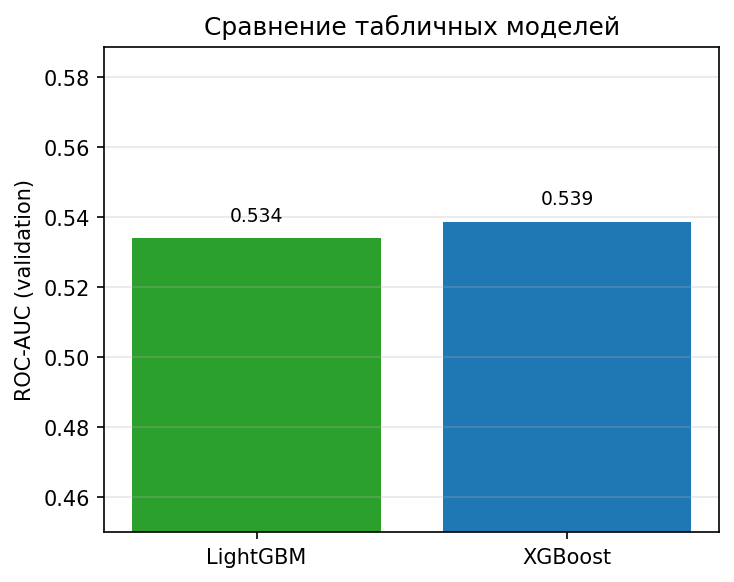
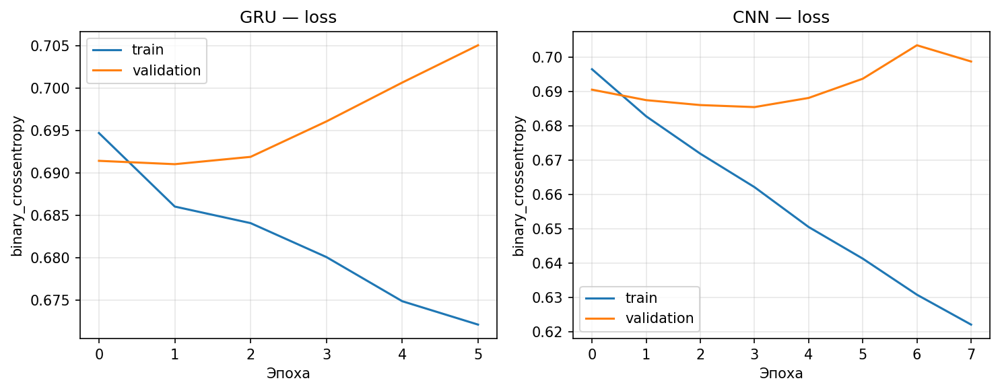
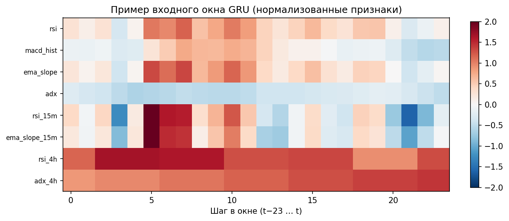
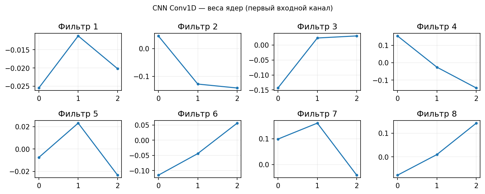

# 3.5 Реализация ансамбля моделей

В интеллектуальной торговой системе используется **четырёхкомпонентный ансамбль** предикторов: табличные модели (LightGBM, XGBoost) и модели последовательностей (GRU, CNN). Обучение и инференс всех моделей на каждом фолде walk-forward выполняет оркестратор; единая точка создания экземпляров — `orchestration/model_factory.py` (`build_orchestration_models`). Ниже — только особенности программной реализации; агрегирование прогнозов описано в п. 3.7.

## 3.5.1. Состав ансамбля и фабрика моделей

**Таблица 3.8 — Ключи моделей в конфигурации оркестратора**

| Ключ `model_keys` | Модуль | Класс | Тип входа |
|-------------------|--------|-------|-----------|
| `lgb` | `models/tabular/lightgbm_tabular_model.py` | `LightGBMTabularModel` | строка признаков |
| `xgb` | `models/mean_reversion/xgboost_model.py` | `XGBoostMeanReversionModel` | строка признаков |
| `gru` | `models/trend/gru_model.py` | `GRUTrendModel` | окно длины `feature_window_size` |
| `cnn` | `models/volatility/cnn_model.py` | `CNNVolatilityModel` | окно длины `feature_window_size` |

Список активных ключей задаётся в `OrchestratorConfig.model_keys` (профиль `config/profiles/canonical_4model.yaml`: `["lgb", "xgb", "gru", "cnn"]`). Фабрика подставляет один и тот же набор столбцов признаков: `infer_training_feature_columns()` отбрасывает сырой OHLCV и колонки с подстроками `meta_prob`, `signal`, `target`, `future_`, `order_book`, `obi`.

**Единый контракт для оркестратора:** `fit(df, y)` и `predict(df) -> np.ndarray` (вероятность класса 1). Для XGB/GRU/CNN используются адаптеры `_TrainCallableAdapter` и `_DLTrainAdapter`, приводящие методы `train` / `predict` к этому интерфейсу.

`TrainingOrchestrator.collect_predictions()` вызывает **все** модели на каждом баре и возвращает словарь `{model_key: p_i}` — в отличие от legacy-контура `InferenceEngine` + `ModelRouter`, где активна одна модель.

## 3.5.2. LightGBM и XGBoost

**LightGBM** (`LightGBMTabularModel`): бинарный `LGBMClassifier`, на выходе `predict_proba[:, 1]`. Признаки — `feature_cols`, задаются фабрикой до `fit`. Параметры по умолчанию в коде: `n_estimators=200`, `learning_rate=0.05`, `class_weight="balanced"`, `subsample` / `colsample_bytree` = 0,8.

**XGBoost** (`XGBoostMeanReversionModel`): `XGBClassifier`, также `predict_proba[:, 1]`. Метки mean-reversion могут строиться через `prepare_labels(..., safe_mode=True)` с вызовом `create_safe_mean_reversion_labels` из `utils/data_leakage_prevention.py` (без заглядывания в будущее при обучении в WFO).

На рис. 3.9–3.12 приведены диагностические графики табличного контура (важность признаков, кривые обучения LGB, сравнение LGB/XGB по артефактам прогона).

**Рисунок 3.9 — Важность признаков табличных моделей**

**Рисунок 3.10 — Кривые обучения LightGBM**

**Рисунок 3.11 — Важность признаков по сохранённому артефакту LGB**

**Рисунок 3.12 — Сравнение прогнозов LightGBM и XGBoost**

## 3.5.3. GRU (трендовая модель)

**GRUTrendModel** (`models/trend/gru_model.py`): Keras `Sequential` — два слоя GRU (64 и 32), `Dropout`, выход `Dense(1, sigmoid)`. Окно задаётся `window_size` (= `OrchestratorConfig.feature_window_size`, по умолчанию 24). Последовательности собираются в `prepare_sequences()`; метка привязана к бару `i + window_size`.

При обучении — `EarlyStopping` по validation split (хвост ряда, без перемешивания). TensorFlow подключается лениво; при отсутствии TF для ключей `gru`/`cnn` срабатывает проверка `orchestration/ml_deps.require_tensorflow`.

**Рисунок 3.13 — Кривые loss GRU и CNN при обучении**

**Рисунок 3.14 — Тепловая карта входного окна GRU (фрагмент)**

Текстовая сводка слоёв: `docs/figures/3_5/gru_model_summary.txt`.

## 3.5.4. CNN (волатильность / локальные паттерны)

**CNNVolatilityModel** (`models/volatility/cnn_model.py`): два `Conv1D` (64 и 32 фильтра, kernel 3), `MaxPooling1D`, `Flatten`, `Dense` + `Dropout` (0,4 по умолчанию). Подготовка окон и меток — аналогично GRU; метки breakout — `prepare_labels(..., safe_mode=True)` с модулем предотвращения утечки.

**Рисунок 3.15 — Веса свёрточного ядра CNN (первый Conv1D)**

Сводка архитектуры: `docs/figures/3_5/cnn_model_summary.txt`.

## 3.5.5. Связь с оркестратором и артефактами

На каждом фолде WFO `TrainingOrchestrator`:

1. обучает все модели из `build_orchestration_models()` на train с учётом purge/embargo;
2. получает `collect_predictions()` на test;
3. передаёт словарь вероятностей в `DynamicMetaWeighting` (п. 3.7).

Сохранение обученных моделей — через слой артефактов (`artifacts/<symbol>_<tf>/`, pickle для LGB/XGB и regime, веса Keras для GRU/CNN). Примеры вероятностей LGB: `docs/figures/3_5/lgb_prediction_sample.csv`, GRU: `gru_prediction_sample.csv`.

## 3.5.6. Выводы по разделу

Реализован согласованный ансамбль из четырёх предикторов с общим контрактом `fit` / `predict`, централизованной фабрикой и полным параллельным инференсом в оркестраторе. Табличные модели работают по строке признаков; GRU и CNN — по скользящему окну фиксированной длины. Диагностические рисунки (рис. 3.9–3.15) отражают обучение и интерпретируемость без дублирования математического описания ансамбля.
