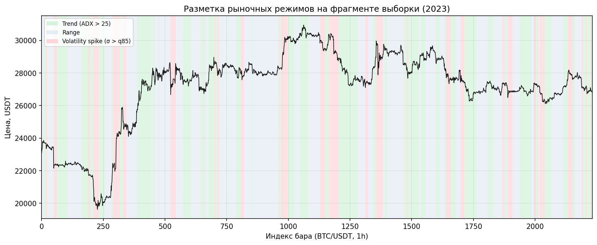
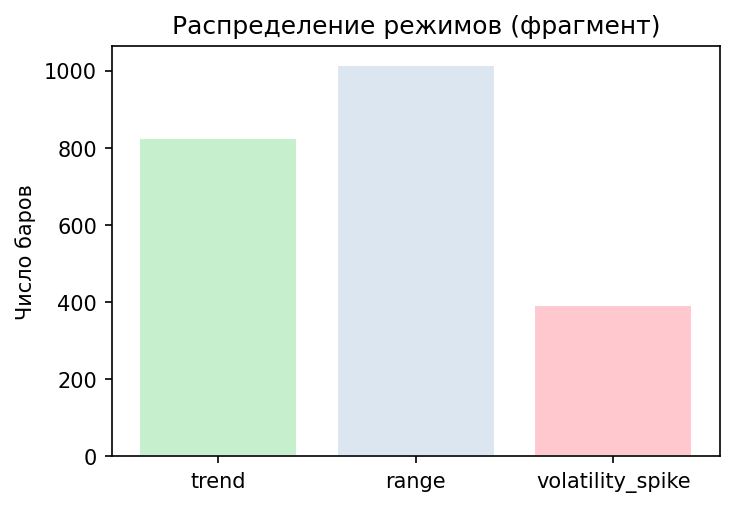

# 3.6 Реализация механизма определения рыночного режима

Механизм определения рыночного режима относит каждый бар \( t \) к одному из состояний рынка и на этой основе управляет весами ансамбля прогностических моделей (п. 3.5). Реализация сочетает **индикаторную базу** (ADX, ATR, реализованная волатильность) с **классификатором режима** на градиентном бустинге и **пороговой логикой** агрегирования. Результат режимной разметки передаётся в подсистему режимно-адаптивного мета-взвешивания (`DynamicMetaWeighting`).

## 3.6.1. Типология рыночных режимов

В ИТС выделены три режима, релевантные управлению ансамблем и фильтрации сигналов.

**Таблица 3.17 — Классификация рыночных режимов**

| Regime | Обозначение в системе | Описание |
|--------|----------------------|----------|
| Trend | `trend` | Устойчивое направленное движение; повышенная сила тренда по ADX; доминируют последовательные модели (GRU, CNN) |
| Range | `range` | Боковое движение (флэт); слабая направленность; доминируют табличные модели (LightGBM, XGBoost) |
| Volatility spike | `high_vol` / `volatility_spike` | Эпизод повышенной реализованной волатильности; усиленный риск-контроль и специализация CNN |

Дополнительно в конфигурации оркестратора зарезервирован режим `breakout` с равномерными весами моделей; в каноническом профиле эксперимента используется пара **trend / range** с поперечной оценкой волатильности.

## 3.6.2. Индикаторная база и формулы

Режимная классификация опирается на показатели, вычисляемые на этапе инженерии признаков (п. 3.3).

### Average Directional Index (ADX)

Истинный диапазон и направленные движения:

\[
\mathrm{TR}_t = \max\bigl( H_t - L_t,\; |H_t - C_{t-1}|,\; |L_t - C_{t-1}| \bigr),
\]

\[
+DM_t,\;-DM_t \;\Rightarrow\; +DI_t,\;-DI_t,\qquad
\mathrm{DX}_t = 100 \cdot \frac{\bigl|+DI_t - -DI_t\bigr|}{+DI_t + -DI_t},
\]

\[
\mathrm{ADX}_t = \mathrm{EWM}(\mathrm{DX}, \alpha), \quad \alpha = \frac{1}{14}.
\]

Интерпретация: \(\mathrm{ADX}_t > 25\) — выраженный тренд; \(\mathrm{ADX}_t \leq 25\) — слабая направленность (боковик).

### Average True Range (ATR)

\[
\mathrm{ATR}_t = \mathrm{EWM}(\mathrm{TR}, \alpha), \quad \alpha = \frac{1}{14}.
\]

ATR характеризует абсолютную амплитуду колебаний и используется в признаковом векторе детектора режимов совместно с нормированной волатильностью.

### Реализованная волатильность (volatility)

Логарифмическая доходность и скользящее стандартное отклонение:

\[
r_t = \ln\frac{C_t}{C_{t-1}}, \qquad
\hat{\sigma}_t = \mathrm{std}\bigl(r_{t-W+1}, \ldots, r_t\bigr) \cdot \sqrt{24}, \quad W = 20.
\]

Режим **volatility spike** фиксируется, когда \(\hat{\sigma}_t\) превышает высокий квантиль своего скользящего распределения (см. п. 3.6.4).

**Таблица 3.18 — Использование индикаторов в режимном модуле**

| Индикатор | Роль в классификации |
|-----------|----------------------|
| ADX | Разделение trend / range (пороговая и ML-логика) |
| ATR | Масштаб движения; входной признак `RegimeDetector` |
| volatility | Детекция всплеска волатильности; фильтр риска |
| ema_slope | Направление краткосрочного тренда; признак ML-модели |

## 3.6.3. Логический конвейер (logic pipeline)

Обработка на каждом баре организована в три последовательных этапа.

**Рисунок 3.19 — Конвейер определения режима и управления ансамблем**

```
Индикаторы (ADX, ATR, volatility, ema_slope, …)
              │
              ▼
    Классификация режима
    (RegimeDetector + пороги)
              │
              ▼
    Управление ансамблем
    (DynamicMetaWeighting)
```


На этапе **классификации** формируется бинарная метка `regime_pred` (1 — трендоподобное состояние, 0 — флэт) и вспомогательная метка волатильности. На этапе **управления ансамблем** вектор весов \( w_k(r_t) \) выбирается из табл. 3.16 (п. 3.5.6) в зависимости от \( r_t \).

Класс `RegimeDetector` (`models/regime/regime_detector.py`) обучается на признаках `['adx', 'ema_slope', 'volatility', 'atr']` предсказывать эпизоды сильного движения; метки строятся по превышению абсолютной доходности над скользящим порогом. На инференсе применяется каузальная оценка по всей доступной истории до бара \( t \).

## 3.6.4. Пороговая логика

Помимо ML-классификатора, в системе зафиксирована **эксплицитная пороговая логика**, обеспечивающая интерпретируемость и согласованность с классической теханализом.

**Таблица 3.19 — Пороговые условия назначения режима**

| Условие | Назначаемый режим |
|---------|-------------------|
| \(\mathrm{ADX}_t > 25\) и нет всплеска \(\hat{\sigma}_t\) | Trend |
| \(\mathrm{ADX}_t \leq 25\) и нет всплеска \(\hat{\sigma}_t\) | Range |
| \(\hat{\sigma}_t > Q_{0{,}85}(\hat{\sigma}_{t-100:t})\) | Volatility spike |
| \(P_{\mathrm{strong}}(t) > 0{,}6\) (выход `RegimeDetector`) | Trend (ML-контур) |
| \(P_{\mathrm{strong}}(t) \leq 0{,}6\) | Range (ML-контур) |
| \(\hat{\sigma}_t > Q_{0{,}7}(\hat{\sigma}_{t-100:t})\) | `high_vol` (риск-контур) |

Здесь \(P_{\mathrm{strong}}(t)\) — вероятность класса «сильное движение» по LightGBM; \(Q_p\) — эмпирический квантиль на скользящем окне 100 баров. Приоритет условия волатильности при визуализации и риск-фильтрации выше, чем у ADX-правила, что отражает необходимость снижения экспозиции в турбулентные периоды.

**Таблица 3.20 — Сводка порогов реализации `get_regime_info`**

| Параметр | Значение | Назначение |
|----------|----------|------------|
| Порог \(P_{\mathrm{strong}}\) | 0,60 | trend vs range |
| Квантиль волатильности | 0,70 (окно 100) | high_vol vs low_vol |
| ADX (правило визуализации) | 25 | trend vs range на рис. 3.20 |
| Квантиль всплеска (визуализация) | 0,85 | volatility spike |

## 3.6.5. Графическая разметка режимов

На рис. 3.20 представлен фрагмент ряда BTC/USDT (1h) с наложением цветовой разметки режимов на график цены закрытия. Зелёная зона соответствует тренду (ADX > 25), синяя — боковику, красная — всплеску волатильности.



Распределение режимов на том же фрагменте приведено на рис. 3.21. Доля боковика преобладает, что типично для часовых баров BTC вне фаз импульсного тренда.



Визуальная разметка подтверждает согласованность пороговой логики с динамикой цены: продолжительные монотонные участки сопровождаются меткой Trend, консолидации — Range, резкие расширения диапазона — Volatility spike.

## 3.6.6. Связь с управлением ансамблем

Выход режимного модуля — структура `regime_info`:

- `market_regime` ∈ {`trend`, `range`};
- `volatility_regime` ∈ {`high_vol`, `low_vol`};
- `regime_pred` — массив меток по барам;
- `strong_movement_prob` — вероятность сильного движения.

Модуль `DynamicMetaWeighting` преобразует `regime_pred` в матрицу весов \( w_{k,t} \): при \( r_t = \mathrm{trend} \) усиливаются GRU и CNN; при \( r_t = \mathrm{range} \) — LightGBM и XGBoost. Роутер моделей (`ModelRouter`) допускает жёсткую маршрутизацию к специализированному предиктору; в каноническом контуре применяется **мягкое** взвешивание всех четырёх моделей.

## 3.6.7. Выводы по разделу

Реализованный механизм определения рыночного режима обеспечивает: (1) формализованную типологию Trend / Range / Volatility spike; (2) опору на стандартные индикаторы ADX, ATR и реализованную волатильность; (3) воспроизводимый конвейер «индикаторы → классификация → управление ансамблем»; (4) пороговую и ML-составляющую с каузальным инференсом; (5) наглядную разметку режимов на исторических данных. Данный модуль замыкает связь между признаковым пространством (п. 3.3), ансамблем моделей (п. 3.5) и последующим конвейером торговых решений.
