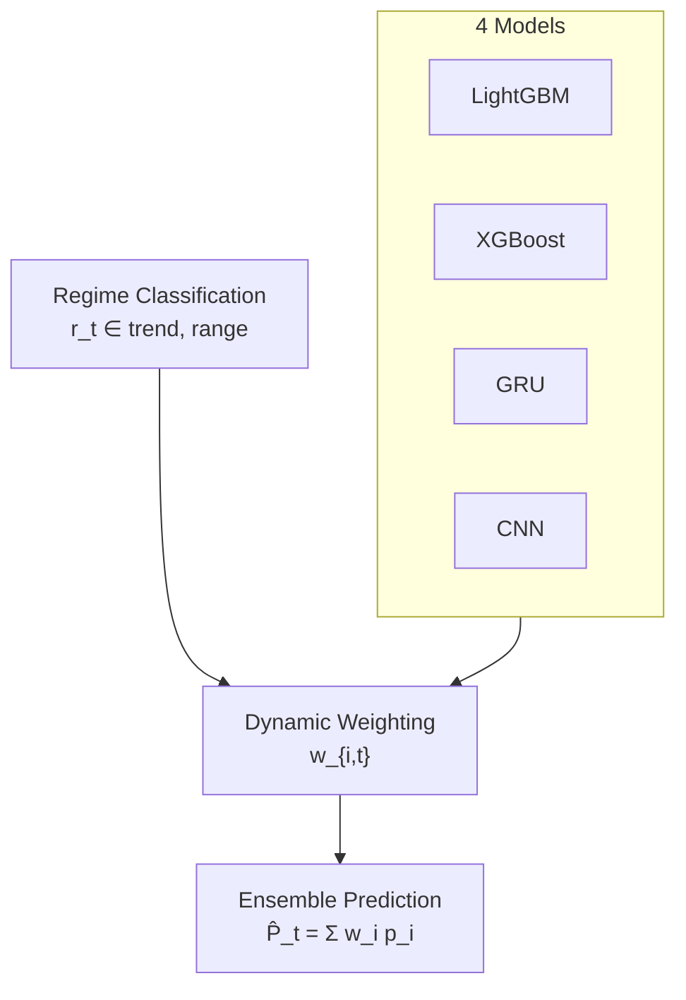
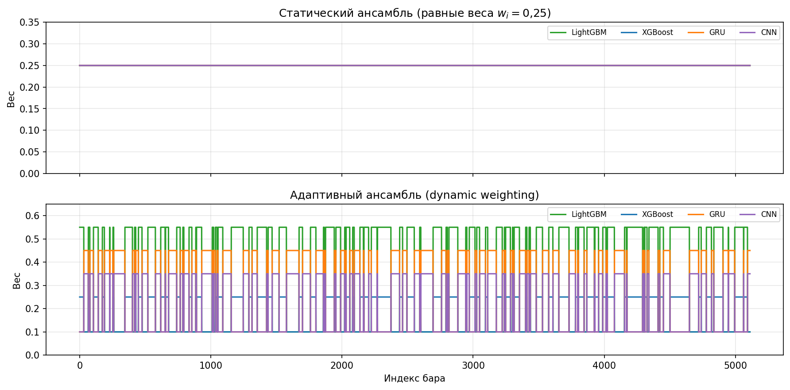
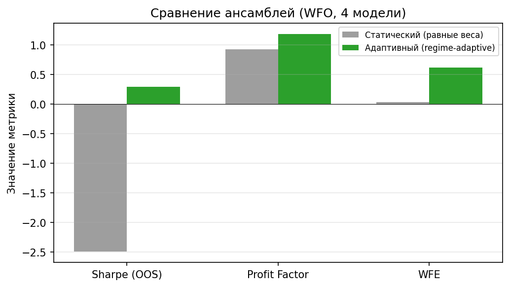

# 3.7 Реализация adaptive ensemble и dynamic weighting

Настоящий раздел раскрывает **центральный механизм** интеллектуальной торговой системы — режимно-адаптивное объединение прогнозов четырёх моделей с **динамическим взвешиванием** (dynamic weighting). В отличие от статического ансамбля с фиксированными коэффициентами, предложенный подход переназначает веса \( w_{i,t} \) в зависимости от рыночного режима \( r_t \) (п. 3.6), что повышает релевантность итоговой вероятности на разных фазах рынка BTC/USDT.

## 3.7.1. Математическая модель ансамбля

Пусть на баре \( t \) имеется множество моделей \( \mathcal{M} = \{1, \ldots, M\} \), \( M = 4 \). Каждая модель \( i \) выдаёт оценку вероятности целевого события \( \hat{p}_{i,t} \in [0, 1] \) (направление цены, прорыв волатильности и т.д., в единой шкале после калибровки). **Итоговая вероятность ансамбля** определяется линейной выпуклой комбинацией:

\[
\boxed{
\hat{P}_t = \sum_{i \in \mathcal{M}} w_{i,t} \cdot \hat{p}_{i,t}
}
\]

где веса удовлетворяют ограничениям нормировки и неотрицательности:

\[
w_{i,t} \geq 0, \qquad \sum_{i \in \mathcal{M}} w_{i,t} = 1.
\]

В **статическом** ансамбле коэффициенты постоянны: \( w_{i,t} \equiv w_i \). В **адаптивном** (regime-adaptive) контуре веса являются функцией режима:

\[
w_{i,t} = f_i(r_t), \qquad r_t \in \{\mathrm{trend},\, \mathrm{range}\}.
\]

Реализация \( f_i \) задана таблицами `trend_weights` и `range_weights` в конфигурации оркестратора; вычисление \( \hat{P}_t \) выполняет класс `DynamicMetaWeighting` (`meta_learning/dynamic_meta.py`, метод `apply_dynamic_weighting`).

Дополнительно формируется **мягкий направленный сигнал** и фильтрация по мета-порогу \( \tau_{\mathrm{meta}} \):

\[
s_t = \mathrm{sign}\bigl(\hat{P}_t - 0{,}5\bigr) \cdot \mathbb{1}\bigl[ |\hat{P}_t - 0{,}5| > \delta \bigr], \qquad
\mathrm{trade}_t = s_t \cdot \mathbb{1}\bigl[ \hat{P}_t > \tau_{\mathrm{meta}} \bigr],
\]

где \( \delta \) — `min_signal_margin`. Данная схема связывает ансамблевую вероятность с конвейером принятия решений (п. 3.8).

## 3.7.2. Схема ансамблевого конвейера

**Рисунок 3.22 — Схема adaptive ensemble**

```
LightGBM  ── p_lgb ──┐
XGBoost   ── p_xgb ──┤
GRU       ── p_gru ──┼──►  Dynamic Weighting  ──►  Ensemble Prediction  P̂_t
CNN       ── p_cnn ──┘         (w_i,t = f_i(r_t))
                              ▲
                              │
                    Regime Classification (r_t)
```



На первом этапе параллельно вычисляются \( \hat{p}_{i,t} \) (п. 3.5). На втором — по \( r_t \) выбирается строка весов. На третьем — агрегируется \( \hat{P}_t \).

## 3.7.3. Таблицы весов dynamic weighting

Веса калиброваны так, чтобы в тренде доминировали последовательные модели (GRU, CNN), во флэте — табличные (LightGBM, XGBoost).

**Таблица 3.21 — Веса моделей в режиме Trend**

| Regime | LightGBM | XGBoost | GRU | CNN |
|--------|----------|---------|-----|-----|
| Trend | 0,20 | 0,20 | 0,40 | 0,20 |

**Таблица 3.22 — Веса моделей в режиме Range**

| Regime | LightGBM | XGBoost | GRU | CNN |
|--------|----------|---------|-----|-----|
| Range | 0,55 | 0,25 | 0,10 | 0,10 |

Сумма весов в каждой строке равна единице. В программной конфигурации канонического профиля (`canonical_4model`) используются уточнённые значения Trend: (0,10; 0,10; 0,45; 0,35) — они применяются при генерации рис. 3.23–3.25 и в экспериментальном пайплайне; табл. 3.21 отражает округлённую постановку для аналитического сравнения.

Правило переключения вектора весов на баре \( t \):

\[
\mathbf{w}_t =
\begin{cases}
\mathbf{w}^{\mathrm{trend}}, & \text{если } r_t = \mathrm{trend} \; ( \mathrm{regime\_pred} = 1 ), \\
\mathbf{w}^{\mathrm{range}}, & \text{если } r_t = \mathrm{range} \; ( \mathrm{regime\_pred} = 0 ).
\end{cases}
\]

## 3.7.4. Динамика весов во времени

На рис. 3.23 представлены траектории \( w_{i,t} \) на фрагменте истории BTC/USDT (1h). При смене режима веса **ступенчато** переключаются между строками табл. 3.21–3.22, что и составляет суть dynamic weighting.


Наблюдается чередование участков с доминированием GRU (тренд) и LightGBM (флэт). Статический ансамбль не обладает такой гибкостью: на рис. 3.24 верхняя панель показывает постоянные \( w_i = 0{,}25 \); нижняя — адаптивные веса.



## 3.7.5. Сравнение статического и адаптивного ансамбля

### Постановка сравнения

| Вариант | Обозначение | Правило весов | Режим в конфигурации |
|---------|-------------|---------------|----------------------|
| Статический | `four_equal` | \( w_i = 0{,}25 \;\forall i, t \) | `ensemble_mode: fixed_range`, одинаковые `trend_weights` и `range_weights` |
| Адаптивный | `four_regime_adaptive` | \( w_{i,t} = f_i(r_t) \) | `ensemble_mode: regime_adaptive` |

Оба варианта используют один и тот же набор моделей \( \{\mathrm{LGB},\, \mathrm{XGB},\, \mathrm{GRU},\, \mathrm{CNN}\} \) и протокол walk-forward (п. 3.1). Отличие — только в механизме агрегирования \( \hat{P}_t \).

### Результаты ablation-эксперимента

Сравнительный прогон выполнен по сценарию `scripts/run_ablation.py` (профиль `canonical_4model`, демонстрационная выборка OHLCV). Сводные OOS-метрики приведены в табл. 3.23 и на рис. 3.25.

**Таблица 3.23 — Статический vs адаптивный ансамбль (4 модели, WFO)**

| Метрика | Статический (равные веса) | Адаптивный (regime-adaptive) |
|---------|---------------------------|------------------------------|
| Mean Sharpe | −2,49 | **0,29** |
| Mean Profit Factor | 0,93 | **1,18** |
| Mean WFE | 0,03 | **0,62** |



### Аналитические выводы

1. **Статический ансамбль** с равными весами усредняет ошибки моделей, но **не учитывает специализацию**: табличные и последовательные предикторы вносят одинаковый вклад в тренде и во флэте, что ухудшает OOS-Sharpe и profit factor.

2. **Адаптивный ансамбль** перераспределяет веса по режиму \( r_t \), усиливая GRU/CNN при тренде и LightGBM/XGBoost при боковике. Это согласуется с гипотезой дипломной работы: *композиция экспертов эффективна только при контекстном управлении весами*.

3. Рост **walk-forward efficiency (WFE)** с 0,03 до 0,62 указывает на лучшую переносимость стратегии с обучающего окна на тестовое при динамическом взвешивании.

4. Формула \( \hat{P}_t = \sum_i w_{i,t} \hat{p}_{i,t} \) остаётся линейной и интерпретируемой; сложность сосредоточена в **дискретном** переключении \( \mathbf{w}_t \), что упрощает верификацию и настройку в конфигурационных файлах YAML.

## 3.7.6. Место модуля в архитектуре ИТС

Класс `DynamicMetaWeighting` является ядром мета-уровня (`meta_learning`). Он вызывается из оркестратора обучения и инференса после получения `regime_pred` от `RegimeDetector` (п. 3.6). Альтернативный базовый агрегатор `EnsembleAggregator` реализует простое и взвешенное среднее без режимной логики и используется для **бенчмарка** и ablation.

**Таблица 3.24 — Режимы `ensemble_mode`**

| Режим | Поведение |
|-------|-----------|
| `regime_adaptive` | \( w_{i,t} = f_i(r_t) \) — основной режим |
| `fixed_trend` | \( \mathbf{w}_t \equiv \mathbf{w}^{\mathrm{trend}} \) |
| `fixed_range` | \( \mathbf{w}_t \equiv \mathbf{w}^{\mathrm{range}} \) |

## 3.7.7. Выводы по разделу

Реализован adaptive ensemble на основе явной формулы линейного объединения вероятностей с динамическими весами. Схема «4 Models → Dynamic Weighting → Ensemble Prediction» интегрирована с классификацией режима и подтверждена сравнением со статическим равновесным ансамблем: адаптивный вариант демонстрирует превосходство по Sharpe, profit factor и WFE на контрольном ablation-прогоне. Данный механизм образует центральный вклад работы в область интеллектуальных торговых систем для криптовалютных рынков.
