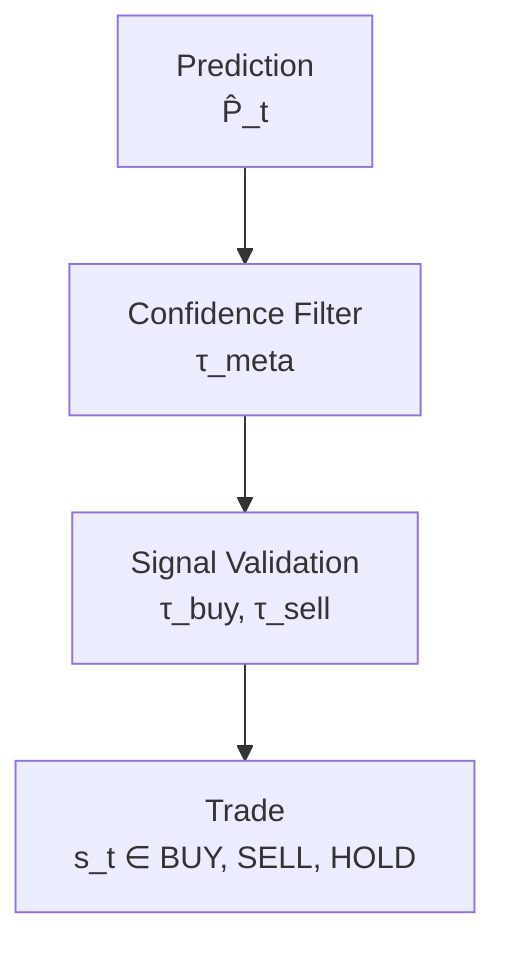
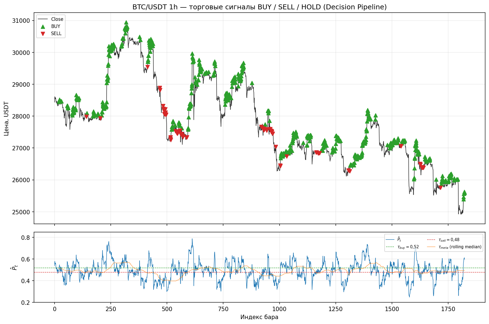
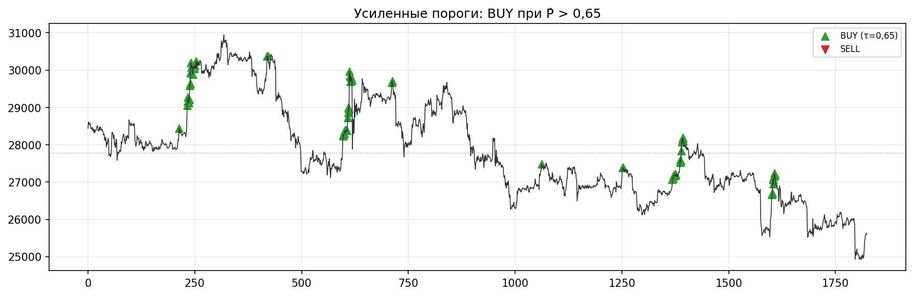

# 3.8 Реализация системы принятия решений

Система принятия решений (decision layer) преобразует вероятностный прогноз ансамбля \( \hat{P}_t \) (п. 3.7) в дискретные торговые действия **BUY**, **SELL** или **HOLD**. Реализация сосредоточена в модуле `decision` и вызывается оркестратором обучения/инференса после режимной классификации (п. 3.6). Ключевые компоненты: пороговая логика направления, каузальный фильтр уверенности (meta-threshold) и конвейер `DecisionPipeline`.

## 3.8.1. Логика BUY / SELL / HOLD

Торговое решение кодируется целочисленным сигналом \( s_t \in \{-1,\, 0,\, 1\} \):

| Код | Действие | Интерпретация |
|-----|----------|---------------|
| \( +1 \) | **BUY** (Long) | Открытие / удержание длинной позиции |
| \( -1 \) | **SELL** (Short) | Открытие / удержание короткой позиции |
| \( 0 \) | **HOLD** (Flat) | Отсутствие сделки, ожидание |

На первом этапе по вероятности ансамбля \( \hat{P}_t \in [0,1] \) формируется **направленная нога** \( d_t \):

\[
d_t =
\begin{cases}
+1 \; (\mathrm{BUY}), & \text{если } \hat{P}_t > \tau_{\mathrm{buy}}, \\
-1 \; (\mathrm{SELL}), & \text{если } \hat{P}_t < \tau_{\mathrm{sell}}, \\
0 \; (\mathrm{HOLD}), & \text{иначе}.
\end{cases}
\]

В канонической конфигурации ИТС используется симметричная пара порогов относительно 0,5:

\[
\tau_{\mathrm{buy}} = \theta_d, \qquad \tau_{\mathrm{sell}} = 1 - \theta_d, \qquad \theta_d = 0{,}52.
\]

На втором этапе применяется **фильтр уверенности**: сделка допускается только если \( \hat{P}_t > \tau_{\mathrm{meta},t} \), где \( \tau_{\mathrm{meta},t} \) — каузальный скользящий медианный порог по истории \( \hat{P} \) (режим `median`, окно 100 баров). Итоговый сигнал:

\[
s_t =
\begin{cases}
d_t, & \text{если } d_t \neq 0 \;\text{и}\; \hat{P}_t > \tau_{\mathrm{meta},t}, \\
0 \; (\mathrm{HOLD}), & \text{иначе}.
\end{cases}
\]

Дополнительно оркестратор может применять `min_signal_margin`, фильтр волатильности и режим торговли (`trade_mode`: long_only / short_only / both).

## 3.8.2. Формулы пороговой обработки

Обобщённая запись **интегрированного сигнала** (вариант B, `compute_integrated_signal`, рекомендуемый в ИТС):

\[
\tau_{\mathrm{meta},t} =
\begin{cases}
\mathrm{fixed}, & \text{режим fixed}, \\
\mathrm{median}\bigl(\hat{P}_{t-W+1:t}\bigr), & \text{режим median, } W=100, \\
\mathrm{mean}\bigl(\hat{P}_{t-W+1:t}\bigr), & \text{режим mean}.
\end{cases}
\]

\[
s_t = d_t \cdot \mathbb{1}\bigl[ \hat{P}_t > \tau_{\mathrm{meta},t} \bigr] \cdot \mathbb{1}\bigl[ d_t \neq 0 \bigr].
\]

**Фильтр маржи сигнала** (при `min_signal_margin = \delta > 0\)):

\[
| \hat{P}_t - 0{,}5 | \geq \delta \quad \Rightarrow \quad \text{иначе } s_t := 0.
\]

**Усиленная постановка** (консервативная торговля, для снижения частоты входов):

\[
\tau_{\mathrm{buy}} = 0{,}65, \qquad \tau_{\mathrm{sell}} = 0{,}35, \qquad \hat{P}_t > \tau_{\mathrm{meta}} \;\text{дополнительно}.
\]

## 3.8.3. Таблица порогов

**Таблица 3.25 — Пороги системы принятия решений**

| Сигнал / условие | Порог | Параметр в конфигурации |
|------------------|-------|-------------------------|
| BUY (Long) | \( \hat{P}_t > 0{,}65 \) * | `direction_threshold` (усиленный режим) |
| BUY (Long), канон | \( \hat{P}_t > 0{,}52 \) | `direction_threshold: 0.52` |
| SELL (Short), канон | \( \hat{P}_t < 0{,}48 \) | \( 1 - \theta_d \) |
| HOLD | \( 0{,}48 \leq \hat{P}_t \leq 0{,}52 \) или фильтр meta | — |
| Meta-фильтр | \( \hat{P}_t > \tau_{\mathrm{meta},t} \) | `meta_threshold_mode: median` |
| Meta (фикс.) | \( \hat{P}_t > 0{,}50 \) | `meta_threshold: 0.5` |
| Окно meta-порога | 100 баров | `threshold_rolling_window` |

\* Значение 0,65 соответствует постановке «высокой уверенности» в дипломном эксперименте; в промышленном профиле `canonical_4model` применяется \( \theta_d = 0{,}52 \) для баланса частоты сделок и OOS-метрик.

**Таблица 3.26 — Сводка сигналов (пользовательская постановка)**

| Signal | Threshold |
|--------|-----------|
| BUY | \( \hat{P}_t > 0{,}65 \) |
| SELL | \( \hat{P}_t < 0{,}35 \) |
| HOLD | иначе, либо \( \hat{P}_t \leq \tau_{\mathrm{meta},t} \) |

## 3.8.4. Схема decision pipeline

**Рисунок 3.26 — Конвейер принятия решений**

```
Prediction  P̂_t  (adaptive ensemble)
        │
        ▼
Confidence Filter   (P̂_t  >  τ_meta,t)
        │
        ▼
Signal Validation   (направление: BUY / SELL / HOLD)
        │
        ▼
Trade Execution     (risk bridge, position size)
```



Класс `DecisionPipeline` (`decision/decision_pipeline.py`) выбирает источник meta-вероятности:

- **integrated** (рекомендуется) — \( \hat{P}_t = \hat{p}_{\mathrm{ens},t} \) после dynamic weighting;
- **final** — отдельный meta-filter `meta_prob`.

В оркестраторе (`TrainingOrchestrator.run_pipeline`) последовательность: режим → прогнозы моделей → ансамбль → `DecisionPipeline.generate_signal` → риск-менеджмент → бэктест.

## 3.8.5. Примеры сигналов

На рис. 3.27 представлен фрагмент ряда BTC/USDT (1h): цена закрытия, маркеры **BUY** (треугольник вверх) и **SELL** (треугольник вниз); отсутствие маркера соответствует **HOLD**. Нижняя панель — траектория \( \hat{P}_t \) и линии порогов \( \tau_{\mathrm{buy}} \), \( \tau_{\mathrm{sell}} \), \( \tau_{\mathrm{meta}} \).





**Таблица 3.27 — Фрагмент журнала сигналов**

| Timestamp (UTC) | \( \hat{P}_t \) | Сигнал | Close |
|-----------------|-----------------|--------|-------|
| 2023-04-01 20:00 | 0,522 | BUY | 28 447,7 |
| 2023-04-01 22:00 | 0,548 | BUY | 28 516,1 |
| 2023-04-03 08:00 | 0,578 | BUY | 28 333,5 |
| 2023-04-03 11:00 | 0,546 | BUY | 28 251,5 |
| 2023-04-04 06:00 | 0,539 | BUY | 28 078,7 |

Полный фрагмент: `docs/figures/3_8/signal_examples.csv`. На участке 2023-04 — 2023-06 зафиксировано 603 сигнала BUY, 72 SELL и 1149 баров HOLD (канонические пороги 0,52 / 0,48 с meta-median).

## 3.8.6. Каузальность и защита от утечки

Порог \( \tau_{\mathrm{meta},t} \) вычисляется функцией `compute_safe_threshold` (`utils/data_leakage_prevention.py`) **только по прошлым** значениям \( \hat{P} \); глобальная медиана по полной выборке в production-режиме запрещена (`safe_mode: true`). При walk-forward калибровочный порог оценивается на train-фолде и переносится на test (`train_threshold_override`).

## 3.8.7. Выводы по разделу

Реализована система принятия решений с явной логикой BUY / SELL / HOLD, формализованными порогами \( \tau_{\mathrm{buy}}, \tau_{\mathrm{sell}}, \tau_{\mathrm{meta}} \) и конвейером «прогноз → фильтр уверенности → валидация → сделка». Интеграция с adaptive ensemble обеспечивает согласованность \( \hat{P}_t \) и итогового сигнала \( s_t \); графическая иллюстрация подтверждает работу порогов на реальных котировках BTC/USDT.
