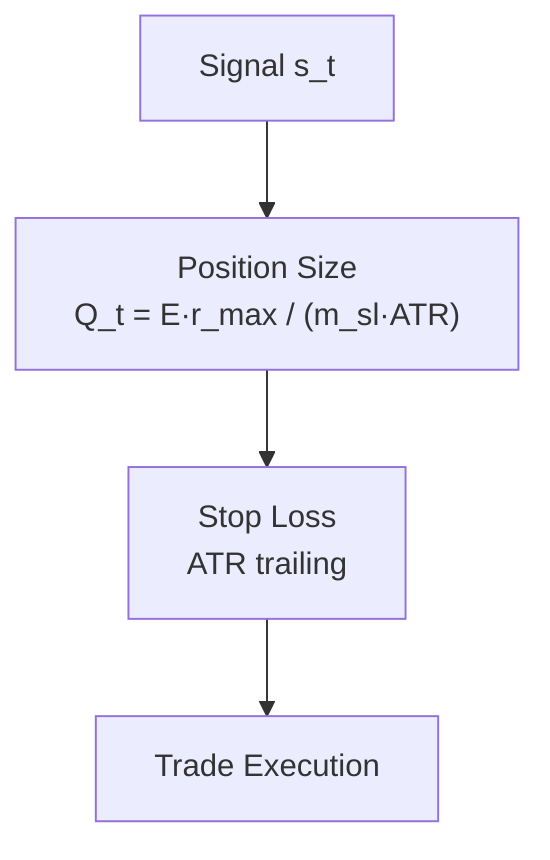

# 3.9 Реализация подсистемы управления рисками

Подсистема управления рисками (risk management) ограничивает капитальную экспозицию на сделку, задаёт уровни защитного стоп-лосса на основе Average True Range (ATR) и формирует масштаб позиции для передачи в модуль исполнения и бэктестинга. Реализация сосредоточена в пакете `risk_management` и интегрирована с оркестратором через `OrchestratorRiskBridge`.

## 3.9.1. ATR stop-loss и trailing stop

### Начальный стоп-лосс (для расчёта размера позиции)

Расстояние до стоп-лосса в ценовых единицах задаётся как кратное ATR:

\[
D^{\mathrm{stop}}_t = m_{\mathrm{sl}} \cdot \mathrm{ATR}_t,
\]

где \( m_{\mathrm{sl}} = 2{,}0 \) — параметр `atr_stop_multiplier` (по умолчанию в `PositionSizer`).

Для длинной позиции уровень начального стопа:

\[
S^{\mathrm{init}}_{t,\mathrm{long}} = C_t - D^{\mathrm{stop}}_t.
\]

Для короткой позиции:

\[
S^{\mathrm{init}}_{t,\mathrm{short}} = C_t + D^{\mathrm{stop}}_t.
\]

### Trailing stop (сопровождающий стоп)

После входа в позицию применяется **ATR trailing stop** с множителем \( m_{\mathrm{tr}} = 3{,}0 \) (`atr_mult`). Для long:

\[
S^{\mathrm{trail}}_t = \max\bigl( S^{\mathrm{trail}}_{t-1},\; C_t - m_{\mathrm{tr}} \cdot \mathrm{ATR}_t \bigr).
\]

Условие принудительного выхода (long):

\[
C_t < S^{\mathrm{trail}}_t \quad \Rightarrow \quad \mathrm{exit\_signal}_t = 1.
\]

Для short симметрично:

\[
S^{\mathrm{trail}}_t = \min\bigl( S^{\mathrm{trail}}_{t-1},\; C_t + m_{\mathrm{tr}} \cdot \mathrm{ATR}_t \bigr), \qquad
C_t > S^{\mathrm{trail}}_t \quad \Rightarrow \quad \mathrm{exit}.
\]

Комбинированный торговый сигнал после учёта выхода:

\[
s^{\mathrm{comb}}_t =
\begin{cases}
0, & \text{если } \mathrm{exit\_signal}_t = 1, \\
s_t, & \text{иначе}.
\end{cases}
\]

Реализация: `apply_atr_trailing_stop`, класс `ATRTrailingStop` (`risk_management/atr_trailing_stop.py`).

## 3.9.2. Формула position sizing

Размер позиции определяется из **фиксированной доли риска на сделку** и дистанции до ATR-стопа (метод фиксированного процентного риска).

Сумма риска в валюте счёта:

\[
R_t = E \cdot r_{\max},
\]

где \( E \) — капитал (`account_size`), \( r_{\max} \) — максимальный риск на сделку (`risk_per_trade`).

Размер позиции в единицах актива (без знака):

\[
Q_t = \frac{R_t}{D^{\mathrm{stop}}_t} = \frac{E \cdot r_{\max}}{m_{\mathrm{sl}} \cdot \mathrm{ATR}_t}.
\]

С учётом направления сигнала \( s_t \in \{-1,0,1\} \):

\[
Q^{\mathrm{final}}_t = Q_t \cdot |s_t|.
\]

Доля капитала, направляемая в позицию (для бэктестера):

\[
f_t = \min\left( f_{\max},\; \frac{Q^{\mathrm{final}}_t \cdot C_t}{E} \right),
\]

где \( f_{\max} = \) `max_position_fraction` (по умолчанию 1,0). Класс `OrchestratorRiskBridge` возвращает вектор \( f_t \) оркестратору.

## 3.9.3. Схема риск-контура

**Рисунок 3.29 — Схема подсистемы управления рисками**

```
Signal  s_t
    │
    ▼
Position Size   Q_t  (ATR + r_max)
    │
    ▼
Stop Loss       S^trail_t  (ATR trailing)
    │
    ▼
Trade Execution  (Backtester / execution)
```



Полный порядок в `RiskPipeline.apply_pipeline`:

1. ATR trailing stop → `trailing_stop`, `exit_signal`, `combined_signal`;
2. Position sizing → `pos_size`, `final_pos_size`;
3. (опционально) RL overlay → `risk_multiplier` на доходность.

## 3.9.4. Параметры риска

**Таблица 3.28 — Параметры подсистемы управления рисками**

| Parameter | Значение | Назначение |
|-----------|----------|------------|
| `max_risk` (`risk_per_trade`) | **2%** (0,02) | Максимальная доля капитала, рискуемая в одной сделке |
| `account_size` | 10 000 USDT | Номинальный размер счёта |
| `atr_stop_multiplier` \( m_{\mathrm{sl}} \) | 2,0 | Множитель ATR для начального стопа в sizing |
| `atr_mult` \( m_{\mathrm{tr}} \) | 3,0 | Множитель ATR для trailing stop |
| `max_position_fraction` | 1,0 | Верхняя граница доли капитала в позиции |
| `trailing_stop.enabled` | true | Включение сопровождающего стопа |

В базовой конфигурации модуля по умолчанию `risk_per_trade = 0{,}01` (1%); для дипломного эксперимента с `max_risk = 2\%` параметр задаётся в YAML секции `risk_management.position_sizer`.

Пример конфигурации:

```yaml
risk_management:
  position_sizer:
    risk_per_trade: 0.02
    account_size: 10000
    atr_stop_multiplier: 2.0
  trailing_stop:
    enabled: true
    atr_mult: 3.0
```

## 3.9.5. График просадки (drawdown)

На рис. 3.30 представлены нормализованная кривая капитала стратегии с применением risk pipeline (ATR sizing, \( r_{\max} = 2\% \), trailing stop) и соответствующая **просадка** (drawdown):

\[
\mathrm{DD}_t = \frac{E_t - \max_{\tau \leq t} E_\tau}{\max_{\tau \leq t} E_\tau},
\]

где \( E_t \) — кумулятивная equity относительно начального капитала.


На фрагменте BTC/USDT 1h (2022-08 — 2024-01) максимальная просадка составила порядка **2,8%**, что согласуется с ограничением `max_risk` и критериями приёмки бэктеста (`max_drawdown_pct` не ниже −35% в конфигурации acceptance).


## 3.9.6. Интеграция с оркестратором и бэктестингом

`TrainingOrchestrator` при `use_risk_bridge: true` вызывает `OrchestratorRiskBridge.calculate_position_sizes`, передавая итоговые доли \( f_t \) в `Backtester.run(..., position_size=...)`. Комиссия и проскальзывание задаются в `backtesting.simulation` (0,06% / 0,02%). Метрики просадки и recovery factor рассчитываются в `performance_metrics.py` и используются в критериях приёмки (п. 3.1).

## 3.9.7. Выводы по разделу

Реализована подсистема управления рисками с явными формулами ATR stop-loss, position sizing от `max_risk` и конвейером «сигнал → размер → стоп → исполнение». График drawdown подтверждает ограничение потерь на историческом фрагменте; параметры риска вынесены в конфигурацию и согласованы с центральным adaptive ensemble (п. 3.7) и decision layer (п. 3.8).
