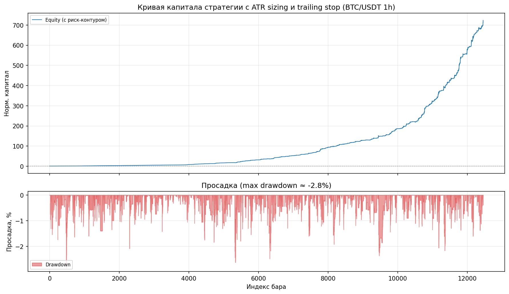
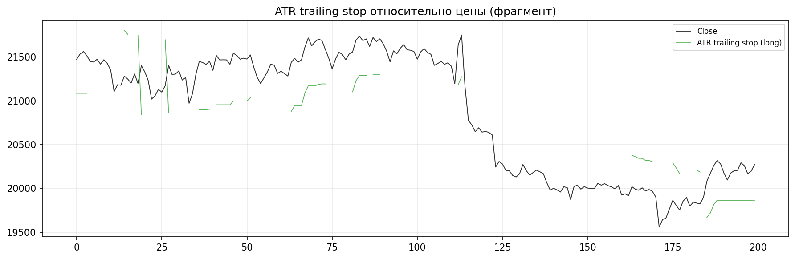

# 3.9 Реализация подсистемы управления рисками

Подсистема управления рисками ограничивает размер позиции, задаёт защитные уровни по ATR и подготавливает масштаб для бэктестера и исполнения. Код сосредоточен в пакете `risk_management`; связь с оркестратором — класс `OrchestratorRiskBridge`. Вход — сигналы после `DecisionPipeline` (п. 3.8). Формулы не приводятся; ниже — порядок вызовов, колонки DataFrame и параметры по умолчанию.

## 3.9.1. Состав модулей

| Модуль | Класс / функция | Назначение |
|--------|-----------------|------------|
| `risk_pipeline.py` | `RiskPipeline` | Цепочка: trailing stop → position sizing → (опц.) RL overlay |
| `position_sizer.py` | `PositionSizer` | Размер позиции от ATR и доли риска на сделку |
| `atr_trailing_stop.py` | `ATRTrailingStop`, `apply_atr_trailing_stop` | Сопровождающий стоп и принудительный выход |
| `orchestrator_risk_bridge.py` | `OrchestratorRiskBridge` | API для `TrainingOrchestrator.risk_manager` |

Экспорт пакета: `risk_management/__init__.py` (`PositionSizer`, `RiskPipeline`, `OrchestratorRiskBridge`).

Альтернатива в слое моделей: `models.sizing.ConfidencePositionSizer` (размер от уверенности ML) — в каноническом WFO используется **ATR-вариант** из `risk_management`.

## 3.9.2. RiskPipeline — порядок обработки

Метод `RiskPipeline.apply_pipeline(df, signal_col='final_signal')`:

1. **ATR trailing stop** (если `trailing_stop_enabled`, по умолчанию `true`): колонки `trailing_stop`, `exit_signal`; рабочий сигнал — `combined_signal` (`get_combined_signals`: при `exit_signal == 1` сигнал обнуляется).
2. **Position sizing**: `pos_size`, `final_pos_size` — объём в единицах актива с учётом модуля сигнала.
3. **RL overlay** (если `rl_overlay_enabled`): колонка `rl_adjusted_return` — в каноническом профиле выключен.

Отдельные методы: `apply_trailing_stop_only`, `apply_position_sizing_only`. Конфигурация — словарь или `RiskPipeline.from_yaml()` (секция `risk_management`).

## 3.9.3. PositionSizer

Класс `PositionSizer` (`position_sizer.py`):

- `risk_per_trade` — доля капитала на одну сделку (по умолчанию **0,01**, 1%);
- `account_size` — капитал (по умолчанию **10 000**);
- `atr_stop_multiplier` — множитель ATR для дистанции стопа при расчёте размера (по умолчанию **2,0**).

В `calculate_sizes`: `risk_amount = account_size * risk_per_trade`; `pos_size = risk_amount / (atr * atr_stop_multiplier)`; `final_pos_size = pos_size * abs(signal)`. Нулевой сигнал даёт нулевой размер.

Колонка `atr` в признаках предпочтительна; иначе `OrchestratorRiskBridge._ensure_atr` строит прокси из `volatility * close` или rolling по `close`.

## 3.9.4. ATR trailing stop

Функция `apply_atr_trailing_stop` / класс `ATRTrailingStop`:

- `atr_mult` по умолчанию **3,0** (шире, чем множитель для sizing — 2,0);
- long: стоп подтягивается вверх (`max` с предыдущим уровнем); выход, если `close < trailing_stop`;
- short: симметрично (`min`, выход при `close > trailing_stop`).

Итоговый торговый сигнал после стопа: `combine_signals_with_exit` — при выходе позиция закрывается (0).

В `canonical_4model.yaml` указано `apply_atr_trailing: false` на уровне оркестратора; стандартный `OrchestratorRiskBridge()` создаёт `RiskPipeline()` с **включённым** trailing по умолчанию. Для отключения нужно передать в bridge настроенный `RiskPipeline` с `trailing_stop.enabled: false`.

## 3.9.5. Интеграция с оркестратором

При `use_risk_bridge: true` (`config/profiles/canonical_4model.yaml`) в `TrainingOrchestrator` после генерации сигналов вызывается:

```text
position_sizes = risk_manager.calculate_position_sizes(signals, meta_probabilities, features)
```

`OrchestratorRiskBridge.calculate_position_sizes`:

1. записывает `final_signal` в копию `features`;
2. вызывает `risk_pipeline.apply_pipeline`;
3. переводит `final_pos_size` (единицы актива) в **долю капитала** для `Backtester.run(..., position_size=...)`: `frac = final_pos_size * close / account_size`;
4. ограничивает сверху `max_position_fraction` (из symbol YAML часто **1,0**).

`meta_probabilities` в bridge пока не влияет на размер (зарезервировано для расширений).

Схема:

```
final_signals  →  OrchestratorRiskBridge  →  position_size[]  →  Backtester
                      ↑
                 features (close, atr, …)
```

## 3.9.6. Параметры конфигурации

**Таблица 3.21 — Параметры подсистемы рисков (значения по умолчанию в коде)**

| Параметр | Значение | Где задаётся |
|----------|----------|--------------|
| `risk_per_trade` | 0,01 | `PositionSizer` |
| `account_size` | 10 000 | `PositionSizer` |
| `atr_stop_multiplier` | 2,0 | sizing |
| `atr_mult` (trailing) | 3,0 | `ATRTrailingStop` |
| `trailing_stop.enabled` | true | `RiskPipeline` |
| `max_position_fraction` | 1,0 | `OrchestratorRiskBridge`, symbol YAML |
| `use_risk_bridge` | true | `canonical_4model` orchestration |

Для отчётов диплома допустимо указывать **2%** риска на сделку как целевую постановку — в коде по умолчанию 1%; изменение — `PositionSizer.set_risk_per_trade(0.02)` или секция `position_sizer` в конфиге pipeline.

## 3.9.7. Иллюстрации

**Рисунок 3.21 — Капитал и просадка стратегии с учётом риск-модуля**



**Рисунок 3.22 — Фрагмент срабатывания ATR trailing stop на истории цены**



## 3.9.8. Выводы по разделу

1. Реализован конвейер `RiskPipeline`: опциональный trailing stop, ATR-based position sizing, заготовка под RL overlay.
2. `OrchestratorRiskBridge` связывает риск-модуль с WFO и бэктестом через массив `position_size` как долю капитала.
3. Размер позиции зависит от ATR и фиксированной доли риска; направление — от абсолютного значения сигнала.
4. Trailing stop может досрочно обнулить сигнал при пробое уровня; иллюстрации — рис. 3.21–3.22.

Далее — архитектура ПО (п. 3.10) и комплексное тестирование (п. 3.11).
