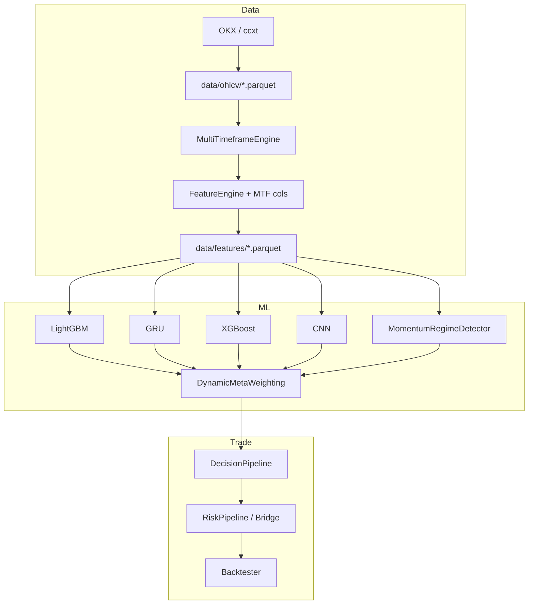
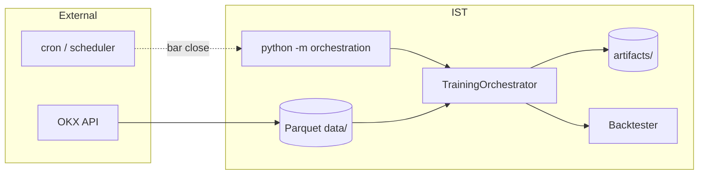

# Intelligent Trading System (IST) — полная документация системы для диплома

**Версия документа:** по состоянию кодовой базы (май 2026)  
**Назначение:** описание архитектуры, pipeline, моделей, признаков, ансамбля, decision/risk, валидации и инженерной реализации **как есть** в репозитории `D:/IST`.

---

## Содержание

1. [A. Структура проекта](#a-структура-проекта)
2. [B. Pipeline системы](#b-pipeline-системы)
3. [C. Все 4 модели](#c-все-4-модели)
4. [D. Feature engineering](#d-feature-engineering)
5. [E. Regime detection](#e-regime-detection)
6. [F. Dynamic weighting](#f-dynamic-weighting)
7. [G. Decision pipeline](#g-decision-pipeline)
8. [H. Risk management](#h-risk-management)
9. [I. Validation / backtesting](#i-validation--backtesting)
10. [J. Реальная инженерия](#j-реальная-инженерия)

---

## A. Структура проекта

### A.1. Дерево проекта (основные каталоги)

Исключены: `__pycache__/`, `.venv/`, артефакты pytest, тысячи JSON журнала бэктестов.

```text
D:/IST/
├── config.yaml                    # Корневой YAML (data_layer, feature_engineering, orchestration, backtesting)
├── requirements.txt
├── pytest.ini
├── ist.py                         # Legacy: монолит из Colab (~2500 строк), справочник
├── test_threshold_leakage.py      # Регрессионный тест утечки порогов
│
├── config/
│   ├── README.md
│   ├── profiles/
│   │   └── canonical_4model.yaml  # Канонический профиль: 4 модели + WFO
│   ├── symbols/
│   │   └── BTC-USDT_1h.yaml       # Пер-символьные override
│   └── archive/discussion/        # Архив экспериментальных конфигов
│
├── data/                          # Runtime Parquet
│   ├── ohlcv/                     # BTC-USDT_{15m,1h,4h}.parquet
│   ├── features/                  # Инженерные признаки
│   └── synced/                    # MTF-merged (опционально)
│
├── artifacts/                     # Обученные бандлы
│   └── BTC-USDT_1h/
│       ├── manifest.json
│       ├── LATEST.txt
│       ├── active/*.jsonl
│       └── <run_id>/artifacts/*.pkl
│
├── docs/                          # Диплом, аудит, журнал бэктестов
│   ├── DIPLOMA_TECHNICAL_ANALYSIS.md
│   ├── DIPLOMA_SYSTEM_DOCUMENTATION.md   # этот файл
│   └── backtest_journal/
│
├── scripts/
│   ├── run_ablation.py
│   └── sharpe_push_trials.py
│
├── data_layer/                    # Загрузка OHLCV (OKX/ccxt), Parquet I/O
├── synchronization/               # MTF merge, gap fill
├── feature_engineering/           # Индикаторы, FeatureManager, microstructure
├── models/                        # LGB, XGB, GRU, CNN, regime ML, router (legacy)
├── meta_learning/                 # DynamicMetaWeighting, thresholds, assembler
├── decision/                      # DecisionPipeline, signal_rules
├── risk_management/               # ATR sizing, trailing, bridge
├── rl_layer/                      # DQN risk multiplier (не направление)
├── backtesting/                   # Backtester, WFO, metrics, journal
├── orchestration/                 # Центральный spine: train/infer/symbol pipeline
├── execution/                     # Brokers, paper loop (scaffold)
├── gui/                           # Только README (не реализован)
├── utils/                         # logger, data_leakage_prevention
└── tests/                         # pytest unit + integration
```

### A.2. Назначение папок верхнего уровня

| Папка | Назначение |
|-------|------------|
| `config/` | Слоистая конфигурация: профили, символы, архив |
| `data/` | Персистентные Parquet: OHLCV, features, synced MTF |
| `artifacts/` | Версионированные pickle + manifest после обучения |
| `docs/` | Техническая документация, журнал экспериментов |
| `data_layer/` | REST OKX через ccxt, валидация, сохранение OHLCV |
| `synchronization/` | Выравнивание 15m/4h к базовому TF (1h) |
| `feature_engineering/` | Технические индикаторы, MTF-колонки, microstructure |
| `models/` | Четыре предиктивные модели + ML regime (не в prod path) |
| `meta_learning/` | Режимно-адаптивный ансамбль, пороги |
| `decision/` | Правила сигналов BUY/SELL/HOLD (как 1/-1/0) |
| `risk_management/` | Размер позиции, trailing stop, bridge в orchestrator |
| `rl_layer/` | DQN — множитель риска, не предсказание направления |
| `backtesting/` | Симуляция PnL, WFO, критерии приёмки |
| `orchestration/` | **Центральный модуль**: factory, WFO, symbol pipeline, CLI |
| `execution/` | Paper/live execution (в основном каркас) |
| `utils/` | Логирование, purge/embargo, safe thresholds |

### A.3. Основные модули по пакетам

#### `data_layer/`
- `loaders/okx_ohlcv_loader.py` — `OKXDataLoader` (ccxt, пагинация)
- `validators/ohlcv_validator.py` — схема OHLCV
- `storage.py` — Parquet paths
- `config.py` — Pydantic `DataLayerConfig`

#### `synchronization/`
- `multi_timeframe_engine.py` — merge aux TF → base
- `mtf_features.py` — `rsi_15m`, `ema_slope_15m`, `rsi_4h`, `adx_4h`
- `gap_handler.py` — ffill, `ensure_datetime_index`
- `indicators.py` — EMA, RSI, MACD, ATR, ADX

#### `feature_engineering/`
- `feature_engine.py` — `FeatureEngine.add_indicators()`
- `feature_manager.py` — pipeline build + storage
- `config.py` — `DIRECTION_FEATURE_COLUMNS`, Pydantic config
- `microstructure/` — simulator OBI, L2 adapter (stub)

#### `models/`
- `tabular/lightgbm_tabular_model.py` — **lgb**
- `mean_reversion/xgboost_model.py` — **xgb**
- `trend/gru_model.py` — **gru**
- `volatility/cnn_model.py` — **cnn**
- `regime/regime_detector.py` — ML regime (не canonical prod)
- `router/model_router.py` — legacy: один модель на режим
- `inference/inference_engine.py` — legacy inference

#### `meta_learning/`
- `dynamic_meta.py` — `DynamicMetaWeighting`
- `signal_assembler.py` — альтернативная сборка сигналов
- `thresholds.py` — `ThresholdManager`

#### `decision/`
- `signal_rules.py` — `compute_final_signal`, `compute_integrated_signal`
- `decision_pipeline.py` — `DecisionPipeline`

#### `orchestration/` (центр системы)
- `training_orchestrator.py` — WFO, `run_pipeline()`
- `inference_orchestrator.py` — production inference
- `model_factory.py` — `build_orchestration_models()`, `infer_training_feature_columns()`
- `canonical_pipeline.py` — OKX → MTF → features
- `symbol_pipeline.py` — end-to-end per symbol
- `glue.py` — parquet → WFO, `MomentumRegimeDetector`
- `artifact_bundle.py` — save/load pickles + manifest
- `__main__.py` — CLI

#### `backtesting/`
- `backtester.py`, `performance_metrics.py`, `walk_forward.py`
- `criteria_evaluator.py`, `results_journal.py`
- `time_series_splitter.py` — простой splitter **без** purge/embargo

---

## B. Pipeline системы

### B.1. Контракт pipeline (канонический)

Зафиксирован в `TrainingOrchestrator` и `InferenceOrchestrator`:

```text
features[t]
    → regime[t]                    # regime_pred: 0 или 1
    → {p_lgb, p_gru, p_xgb, p_cnn}[t]   # вероятности P(up)
    → meta_mgmt_prob[t]            # взвешенный ансамбль
    → direction_soft[t]            # та же величина или порогованная
    → DecisionPipeline             # final_signal ∈ {-1, 0, 1}
    → RiskPipeline / Bridge        # position_size
    → Backtester / Execution       # PnL
```

### B.2. Откуда старт (точки входа)

| Этап | Модуль | Описание |
|------|--------|----------|
| **1. Данные** | `data_layer` | `python -m data_layer` — загрузка OHLCV с OKX → `data/ohlcv/*.parquet` |
| **2. MTF sync** | `synchronization` + `orchestration/canonical_pipeline.py` | Merge 15m/4h к 1h |
| **3. Features** | `feature_engineering` | `FeatureManager.transform()` → `data/features/*.parquet` |
| **4. Train/WFO** | `orchestration` | `python -m orchestration from-parquet`, `prepare-symbol`, `symbol-pipeline` |
| **5. Inference** | `orchestration/inference_orchestrator.py` | Загрузка artifact bundle |
| **6. Execution** | `execution/paper_loop.py` | Один шаг inference+order (внешний scheduler) |

**Сквозной glue:** `orchestration/glue.py` — `load_feature_table_from_parquet()` → `run_wfo_backtest_from_parquet()`.

### B.3. Где что в pipeline



| Компонент | Пакет | Ключевой класс/функция |
|-----------|-------|-------------------------|
| Features | `feature_engineering` | `FeatureEngine`, `FeatureManager` |
| Inference (4 models) | `models/*` + `orchestration` | `model.predict(features)` |
| Ensemble | `meta_learning` | `DynamicMetaWeighting.apply_dynamic_weighting()` |
| Decision | `decision` | `DecisionPipeline.generate_signal()` |
| Risk | `risk_management` | `RiskPipeline`, `OrchestratorRiskBridge` |
| Backtest | `backtesting` | `Backtester.run()` |

### B.4. Отличие от legacy (`ist.py`, `ModelRouter`)

- **Legacy:** `ModelRouter` выбирает **одну** модель на режим.
- **Canonical:** **все четыре** модели вызываются на каждом баре; смешивание через **веса**, а не routing.

---

## C. Все 4 модели

> **Важно для диплома:** на каноническом пути все четыре модели обучаются на **одном и том же бинарном target** (forward direction за `prediction_horizon` баров). Специализация «trend / mean-reversion / volatility» реализована **концептуально** (архитектура + веса в ансамбле), а не разными таргетами в WFO.

### C.1. Общий target (все 4 модели)

```python
# orchestration/glue.py — default_horizon_labels()
fwd = close.shift(-horizon)
fwd_ret = (fwd / close) - 1.0
y = (fwd > close).astype(float)   # или (fwd_ret > min_return)
y.iloc[-horizon:] = np.nan        # последние horizon баров без метки
```

| Параметр | Значение (canonical) |
|----------|----------------------|
| `prediction_horizon` | **12** баров (при 1h → ~12 часов вперёд) |
| Класс 1 | Цена через horizon выше текущей |
| Класс 0 | Иначе |
| Purge при split | Последние `horizon` баров train удаляются |

### C.2. Общие входные признаки

Функция `infer_training_feature_columns(df)` в `orchestration/model_factory.py`:

- **Включаются:** все числовые колонки DataFrame
- **Исключаются:** `open`, `high`, `low`, `close`, `volume`
- **Исключаются по подстроке:** `meta_prob`, `signal`, `target`, `future_`, `order_book`, `obi`

Типичный набор после `FeatureEngine` + MTF (15+ колонок):  
`ema_fast`, `ema_slow`, `ema_slope`, `rsi`, `macd`, `macd_signal`, `macd_hist`, `atr`, `log_ret`, `volatility`, `adx`, `rsi_15m`, `ema_slope_15m`, `rsi_4h`, `adx_4h`.

**Эталонный минимальный набор** (8 колонок) — `DIRECTION_FEATURE_COLUMNS` в `feature_engineering/config.py`; orchestration часто обучает на **расширенном** наборе.

**Форма входа:**

| Модель | Форма |
|--------|-------|
| LGB, XGB | `(n_bars, n_features)` — построчно |
| GRU, CNN | `(n_sequences, window_size, n_features)`, `window_size=24` |

---

### C.3. Модель 1: LightGBM (`lgb`)

| Аспект | Детали |
|--------|--------|
| **Файл** | `models/tabular/lightgbm_tabular_model.py` |
| **Класс** | `LightGBMTabularModel` |
| **Роль в системе** | Табличная модель; **доминирует в range-режиме** (вес 0.55) |
| **Архитектура** | `LGBMClassifier`: `n_estimators=200`, `lr=0.05`, `max_depth=-1`, `objective=binary`, `class_weight=balanced`, `subsample=0.8`, `colsample_bytree=0.8`, `min_child_samples=20` |
| **Output** | `predict_proba(X)[:, 1]` → **P(up)** ∈ [0, 1] |
| **Обучение** | `fit(df[feature_cols], y)`; NaN в `y` отбрасываются |
| **В ансамбле** | Веса из `trend_weights.lgb` / `range_weights.lgb` |

---

### C.4. Модель 2: XGBoost (`xgb`)

| Аспект | Детали |
|--------|--------|
| **Файл** | `models/mean_reversion/xgboost_model.py` |
| **Класс** | `XGBoostMeanReversionModel` (через `_TrainCallableAdapter`) |
| **Роль** | Mean-reversion **по замыслу**; в WFO — тот же direction target |
| **Архитектура** | `XGBClassifier`: `n_estimators=200`, `lr=0.05`, `max_depth=6`, `binary:logistic` |
| **Output** | `predict_proba[:, 1]` |
| **Обучение** | `train(df, y)` → adapter вызывает `fit` |
| **В ансамбле** | trend: 0.10; range: 0.25 |

*Legacy:* в классе есть `prepare_labels()` для mean-reversion z-score — **не используется** orchestration WFO.

---

### C.5. Модель 3: GRU (`gru`)

| Аспект | Детали |
|--------|--------|
| **Файл** | `models/trend/gru_model.py` |
| **Класс** | `GRUTrendModel` |
| **Роль** | Последовательные паттерны; **доминирует в trend-режиме** (вес 0.45) |
| **Архитектура** | Keras Sequential: `Input(24, F)` → `GRU(64, return_sequences=True)` → `Dropout(0.2)` → `GRU(32)` → `Dropout` → `Dense(16, relu)` → `Dense(1, sigmoid)` |
| **Optimizer** | Adam `lr=0.0005`, loss `binary_crossentropy` |
| **Обучение** | Sliding windows; val split **10% по времени** (не random); `EarlyStopping(patience=5)`; epochs из config: **5** (`orchestration_dl.epochs`) |
| **Output** | Sigmoid → P(up) на последнем баре окна |
| **В ансамбле** | trend: 0.45; range: 0.10 |

---

### C.6. Модель 4: CNN (`cnn`)

| Аспект | Детали |
|--------|--------|
| **Файл** | `models/volatility/cnn_model.py` |
| **Класс** | `CNNVolatilityModel` |
| **Роль** | Локальные паттерны волатильности; силён в trend (0.35) и умеренно в range (0.10) |
| **Архитектура** | `Conv1D(64, k=3)` → `MaxPooling1D(2)` → `Conv1D(32, k=3)` → `Flatten` → `Dense(16)` → `Dropout(0.4)` → `Dense(1, sigmoid)` |
| **Обучение** | Аналогично GRU, `window_size=24`, `dropout=0.4` |
| **Output** | P(up) |
| **В ансамбле** | trend: 0.35; range: 0.10 |

*Legacy:* `prepare_labels()` для volatility breakout — не в canonical WFO.

---

### C.7. Сводная таблица моделей

| Key | Алгоритм | Вход | Target (canonical) | Output | Trend weight | Range weight |
|-----|----------|------|-------------------|--------|--------------|--------------|
| lgb | LightGBM | tabular | forward up/down | P(up) | 0.10 | **0.55** |
| gru | GRU | seq 24×F | то же | P(up) | **0.45** | 0.10 |
| xgb | XGBoost | tabular | то же | P(up) | 0.10 | 0.25 |
| cnn | 1D-CNN | seq 24×F | то же | P(up) | 0.35 | 0.10 |

Конфиг: `config/profiles/canonical_4model.yaml` → секция `orchestration`.

---

## D. Feature engineering

### D.1. Pipeline построения признаков

1. OHLCV base TF (1h) + aux (15m, 4h) из Parquet  
2. `MultiTimeframeEngine` — resample aux → 1h, `ffill`  
3. `FeatureEngine.add_indicators()` на merged frame  
4. `dropna` (если `drop_na: true`)  
5. Сохранение: `data/features/<symbol>_<tf>.parquet`

Entry point: `orchestration/canonical_pipeline.py` → `build_canonical_features()`.

### D.2. Список признаков

#### Базовые (1h) — `feature_engineering/feature_engine.py`

| Колонка | Формула / параметры |
|---------|---------------------|
| `ema_fast` | EMA(close, 20) |
| `ema_slow` | EMA(close, 50) |
| `ema_slope` | Δema_fast / ema_fast.shift(1) |
| `rsi` | RSI(14) |
| `macd`, `macd_signal`, `macd_hist` | MACD 12/26/9 |
| `atr` | ATR(14) |
| `log_ret` | log(close / close.shift(1)) |
| `volatility` | rolling std(log_ret, 20) × √24 |
| `adx` | ADX(14) |

#### Multi-timeframe — `synchronization/mtf_features.py`

| Колонка | TF | Расчёт |
|---------|-----|--------|
| `rsi_15m` | 15m | RSI(14) |
| `ema_slope_15m` | 15m | EMA(20).pct_change() |
| `rsi_4h` | 4h | RSI(14) |
| `adx_4h` | 4h | ADX(14) |

Конфиг sync (`canonical_4model.yaml`):

```yaml
synchronization:
  base_timeframe: "1h"
  auxiliary_timeframes: ["15m", "4h"]
  resample_rule: "1h"
  fill_method: ffill
```

### D.3. Multi-timeframe?

**Да.** Базовый бар 1h; признаки 15m и 4h ресемплируются и выравниваются на индекс 1h (`gap_handler.align_to_base`).

### D.4. Scaling?

- В **`FeatureEngine` scaling не применяется** — сырые значения индикаторов.
- GRU/CNN строят окна из сырых признаков (без `StandardScaler` в modular path).
- Утилита `normalize_features()` в `models/utils/helpers.py` (standard/minmax) — опционально, не в canonical pipeline.
- Legacy `ist.py` использовал `StandardScaler` для экспериментов.

### D.5. Volatility?

| Механизм | Где |
|----------|-----|
| Признаки `atr`, `log_ret`, `volatility` | `FeatureEngine` |
| Фильтр сигналов по ATR | `TrainingOrchestrator._apply_volatility_filter()` — обнуляет сигнал, если `atr` на test > train percentile; в BTC config часто **0 = выкл** |
| CNN legacy labels | отдельный volatility breakout target (не WFO) |

### D.6. Imbalance (order book)?

| Режим | Поведение |
|-------|-----------|
| `off` | Canonical profile — **нет** OBI колонок |
| `simulated` | `order_book_imbalance = tanh(ema_slope*100 + noise)`, `bid_ask_spread` |
| `live` | `NotImplementedError` |

Формула OBI: `(bid_vol - ask_vol) / (bid_vol + ask_vol)` в `microstructure/order_book.py`.

Колонки с `order_book` / `obi` **исключаются** из training features (`model_factory._LEAKY_SUBSTR`).

### D.7. Windows?

| Назначение | Размер |
|------------|--------|
| Rolling volatility | 20 баров |
| GRU/CNN sequence | **24** (`feature_window_size`) |
| Regime ML labels (не prod) | 24 |
| Meta threshold rolling | 100 |
| WFO train / test | 1500 / 250 |
| Momentum SMA (regime / confirm) | 50–100 |

### D.8. Lag features?

Явные multi-bar lags (return_5, return_15) **не реализованы** в `FeatureEngine` — только `shift(1)` внутри `ema_slope` и `log_ret`. В README отмечены как roadmap.

### D.9. Regime features?

- `adx` — базовый индикатор, используется и для ML `RegimeDetector`
- ML regime (не prod): `adx`, `ema_slope`, `volatility`, `atr`
- Production regime: **не признак**, а отдельный `regime_pred` от SMA (см. раздел E)

### D.10. Эталонные 8 признаков для Direction/DL

```python
DIRECTION_FEATURE_COLUMNS = [
    "rsi", "macd_hist", "ema_slope", "adx",
    "rsi_15m", "ema_slope_15m", "rsi_4h", "adx_4h",
]
```

---

## E. Regime detection

### E.1. Две реализации в кодовой базе

| Реализация | Тип | Используется в production WFO? |
|------------|-----|--------------------------------|
| `MomentumRegimeDetector` | **Rule-based** | **Да** (default `regime: momentum`) |
| `SimpleHourlyRegimeStub` | Rule-based stub | Smoke/CLI fallback |
| `RegimeDetector` (LightGBM) | **ML** | **Нет** на canonical path |

### E.2. Production: MomentumRegimeDetector

**Файл:** `orchestration/glue.py`

```python
sma = close.rolling(sma_period, min_periods=1).mean()
regime_pred = (close > sma).astype(int)   # 1 = trend, 0 = range
```

| Параметр | Default |
|----------|---------|
| `sma_period` | 50 (tuning может менять на 100) |
| `market_regime` | `"trend"` если последний бар `regime_pred==1`, иначе `"range"` |
| Обучение | **Не требуется** — только прошлые `close` |

### E.3. ML: RegimeDetector (существует, не в canonical prod)

**Файл:** `models/regime/regime_detector.py`

| Аспект | Детали |
|--------|--------|
| Модель | `LGBMClassifier`, binary |
| Признаки | `adx`, `ema_slope`, `volatility`, `atr` |
| Labels | abs pct_change за 24 бара vs rolling vol × 1.5 |
| `regime_pred` | 0/1 per bar |
| `get_regime_info()` | `market_regime`: trend если P>0.6; `volatility_regime`: high/low vs 70th percentile |

### E.4. Состояния рынка

**В ансамбле (бинарно):**

| `regime_pred` | Имя | Смысл |
|---------------|-----|-------|
| 1 | **trend** | close > SMA — «направленный» режим |
| 0 | **range** | close ≤ SMA — «боковик» |

**Строковые метки** (информационно): `market_regime` ∈ {`trend`, `range`}; ML-модуль добавляет `high_vol` / `low_vol`.

Отдельных классов bullish/bearish **нет** — направление дают модели P(up), не regime detector.

### E.5. Rule-based или ML?

**На каноническом пути — rule-based (momentum SMA).**  
ML `RegimeDetector` сохраняется в `artifacts/.../regime_detector.pkl` как объект detector'а, но при `regime: momentum` это экземпляр `MomentumRegimeDetector`, не обученный LGBM.

---

## F. Dynamic weighting

### F.1. Класс и файл

`meta_learning/dynamic_meta.py` — **`DynamicMetaWeighting`**

Создание из конфига: `orchestration/model_factory.py` → `meta_weighting_from_config(cfg)`.

### F.2. Как считаются веса

**Режим по умолчанию:** `ensemble_mode: regime_adaptive`

Для каждого бара `t` и модели `k`:

```text
weight_k[t] = trend_weights[k]   если regime_pred[t] == 1
weight_k[t] = range_weights[k]   если regime_pred[t] == 0
```

Реализация: `_regime_adaptive_weights()` — numpy mask по `regime_pred`.

**Альтернативные режимы:**

| mode | Поведение |
|------|-----------|
| `regime_adaptive` | Веса переключаются по `regime_pred` |
| `fixed_trend` | Всегда `trend_weights` |
| `fixed_range` | Всегда `range_weights` |

### F.3. Фиксированные или динамические?

**Динамические по времени** (меняются bar-to-bar с `regime_pred`), но **сами числа весов фиксированы в YAML** — не обучаются градиентом на данных.

### F.4. От чего зависят веса

1. Текущий `regime_pred[t]` (SMA momentum)  
2. Конфиг `trend_weights` / `range_weights`  
3. `ensemble_mode`

**Не зависят от:** confidence моделей, волатильности бара (кроме косвенно через смену regime).

### F.5. Агрегация ensemble output

```python
meta_mgmt_prob[t] = Σ_k weight_k[t] * p_k[t]
```

`apply_dynamic_weighting(predictions, regime_pred)` — сумма по моделям из `model_keys`.

Затем в orchestrator:

```python
direction_signals = where(meta_prob > 0.52, 1,
                  where(meta_prob < 0.48, -1, 0))
```

(`direction_threshold` = 0.52 → short порог `1 - 0.52 = 0.48` для вероятности.)

### F.6. Таблица весов (canonical)

**Trend (`regime_pred=1`):**

| lgb | gru | xgb | cnn |
|-----|-----|-----|-----|
| 0.10 | **0.45** | 0.10 | 0.35 |

**Range (`regime_pred=0`):**

| lgb | gru | xgb | cnn |
|-----|-----|-----|-----|
| **0.55** | 0.10 | 0.25 | 0.10 |

---

## G. Decision pipeline

### G.1. Кодировка сигналов (BUY / SELL / HOLD)

Система **не использует** строки BUY/SELL/HOLD:

| Значение | Эквивалент |
|----------|------------|
| `1` | Long (BUY) |
| `-1` | Short (SELL) |
| `0` | Flat (HOLD / no trade) |

### G.2. Архитектура decision layer

**Файлы:** `decision/decision_pipeline.py`, `decision/signal_rules.py`

**Два варианта:**

| Вариант | Функция | Вход meta |
|---------|---------|-----------|
| A (`final`) | `compute_final_signal` | `meta_prob` (отдельный meta-filter) |
| B (`integrated`) — **рекомендуемый** | `compute_integrated_signal` | `meta_mgmt_prob` (ансамбль) |

Orchestrator использует **`signal_source: integrated`**.

### G.3. Confidence / direction threshold

```python
direction_signal = 1  if direction_soft > 0.52
direction_signal = -1 if direction_soft < -0.52
direction_signal = 0  otherwise
```

Параметр: `direction_threshold: 0.52` (config).

### G.4. Meta threshold (фильтрация)

Сделка разрешена только если:

```text
meta_mgmt_prob[t] > meta_threshold[t]  AND  direction_signal[t] != 0
```

**Режимы `meta_threshold_mode`:**

| mode | Как считается |
|------|----------------|
| `median` | Rolling/expanding median **только по прошлым** барам (`safe_mode=True`) |
| `mean` | Аналогично mean |
| `fixed` | Константа из конфига |

**WFO:** порог калибруется на **train** fold (`_calibrate_test_meta_threshold`), применяется на test — защита от leakage.

**Safe threshold:** `utils/data_leakage_prevention.compute_safe_threshold()` — окно **100** баров (`threshold_rolling_window`).

### G.5. Hold logic

Сигнал `0` (HOLD) когда:

1. `meta_prob` в мёртвой зоне около 0.5 (внутри ±0.52 для direction)  
2. `meta_mgmt_prob` ниже порога  
3. `min_signal_margin > 0` и `|p - 0.5| < margin`  
4. `trade_mode: long_only` / `short_only` обнуляет противоположную сторону  
5. Volatility filter: ATR test > train percentile  
6. ATR trailing: `exit_signal` → flat (`risk_management`)

### G.6. Confirmation logic

| Стратегия | Условие |
|-----------|---------|
| **ensemble** (default) | Meta threshold + direction threshold |
| **momentum_confirm** | Long: `close > SMA(100)` AND `meta_prob > direction_threshold`; short симметрично если `trade_mode=both` |

Параметр: `signal_strategy: ensemble` в `canonical_4model.yaml`.

### G.7. Пост-фильтры orchestrator (после DecisionPipeline)

Порядок в `TrainingOrchestrator.run_pipeline()`:

1. `DecisionPipeline.generate_signal()`  
2. `_momentum_confirm_signals()` (если strategy)  
3. `_apply_signal_margin()`  
4. `_apply_trade_mode()`  
5. `_apply_volatility_filter()`

---

## H. Risk management

### H.1. Модули

| Файл | Класс | Роль |
|------|-------|------|
| `risk_management/position_sizer.py` | `PositionSizer` | ATR-based size |
| `risk_management/atr_trailing_stop.py` | `ATRTrailingStop` | Trailing + exit |
| `risk_management/risk_pipeline.py` | `RiskPipeline` | Цепочка stop → size → RL |
| `risk_management/orchestrator_risk_bridge.py` | `OrchestratorRiskBridge` | fraction для Backtester |

### H.2. Stop loss

**Явного bar-by-bar stop-order в backtester нет.**

- **Implicit stop width в sizing:**  
  `pos_size = (account × risk_per_trade) / (atr × atr_stop_multiplier)`  
  `atr_stop_multiplier = 2.0` → расстояние стопа ~ 2×ATR в формуле размера.

### H.3. ATR

| Использование | Параметр |
|---------------|----------|
| Признак | `atr` в FeatureEngine, length 14 |
| Position sizing | делитель `atr * 2.0` |
| Trailing stop | `atr_mult = 3.0` — long: stop = max(prev, close - atr×mult) |

Canonical WFO: `apply_atr_trailing: false` — trailing **выключен** в профиле, но код есть.

### H.4. Sizing

```python
risk_amount = account_size * risk_per_trade   # default: 10000 * 1% = 100
pos_size = risk_amount / (atr * 2.0)
final_pos_size = pos_size * abs(signal)
```

`OrchestratorRiskBridge` → доля капитала `notional/account`, cap `max_position_fraction`.

### H.5. Trailing

`ATRTrailingStop.apply()`:

- Long: trailing_stop растёт; exit если `close < stop`  
- Short: симметрично  
- `combined_signal = 0` на барах с `exit_signal`

### H.6. RL multiplier

**Не предсказывает направление.** `rl_layer/dqn_agent.py`:

```python
risk_map = {0: 0.005, 1: 0.01, 2: 0.02}  # множители риска
```

- В `RiskPipeline`: `rl_adjusted_return = signal * pct_change.shift(-1) * multiplier`  
- В `execution`: `final_position_size = position_size * risk_multiplier`

По умолчанию RL overlay **выключен** (`rl_overlay.enabled: false`).

### H.7. Ограничения риска

| Ограничение | Где |
|-------------|-----|
| `risk_per_trade` | 1% счёта на сделку |
| `max_position_fraction` | bridge cap |
| `long_only` / `short_only` | orchestrator |
| Volatility filter | снижает exposure → 0 |
| Trailing exit | принудительный flat |

---

## I. Validation / backtesting

### I.1. Типы split

| Метод | Файл | Purge/Embargo |
|-------|------|---------------|
| `TimeSeriesSplitter` | `backtesting/time_series_splitter.py` | **Нет** |
| `DataLeakagePreventer.safe_train_test_split` | `utils/data_leakage_prevention.py` | **Да** |
| `safe_walk_forward_split` | там же | **Да** |

### I.2. Walk-forward

**Канонический:** `TrainingOrchestrator.walk_forward_optimization()` / `walk_forward_backtest()`

Параметры (`canonical_4model.yaml`):

| Параметр | Значение |
|----------|----------|
| `train_window_size` | 1500 |
| `test_window_size` | 250 |
| `walk_forward_step` | 250 |
| `prediction_horizon` | 12 |
| `enable_purge` | true |
| `embargo_period` | 5 |

**Цикл fold:**

1. Safe split (purge + embargo)  
2. `validate_no_leakage()`  
3. Fit все 4 модели на train (без NaN labels)  
4. `run_pipeline(train)` → калибровка meta threshold  
5. `run_pipeline(test)` → OOS метрики  
6. `Backtester.run(close, final_signals, position_sizes)`

### I.3. Embargo

**5 баров** между концом train и началом test — буфер, чтобы overlap label horizon не загрязнял test.

### I.4. Purge

Из конца train удаляются последние **`horizon` (12)** баров — там target использует future close, пересекающийся с test.

### I.5. Метрики

`backtesting/performance_metrics.py`:

- Sharpe, Sortino  
- Profit Factor, Win Rate  
- Max Drawdown %, Recovery Factor  
- CAGR, Calmar, Ulcer Index  
- Time Underwater, Trade Events  
- Benchmark alpha (если есть market cols)

**Walk-Forward Efficiency (WFE):**

```text
WFE = OOS_annualized_return / IS_annualized_return
```

### I.6. Критерии приёмки

`backtesting/criteria_evaluator.py` + `config.yaml` / profile:

| Критерий | Acceptance (пример) |
|----------|---------------------|
| min_folds | 5 |
| min_oos_sharpe | 0.5 |
| min_oos_profit_factor | 1.2 |
| max_drawdown_pct | -35% |
| min_wfe | 0.5 |
| min_trade_events | 30 |

### I.7. Как считается PnL

`backtesting/backtester.py`:

```text
market_returns = close.pct_change()
strategy_returns = signal.shift(1) * position_size.shift(1) * market_returns
eff_exposure = signal * position_size
trades = |diff(eff_exposure)|
costs = trades * (commission + slippage)    # 0.0006 + 0.0002
net_returns = strategy_returns - costs
cum_strategy_returns = cumprod(1 + net_returns)
```

- Исполнение на **следующем** баре (`shift(1)`)  
- Комиссия и slippage только при **изменении** экспозиции  
- `bars_per_year: 8760` для годовой аннуализации (1h crypto)

### I.8. Журнал результатов

`backtesting/results_journal.py` → `docs/backtest_journal/runs.jsonl` + per-run JSON.

---

## J. Реальная инженерия

### J.1. Async

**Нет.** В Python-источниках проекта не используются `async`/`asyncio`. Pipeline синхронный, pandas/numpy.

### J.2. Orchestrator

| Компонент | Файл |
|-----------|------|
| Training | `orchestration/training_orchestrator.py` |
| Inference | `orchestration/inference_orchestrator.py` |
| Symbol E2E | `orchestration/symbol_pipeline.py` |
| Canonical build | `orchestration/canonical_pipeline.py` |
| Glue WFO | `orchestration/glue.py` |

Контракт инициализации: `initialize(models, regime_detector, meta_weighting, decision_pipeline, risk_manager)`.

### J.3. Scheduler

**В репозитории не реализован.** `execution/paper_loop.py` явно указывает: цикл bar-close — **внешний** (биржа / cron / systemd). IST предоставляет `run_one_step()`, не daemon.

### J.4. API

**HTTP API нет** (нет FastAPI/Flask). Интерфейсы:

- **CLI:** `python -m orchestration <command>`
- **Library:** импорт orchestrator/backtester из Python

Команды CLI (`orchestration/__main__.py`):

| Команда | Назначение |
|---------|------------|
| `validate-config` | Проверка YAML |
| `smoke` | Integration smoke |
| `from-parquet` | WFO backtest с parquet |
| `prepare-symbol` | Download + features |
| `symbol-pipeline` | Полный цикл символа |
| `report-real` | Benchmark на реальных данных |

### J.5. Parquet

| Слой | Путь | Модуль |
|------|------|--------|
| OHLCV | `data/ohlcv/{SYMBOL}_{tf}.parquet` | `data_layer/storage.py` |
| Features | `data/features/{slug}.parquet` | `feature_engineering/storage.py` |
| Synced MTF | `data/synced/` | `synchronization/storage.py` |
| Compression | snappy (config) | `config.yaml` |

Чтение: `pd.read_parquet()` в glue, symbol_pipeline, benchmarks.

### J.6. Caching

- **Нет** `lru_cache` / memcached в коде  
- **Artifact cache:** обученные модели в `artifacts/<symbol>/<run_id>/` + `manifest.json` + `LATEST.txt`  
- Повторный inference загружает pickle bundle (`artifact_bundle.py`)

### J.7. Config system

**Многоуровневый YAML + Pydantic:**

| Уровень | Файл |
|---------|------|
| Root | `config.yaml` |
| Profile | `config/profiles/canonical_4model.yaml` |
| Symbol override | `config/symbols/BTC-USDT_1h.yaml` |
| Layer configs | `data_layer/config.py`, `feature_engineering/config.py`, `orchestrator_config.py` |

Загрузка: `OrchestratorConfig.from_yaml()`, `FeatureEngineeringConfig.from_yaml()`, `validate_pipeline_config()`.

Секреты: `${OKX_API_KEY}` placeholders в YAML.

### J.8. Logging

- `utils/logger.py` — setup helper  
- Стандартный `logging.getLogger(__name__)` в execution modules  
- Централизованного structlog/ELK **нет**  
- `log_level: INFO` в profile app section

### J.9. YAML

Используется повсеместно:

- Конфигурация pipeline  
- `DecisionPipeline` может загружаться из YAML path  
- `RiskPipeline.from_yaml()`  
- Критерии backtesting через `load_backtesting_config()`

Парсер: `yaml.safe_load` / Pydantic `model_validate`.

### J.10. Factory patterns

| Factory | Файл | Что создаёт |
|---------|------|-------------|
| `build_orchestration_models()` | `orchestration/model_factory.py` | Dict lgb/gru/xgb/cnn |
| `meta_weighting_from_config()` | там же | `DynamicMetaWeighting` |
| `regime_detector_for()` | `orchestration/benchmark_runner.py` | Momentum / stub |
| `OKXDataLoader(exchange_factory=...)` | `data_layer/loaders/` | inject ccxt |
| `_TrainCallableAdapter`, `_DLTrainAdapter` | model_factory | унификация fit/predict |

### J.11. Strategy pattern

| «Стратегия» | Реализация |
|-------------|------------|
| `signal_strategy` | `ensemble` vs `momentum_confirm` в orchestrator |
| `ensemble_mode` | regime_adaptive / fixed_trend / fixed_range |
| `signal_source` | final vs integrated в DecisionPipeline |
| `trade_mode` | both / long_only / short_only |
| Legacy `ModelRouter` | выбор одной модели по regime (deprecated) |

Не классический GoF Strategy с интерфейсом — **ветвление по строковым ключам конфига**.

### J.12. Дополнительные инженерные аспекты

| Тема | Статус |
|------|--------|
| **Тесты** | `tests/` — pytest, integration с real parquet |
| **Leakage prevention** | `utils/data_leakage_prevention.py` — отдельный модуль |
| **Artifacts versioning** | run_id timestamp + hash, manifest schema |
| **Optional ML deps** | `orchestration/ml_deps.py` — проверка lightgbm/tensorflow |
| **GUI** | Не реализован (`gui/README.md` только spec) |
| **Execution** | `PaperBroker`, `OKXBroker` scaffold |
| **Legacy monolith** | `ist.py` — reference, не production path |

### J.13. Диаграмма развёртывания (логическая)



---

## Приложение: быстрые ссылки на ключевой код

| Тема | Путь |
|------|------|
| Pipeline contract | `orchestration/training_orchestrator.py` |
| Labels | `orchestration/glue.py` → `default_horizon_labels` |
| Model factory | `orchestration/model_factory.py` |
| Ensemble weights | `meta_learning/dynamic_meta.py` |
| Regime (prod) | `orchestration/glue.py` → `MomentumRegimeDetector` |
| Decision rules | `decision/signal_rules.py` |
| Purge/embargo | `utils/data_leakage_prevention.py` |
| PnL | `backtesting/backtester.py` |
| Canonical config | `config/profiles/canonical_4model.yaml` |
| Features | `feature_engineering/feature_engine.py` |

---

## Примечания для защиты диплома

1. **Четыре модели — один target**, специализация через **архитектуру и веса режима**, не через разные y.  
2. **Regime в production — rule-based SMA**, ML RegimeDetector — задел, не основной path.  
3. **Сигналы числовые** 1/0/-1, не enum BUY/SELL/HOLD.  
4. **WFO с purge/embargo** — осознанная защита от leakage; простой `TimeSeriesSplitter` без purge — вспомогательный.  
5. **Нет async/API/scheduler** — research framework с CLI; live loop вынесен наружу.

---

*Документ сгенерирован по кодовой базе IST. При изменении `canonical_4model.yaml` или orchestrator обновите соответствующие таблицы.*
