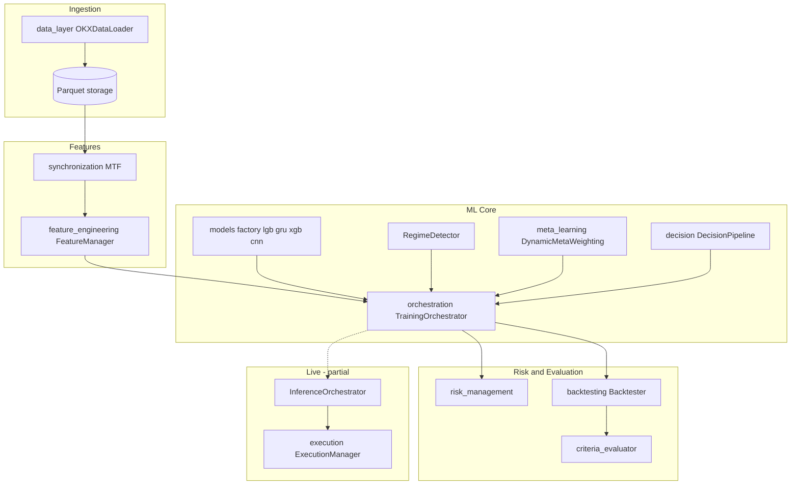

# Технический разбор проекта IST

**Intelligent Trading System (IST)** — интеллектуальная модульная система алгоритмической торговли криптовалютами.

Документ подготовлен для ВКР на тему: *«Интеллектуальная система торговли криптовалютами»*.  
Состояние кодовой базы: **май 2026**, репозиторий `D:/IST`.

---

## Дерево проекта (верхний уровень)

```text
IST/
├── config.yaml                 # Глобальная конфигурация (orchestration, backtesting, data, features)
├── config/symbols/             # Профили по инструменту (напр. BTC-USDT_1h.yaml)
├── requirements.txt
├── artifacts/                  # Манифесты прогонов, bundle оркестратора
├── data/                       # Parquet OHLCV / признаки
├── docs/                       # Аудит, журналы бэктестов, отчёты, данный документ
├── scripts/                    # Тюнинг, batch-прогоны (sharpe_push_trials и др.)
│
├── data_layer/                 # Загрузка OHLCV (OKX REST, ccxt)
├── synchronization/            # Multi-timeframe merge (15m, 4h → 1h)
├── feature_engineering/        # Индикаторы, микроструктура, FeatureManager
├── models/                     # LGB, XGB, GRU, CNN, regime, meta-filter, registry
├── meta_learning/              # DynamicMetaWeighting, ensemble, signal assembler
├── decision/                   # DecisionPipeline, правила final/integrated signal
├── risk_management/            # PositionSizer (ATR), trailing stop, risk bridge
├── rl_layer/                   # DQN, среды риска, overlay backtest
├── backtesting/                # Backtester, метрики, WFO, criteria gate
├── orchestration/              # ★ Центральный spine: Training/Inference orchestrator
├── execution/                  # PaperBroker, paper_loop; OKX live — частично
├── gui/                        # PyQt6 + gui/api (IstGuiClient, workers)
├── utils/                      # DataLeakagePreventer, logger
└── tests/                      # Unit + integration + real parquet benchmarks
```

**Устаревший артефакт:** `ist.py` в корне — монолитный экспорт Colab; **не является** каноническим production-путём.

---

## 1. Общая идея системы

### Какую задачу решает проект

IST решает задачу **автоматизированного принятия торговых решений** на крипторынке (spot/линейные инструменты через API биржи) на основе исторических и (частично) потоковых рыночных данных. Целевая функция на этапе research — не максимизация accuracy классификации, а **устойчивая риск-скорректированная доходность** на out-of-sample окнах с формальными критериями приёмки стратегии.

### Основная концепция

1. **Множество моделей** с разной индуктивной смещённостью (градиентный бустинг на табличных признаках vs рекуррентные/сверточные сети на окнах временных рядов).
2. **Режимно-адаптивный ансамбль (meta-learning):** веса моделей переключаются в зависимости от детектированного рыночного режима (бинарный `regime_pred`: «сильное движение» / «слабое»).
3. **Двухуровневая фильтрация сигналов:** (а) вероятностный прогноз направления с порогом уверенности; (б) мета-порог качества сделки (median/percentile/fixed на train).
4. **Инженерная дисциплина валидации:** walk-forward optimization (WFO), purge/embargo, запрет утечек в порогах и метках.

### Тип торговой системы

| Характеристика | Значение |
|----------------|----------|
| Класс | **Систематическая алгоритмическая** (rule + ML hybrid) |
| Горизонт | **Среднесрочный intraday/swing** на часовых барах (базовый TF `1h`, horizon 12–24 бара) |
| Стили | Long/short (`trade_mode: both`) или long-only — задаётся конфигом |
| Режим исполнения | Research/backtest **реализован**; paper/live — **каркас** |
| Биржа (целевая) | **OKX** через `ccxt` |

### Основная архитектурная идея

**Слоистая pipeline-архитектура** с единым **оркестратором** (`orchestration`), который фиксирует контракт данных между слоями:

```text
features[t] → regime[t] → {p_lgb, p_gru, p_xgb, p_cnn}[t]
           → meta_mgmt_prob[t] → direction_soft[t] → DecisionPipeline → final_signal[t]
           → RiskManagement → Backtester / Execution
```

Разделение **предсказания** (models + meta) и **исполнения/риска** (risk + execution) позволяет менять ML-стек без переписывания бэктеста и наоборот.

---

## 2. Архитектура системы

### Модули и назначение

| Модуль | Пакет | Назначение |
|--------|-------|------------|
| Data Layer | `data_layer/` | REST-загрузка OHLCV, валидация, Parquet |
| Synchronization | `synchronization/` | MTF: 15m/4h → сетка 1h (`resample` + `ffill`) |
| Feature Engineering | `feature_engineering/` | Технические и MTF-признаки, OBI/spread |
| Models | `models/` | Обучаемые предикторы (LGB, XGB, GRU, CNN, RegimeDetector) |
| Meta-Learning | `meta_learning/` | Режимные веса, ensemble, калибровка |
| Decision | `decision/` | Сборка discrete signal {-1, 0, 1} |
| Risk Management | `risk_management/` | ATR sizing, trailing stop, bridge к оркестратору |
| RL Layer | `rl_layer/` | DQN для **множителя риска**, не для направления |
| Backtesting | `backtesting/` | Симуляция, метрики, WFO, acceptance criteria |
| Orchestration | `orchestration/` | TrainingOrchestrator, InferenceOrchestrator, glue, CLI |
| Execution | `execution/` | PaperBroker, OKXBroker, ExecutionManager |
| GUI | `gui/` | PyQt6 desktop + `gui/api` (4 вкладки, paper, журнал WFO) |
| Utils | `utils/` | Anti-leakage, логирование |

### Взаимодействие модулей



### Pipeline обработки данных

1. **Сбор:** `OKXDataLoader.fetch_all_ohlcv(symbol, timeframe, start, end)` — пагинация, rate limit, дедупликация.
2. **Синхронизация MTF:** `MultiTimeframeEngine` загружает вспомогательные TF, считает `rsi_15m`, `ema_slope_15m`, `rsi_4h`, `adx_4h`, merge на индекс 1h.
3. **Признаки:** `FeatureEngine` / `FeatureManager` — EMA, RSI, MACD, ATR, ADX, log-return, volatility; опционально `order_book_imbalance`, `bid_ask_spread`.
4. **Обучение (на train-окне WFO):** fit всех `model_keys` → `RegimeDetector` → predict → `DynamicMetaWeighting` → `DecisionPipeline` (порог meta только с train).
5. **Инференс (test-окно):** тот же pipeline без переобучения мета-порога на test.
6. **Оценка:** `Backtester.run(df, signals[, position_size])` → `PerformanceMetrics` → `evaluate_criteria` vs `config.yaml` acceptance/target.

### Разделение на слои (соответствие)

| Слой из ТЗ | Реализован | Комментарий |
|------------|------------|-------------|
| Data layer | ✅ | REST OHLCV; WebSocket LOB — не в hot path |
| Feature engineering | ✅ | + MTF в synchronization |
| Model layer | ✅ | Через `models/` + `orchestration.model_factory` |
| Decision layer | ✅ | `decision/DecisionPipeline` |
| Execution layer | ⚠️ | Классы есть; полный scheduler — нет |
| Monitoring / MLOps | ⚠️ | ExperimentLogger, backtest journal, bundle; нет K8s/drift automation |

---

## 3. Источники данных

### Используемые данные

| Тип | Использование | Статус |
|-----|---------------|--------|
| **OHLCV** | Основной ряд цен и объёма | ✅ Production path |
| **LOB / стакан** | OBI, spread | ⚠️ Simulated по умолчанию; live — stub (`l2_adapter`) |
| **On-chain** | — | ❌ Не реализовано |
| **Sentiment** | — | ❌ Не реализовано |
| **Технические индикаторы** | Производные от OHLCV | ✅ |

### Частота данных

- **Базовый timestep:** `1h` (8760 баров/год для annualization Sharpe).
- **Вспомогательные TF:** `15m`, `4h` (агрегируются к 1h).
- **Горизонт прогноза:** `prediction_horizon: 12–24` бара (конфиг orchestration).

### Организация сбора

```text
OKX REST (ccxt)
    → OKXDataLoader.fetch_all_ohlcv
    → validate_ohlcv
    → data/ohlcv/{SYMBOL}_{TF}.parquet
    → [optional] synchronization CLI
    → [optional] feature_engineering CLI / FeatureManager
    → orchestration glue: run_wfo_backtest_from_parquet
```

**Конфигурация** (`config.yaml` → `data_layer`): symbol, sandbox, rate_limit, путь Parquet (`./data/parquet`).

**Пример объёма данных** (артефакт `artifacts/BTC-USDT_1h/manifest.json`): ~31k баров 1h (2022-06 — 2026-01), split train/holdout.

---

## 4. Предобработка и feature engineering

### Создаваемые признаки

**Базовые (1h), `FeatureEngine`:**

| Группа | Колонки |
|--------|---------|
| Тренд | `ema_fast`, `ema_slow`, `ema_slope` |
| Импульс | `rsi`, `macd`, `macd_signal`, `macd_hist` |
| Волатильность | `atr`, `log_ret`, `volatility` (rolling std log-return × √24) |
| Режим | `adx` |

**Multi-timeframe (`synchronization`):**

- `rsi_15m`, `ema_slope_15m`, `rsi_4h`, `adx_4h`

**Эталонный набор для обучения моделей (`DIRECTION_FEATURE_COLUMNS`):**

```python
["rsi", "macd_hist", "ema_slope", "adx",
 "rsi_15m", "ema_slope_15m", "rsi_4h", "adx_4h"]
```

**Микроструктура:**

| Признак | Режим `simulated` | Режим `live` |
|---------|-------------------|--------------|
| `order_book_imbalance` | tanh(ema_slope) + noise | `OrderBookMicrostructure.calculate_obi` (не замкнуто в pipeline) |
| `bid_ask_spread` | proxy от volatility | spread из L2 |

### Использование типов признаков из ТЗ

| Тип | В проекте |
|-----|-----------|
| **OFI** | Не как классический Order Flow Imbalance; используется **OBI** (order book imbalance) |
| **Imbalance** | ✅ `order_book_imbalance` |
| **Volatility features** | ✅ `atr`, `volatility`, vol-spike labels в RegimeDetector |
| **Returns** | ✅ `log_ret`, forward return для меток |
| **Normalization/scaling** | ✅ В DL-моделях — окна + StandardScaler внутри GRU/CNN; табличные модели — raw features с фильтром колонок |

### Синхронизация разнородных данных

- **MTF:** `resample('1h').last().ffill()` — последнее значение младшего/старшего TF на метку часа.
- **Gap handling:** `synchronization/gap_handler.py` — forward fill / adaptive (для расширений).
- **Индекс:** единый `DatetimeIndex`, `dropna()` после merge.

---

## 5. ML/AI часть

### Используемые модели

| Модель | Библиотека | Роль в ансамбле | Ключ |
|--------|------------|-----------------|------|
| LightGBM | `lightgbm` | Табличный универсал; силён во флэте | `lgb` |
| XGBoost | `xgboost` | Mean-reversion профиль | `xgb` |
| GRU | `tensorflow.keras` | Тренд, последовательности | `gru` |
| 1D CNN | `tensorflow.keras` | Волатильностные паттерны | `cnn` |
| RegimeDetector | LightGBM | Бинарный regime → веса ensemble | отдельно |
| LogisticMetaFilter | sklearn | Legacy meta-filter (не основной путь orchestrator) | опционально |

### Наличие архитектур из ТЗ

| Архитектура | Наличие |
|-------------|---------|
| LSTM | ⚠️ В legacy `ist.py`; в factory — **GRU** вместо LSTM |
| GRU | ✅ `models/trend/gru_model.py` |
| Transformer | ❌ В production factory; только в research `ist.py` |
| CNN | ✅ `models/volatility/cnn_model.py` (Temporal CNN) |
| XGBoost / LightGBM | ✅ |
| Reinforcement Learning | ✅ DQN (`rl_layer/dqn_agent.py`) — **risk sizing** |

### Основная архитектура

**Канонический контур:** `orchestration.TrainingOrchestrator` + `orchestration.model_factory.build_orchestration_models`.

- Все модели предсказывают **скалярную вероятность** (бинарная задача: рост цены за horizon баров).
- `RegimeDetector` даёт `regime_pred ∈ {0,1}`.
- `DynamicMetaWeighting.apply_dynamic_weighting` вычисляет **взвешенную вероятность** `meta_mgmt_prob`.

**Legacy контур (не смешивать в одном деплое):** `models.inference.InferenceEngine` + `ModelRouter` — выбор **одной** модели по режиму.

### Ensemble и meta-learning

**Да, оба уровня:**

1. **Ensemble:** линейная комбинация вероятностей с режимными весами (`trend_weights`, `range_weights` в `OrchestratorConfig`).
2. **Meta-learning:** не MAML, а **экспертное взвешивание (mixture-of-experts)** по `regime_pred` + `DecisionPipeline` как meta-gate по порогу.

Пример весов (дефолт, 4 модели):

| Режим (`regime_pred=1` trend) | lgb | gru | xgb | cnn |
|------------------------------|-----|-----|-----|-----|
| Trend | 0.10 | **0.45** | 0.10 | **0.35** |
| Range | **0.55** | 0.10 | **0.25** | 0.10 |

**Замечание:** `breakout_weights` в конфиге объявлены, но `DynamicMetaWeighting` использует только бинарный 0/1 (trend vs range).

---

## 6. Логика принятия решений

### BUY / SELL / HOLD

Дискретный сигнал `final_signal` / `integrated_signal` ∈ **{-1, 0, 1}**:

1. **Мягкое направление:** из `meta_mgmt_prob` (или отдельной direction-модели в legacy):
   - `p > direction_threshold` → long candidate (`1`)
   - `p < 1 - direction_threshold` → short candidate (`-1`)
   - иначе `0`
2. **Мета-фильтр (`DecisionPipeline`, `signal_source: integrated`):**
   - сделка только если `meta_mgmt_prob > meta_threshold`
   - `meta_threshold` = median/mean/percentile на **train** или rolling causal window (`safe_mode`)

Параметры из `config.yaml` (типичные): `direction_threshold: 0.52–0.60`, `meta_threshold_mode: median | percentile`, `min_signal_margin`, `trade_mode: both | long_only`.

### Confidence threshold

- **Да:** `direction_threshold`, `min_signal_margin` (|p−0.5|), `volatility_filter_percentile` (опционально flat при высоком ATR).

### Фильтрация сигналов

- Режим рынка (`trade_allowed` в regime info — опционально).
- Meta-gate (качество сделки).
- `signal_strategy: momentum_confirm` — подтверждение SMA-трендом (опционально).

### Риск-менеджмент

| Механизм | Модуль | Описание |
|----------|--------|----------|
| ATR position sizing | `risk_management/position_sizer.py` | `pos_size = (account × risk%) / (ATR × stop_mult)` |
| ATR trailing stop | `risk_management/atr_trailing_stop.py` | Выход при пробое trailing уровня |
| RL risk multiplier | `rl_layer` | DQN выбирает {0.5%, 1%, 2%} экспозиции |
| OrchestratorRiskBridge | `risk_management/orchestrator_risk_bridge.py` | Связь sizing с WFO |

### Position sizing

**Да.** Два API (документировано различие):

- `risk_management.PositionSizer` — ATR-risk units (канон для backtest bridge).
- `models.sizing.ConfidencePositionSizer` — доля капитала от уверенности (legacy).

`Backtester` поддерживает `position_size` как множитель экспозиции по барам.

---

## 7. Реальная торговая логика

### Paper / live trading

| Режим | Статус |
|-------|--------|
| **Backtest (vectorized)** | ✅ Основной research path |
| **Paper trading** | ⚠️ `PaperBroker`, `execution/paper_loop.py` — один шаг inference→order |
| **Live trading** | ⚠️ `OKXBroker` + `ExecutionManager`; нет полного event loop |

### Исполнение ордеров

- `ExecutionManager.execute_signal(signal, symbol, position_size, current_price, risk_multiplier)`.
- Тип по умолчанию: **MARKET** (`OrderType.MARKET`).
- Издержки согласованы с бэктестом: commission 0.06%, slippage 0.02%.

### API

- **ccxt** → OKX REST (`fetch_ohlcv`, будущие `create_order`).
- Конфиг: `api_key`, `secret`, `passphrase`, `sandbox: true`.

### WebSocket

- В `requirements.txt`: `websockets`, `aiohttp` — для будущего L2/live.
- **Текущий hot path:** REST polling для истории; WS **не интегрирован** в end-to-end scheduler.

### Latency-sensitive часть

**Не реализована** как HFT-система. Архитектура ориентирована на **часовые бары**; latency не профилируется. `execution/monitoring/execution_monitor.py` — зачаток мониторинга исполнения.

---

## 8. Оценка качества

### Метрики (`backtesting/performance_metrics.py`)

| Метрика | Используется |
|---------|--------------|
| Sharpe Ratio | ✅ (annualized, hourly bars) |
| Sortino Ratio | ✅ |
| Win Rate | ✅ |
| Profit Factor | ✅ |
| Max Drawdown | ✅ |
| Recovery Factor | ✅ |
| Calmar Ratio | ✅ |
| CAGR | ✅ |
| Ulcer Index, Time Underwater | ✅ |
| Trade Events | ✅ |
| MAPE / RMSE | ❌ Не primary (классификация направления, не регрессия цены) |

### Backtesting

- `Backtester`: signal lag `shift(1)`, costs на изменение экспозиции `|Δ(signal × position_size)|`.
- Согласование с `ExecutionConfig` по комиссиям.

### Валидация

| Метод | Реализация |
|-------|------------|
| Walk-Forward Optimization | `TrainingOrchestrator.walk_forward_backtest` |
| Train/test split | С purge (`enable_purge`) и embargo (`embargo_period`) |
| Criteria gate | `criteria_evaluator.evaluate_criteria` — уровни **acceptance** и **target** |
| Holdout | Артефакты `train_span` / `holdout_span` в manifest |
| Experiment tracking | `experiment_logger.py`, `docs/backtest_journal/runs/*.json` |

**Walk-Forward Efficiency (WFE)** и пороги min OOS Sharpe, min PF, max DD — в `config.yaml` → `backtesting.acceptance|target`.

---

## 9. Инженерная часть

### Технологический стек

| Категория | Технологии |
|-----------|------------|
| Язык | Python 3.11+ |
| Данные | pandas, numpy, pyarrow (Parquet) |
| ML табличный | LightGBM, XGBoost, scikit-learn |
| ML DL | TensorFlow/Keras (GRU, CNN) |
| Биржа | ccxt (OKX) |
| Конфиг | YAML, pydantic (`FeatureEngineeringConfig`) |
| Тесты | pytest |
| Логи | structlog, logging, JSON experiment logs |

### Инфраструктура из ТЗ

| Технология | Использование |
|------------|---------------|
| Docker | ❌ Не обнаружено в репозитории |
| Kubernetes | ❌ |
| Redis | ❌ Закомментировано в requirements |
| PostgreSQL / asyncpg | ⚠️ В requirements; не hot path (Parquet-first) |
| Kafka | ❌ |
| Async processing | ⚠️ Зависимости есть; основной pipeline **синхронный** pandas |

### MLOps / retraining / drift

| Возможность | Статус |
|-------------|--------|
| Версионирование моделей | `models/registry/model_registry.py` (метаданные; веса — опционально) |
| Bundle deploy | `orchestration/artifact_bundle.py` + schema hash |
| Retraining loop | WFO в orchestrator; `scripts/`, `tuning_loop.py` |
| Data drift | `models/utils` — `detect_drift` (утилита); автоматизации нет |
| CI | Тесты локальные; CI-конфиг не описан в docs |

---

## 10. Главная инновация проекта

### Ключевая уникальность

**Режимно-адаптивный multi-model ensemble с формальным anti-leakage контуром и criteria-gated WFO** — в одной кодовой базе, а не разрозненные ноутбуки.

### Отличие от типичных crypto bots

| Типичный бот | IST |
|--------------|-----|
| Один индикатор / одна ML-модель | Пул LGB+XGB+GRU+CNN |
| Фиксированные веса | Веса от `regime_pred` |
| In-sample backtest | WFO + purge/embargo + train-only meta threshold |
| RL предсказывает цену | RL масштабирует **риск** |
| Нет критериев приёмки | acceptance/target в YAML |

### Сильнейшая исследовательская идея

**Mixture-of-experts по рыночному режиму** с эмпирически заданными весами (trend → sequential models, range → tabular) + **двухступенчатый gate** (direction confidence + meta quality), валидируемый на rolling OOS.

### Сильнейшая инженерная идея

**`TrainingOrchestrator` как единый контракт pipeline** + `DataLeakagePreventer` + `criteria_evaluator` + reproducible parquet → `python -m orchestration from-parquet` — превращает эксперимент в **проверяемый инженерный артефакт** (journal JSON, manifest).

---

## 11. Слабые стороны и ограничения

### Архитектурные проблемы

1. **Два inference-контура:** `InferenceOrchestrator` vs legacy `InferenceEngine`/`ModelRouter`.
2. **Два семейства моделей:** orchestrator pool vs specialist stack (Regime/Vol/Direction в docs и `ist.py`).
3. **`breakout` regime в конфиге не подключён** к `DynamicMetaWeighting` (только binary).
4. **Нет единой CLI** OKX → MTF → features → WFO (модули раздельно).
5. **Противоречивые профили** в `config.yaml` (`orchestration` vs `orchestration_tuning_best`).

### Что улучшить

- Единый канон pipeline и удаление/архивация `ist.py`.
- Полный parity: `RiskPipeline` (trailing + sizing) в каждом WFO-прогоне.
- Live L2 для OBI или явный `microstructure.mode: off` в production profile.
- Сквозной scheduler для execution.
- Синхронизация README слоёв с orchestrator-стеком.

### Сырые компоненты

| Компонент | Зрелость |
|-----------|----------|
| `gui/` | Только PRD |
| Live microstructure | NotImplemented |
| Full live trading loop | Каркас |
| `breakout_weights` | Конфиг без логики |
| Transformer | Не в factory |

### Риски переобучения и data leakage

| Риск | Митигация в проекте | Остаточный риск |
|------|---------------------|-----------------|
| Look-ahead в порогах meta | `safe_mode`, `train_threshold` на WFO | ⚠️ при ручном вызове без DecisionPipeline |
| Meta-label ↔ direction same bar | shift `direction_prob` (A5 partial) | Nested OOS не обязателен |
| Множественные тюнинги на holdout | manifest holdout_span | Переобучение на holdout при частых тюнингах |
| Simulated OBI → RL | Research only | Невалидность для защиты «микроструктуры» без live data |
| DL overfit на коротких окнах | EarlyStopping, малые epochs в WFO | Высокая дисперсия фолдов |

---

## 12. Соответствие дипломной работе

### Тема: «Интеллектуальная система торговли криптовалютами»

**Соответствие: высокое (8/10)** по постановке задачи и архитектуре; **среднее (6/10)** по демонстрации устойчивой прибыльности на live — требуются оформленные результаты holdout.

Система содержит все ожидаемые элементы «интеллектуальной системы»:

- многослойная обработка данных;
- ML/DL и RL;
- модуль принятия решений;
- риск-менеджмент;
- бэктест и формальные критерии качества.

### Сильные части для ВКР

1. **Архитектурная диаграмма и pipeline-контракт** orchestrator.
2. **Режимно-адаптивный ensemble** — научно обоснуемая гипотеза + эксперименты ablation (с/без regime weights).
3. **Walk-forward и anti-leakage** — методологическая строгость (редко у студенческих проектов).
4. **Сравнение моделей** (LGB vs XGB vs GRU vs CNN) на одном датасете.
5. **Criteria acceptance/target** — чёткие метрики успеха эксперимента.
6. Журнал прогонов `docs/backtest_journal/` — воспроизводимость.

### Что выглядит научно новым

- Адаптивное взвешивание heterogeneous models (tabular + deep) по **data-driven regime** proxy.
- Разделение задач: **prediction ensemble** vs **RL risk overlay** (не end-to-end RL trading).
- Интегрированный **leakage-aware decision layer** (meta threshold only from train).

### Что усилить перед защитой

1. **Один финальный эксперимент** на holdout с зафиксированными гиперпараметрами (из `artifacts/.../tuning_best_params`) — таблица метрик.
2. **Ablation study:** baseline (только lgb) → +xgb → +ensemble → +regime weights → +decision gate.
3. **Явно описать ограничения** simulated OBI и отсутствие live.
4. **Убрать противоречия** в главе «Реализация» (не ссылаться на ist.py как на основной код).
5. **Скриншот/график** equity curve + распределение фолдов WFE.
6. Связать **научную новизну** с формулировкой: «интеллектуальная» = adaptive ensemble + formal validation, не просто «есть нейросеть».

---

## Ключевые классы и модули

| Класс / модуль | Путь | Роль |
|----------------|------|------|
| `OKXDataLoader` | `data_layer/loaders/okx_ohlcv_loader.py` | Загрузка OHLCV |
| `MultiTimeframeEngine` | `synchronization/multi_timeframe_engine.py` | MTF merge |
| `FeatureManager` | `feature_engineering/feature_manager.py` | Pipeline признаков |
| `LightGBMTabularModel` | `models/tabular/lightgbm_tabular_model.py` | Табличная модель |
| `GRUTrendModel` | `models/trend/gru_model.py` | Sequential trend |
| `CNNVolatilityModel` | `models/volatility/cnn_model.py` | CNN patterns |
| `RegimeDetector` | `models/regime/regime_detector.py` | regime_pred |
| `DynamicMetaWeighting` | `meta_learning/dynamic_meta.py` | Ensemble weights |
| `DecisionPipeline` | `decision/decision_pipeline.py` | final_signal |
| `TrainingOrchestrator` | `orchestration/training_orchestrator.py` | WFO training |
| `InferenceOrchestrator` | `orchestration/inference_orchestrator.py` | Live inference |
| `build_orchestration_models` | `orchestration/model_factory.py` | Model factory |
| `Backtester` | `backtesting/backtester.py` | Simulation |
| `PerformanceMetrics` | `backtesting/performance_metrics.py` | Metrics |
| `evaluate_criteria` | `backtesting/criteria_evaluator.py` | Pass/fail gate |
| `DataLeakagePreventer` | `utils/data_leakage_prevention.py` | Anti-leakage |
| `DQNAgent` | `rl_layer/dqn_agent.py` | Risk RL |
| `ExecutionManager` | `execution/execution_manager.py` | Order execution |

---

## Основные зависимости (логические)

```text
orchestration
  ├── models (lazy: lgb, xgb, gru, cnn)
  ├── meta_learning (DynamicMetaWeighting)
  ├── decision (DecisionPipeline)
  ├── risk_management (OrchestratorRiskBridge)
  ├── backtesting (Backtester, PerformanceMetrics)
  └── utils (DataLeakagePreventer)

feature_engineering → pandas, pandas_ta (через indicators)
models/gru, models/cnn → tensorflow
models/lgb, regime → lightgbm
data_layer → ccxt
```

---

## Flow данных (end-to-end)

```text
[OKX API]
    │ OHLCV candles
    ▼
[Parquet raw]
    │ optional: MultiTimeframeEngine
    ▼
[Feature table: OHLCV + indicators + MTF + optional OBI]
    │ WFO split (train | test) + purge/embargo
    ▼
[Train fold]
    │ fit RegimeDetector, lgb, xgb, gru, cnn
    │ predict on train → compute train meta_threshold
    ▼
[Test fold]
    │ predict all models → DynamicMetaWeighting → meta_mgmt_prob
    │ DecisionPipeline(direction_soft, meta_mgmt, train_threshold)
    ▼
[final_signal series]
    │ optional: RiskPipeline / RL multiplier
    ▼
[Backtester → net_returns, drawdown]
    ▼
[PerformanceMetrics + criteria_evaluator → PASS/FAIL]
    │
    └── optional: InferenceOrchestrator → ExecutionManager → OKX/Paper
```

---

## Связанные документы в репозитории

| Файл | Содержание |
|------|------------|
| `docs/INTEGRATION_GAPS_REFERENCE.md` | Разрывы интеграции и статусы |
| `docs/AUDIT_ISSUES_REFERENCE.md` | Аудит утечек и архитектуры |
| `docs/TEST_RESULTS_LOG.md` | Журнал pytest / бенчмарков |
| `config.yaml` | Параметры orchestration и backtesting |
| `*/README.md` | PRD по слоям |

---

*Документ сгенерирован на основе статического анализа кодовой базы IST. Для актуальных численных результатов используйте `docs/backtest_journal/` и `artifacts/*/manifest.json`.*
