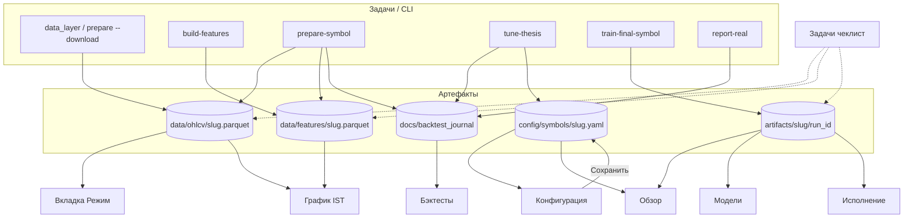

# Описание интерфейса IST (PyQt6)

Документ описывает **расположение элементов**, **источники данных**, **связь с CLI** и **типовые сценарии** десктоп-приложения.

**Связанные документы:**

- [`PROJECT_CLI_AND_GUI_COMMANDS.md`](PROJECT_CLI_AND_GUI_COMMANDS.md) — команды, матрица приёмки (§7), сценарии CLI (§9)
- [`GUI_USER_GUIDE.md`](GUI_USER_GUIDE.md) — краткое руководство
- [`gui/README.md`](../gui/README.md) — архитектура API

**Запуск:** `python -m gui.app` (реальные данные) · `python -m gui.app --demo` (синтетика, CLI отключён).

**Окно по умолчанию:** 1280×820 px. Заголовок: *«Интеллектуальная торговая система (IST)»* (`gui/app/i18n_ru.py` → `WINDOW_TITLE`).

**Поведение при ресайзе:** вкладки «Бэктесты» и «Исполнение» используют `QSplitter` — пользователь может менять доли панелей. Остальные вкладки **без вертикального скролла** (кроме «Конфигурация» — вся вкладка в `QScrollArea`). На низком окне нижние блоки могут обрезаться.

**Горячие клавиши:** в текущей версии **не назначены** (только мышь).

---

## Содержание

1. [Легенда](#легенда)
2. [Общая схема главного окна](#общая-схема-главного-окна)
3. [Сводка: вкладка ↔ CLI ↔ артефакты](#сводка-вкладка--cli--артефакты)
4. [Потоки данных между вкладками](#потоки-данных-между-вкладками)
5. [Панель символа](#панель-символа-symboltoolbar)
6. [Вкладки (3 опорные)](#вкладки)
   - [График](#вкладка-график) — chart + подпанели Решение / Режим / Bundle
   - [Задачи](#вкладка-задачи) — Pipeline / Журнал WFO / Paper
   - [Конфигурация](#вкладка-конфигурация)
7. [Режим демонстрации](#режим-демонстрации---demo)
8. [Типовые сценарии (end-to-end)](#типовые-сценарии-end-to-end)
9. [Известные UX-аномалии](#известные-ux-аномалии)
10. [Что не реализовано в GUI](#что-не-реализовано-в-gui)
11. [Скриншоты для диплома](#скриншоты-для-диплома)
12. [Локализация (i18n)](#локализация-i18n)
13. [Геометрия виджетов](#геометрия-виджетов)
14. [Исходники кода](#исходники-кода)
15. [История документа](#история-документа)

---

## Легенда

### Символы в тексте и интерфейсе

| Символ | Значение |
|--------|----------|
| `✓` / `✗` | Шаг pipeline или проверка decision выполнена / не выполнена |
| `●` | Цветной индикатор готовности данных на панели символа |
| `acc:PASS` / `acc:FAIL` | Последний прогон в журнале прошёл / не прошёл `backtesting.acceptance` |
| `☑` / `☐` | Чекбокс включён / выключен |
| Маркеры на графике IST | pyqtgraph: символ `t` (BUY, зелёный) и `t1` (SELL, красный) у low/high свечи |

### Цвета (акценты UI)

| Элемент | Цвет (hex) | Когда |
|---------|------------|--------|
| Направление **LONG** | `#2e7d32` | карточка «Обзор» |
| Направление **SHORT** | `#c62828` | карточка «Обзор» |
| Направление **FLAT** | `#666666` | карточка «Обзор» |
| Индикатор ● готов | `#2e7d32` | есть bundle |
| Индикатор ● частично | `#f9a825` | есть OHLCV, нет bundle |
| Индикатор ● нет данных | `#c62828` | нет OHLCV |
| Фон regime **trend** на графике | зелёный, alpha ~45 | режим IST |
| Фон regime **range** | серый, alpha ~40 | режим IST |
| Блоки-подсказки | разные фоны по вкладкам | см. `help_label` в views |

### Степень работы в `--demo`

| Метка | Смысл |
|-------|--------|
| **demo: ✓** | Полностью на синтетике, без parquet/bundle |
| **demo: ▲** | Частично (например, paper без реального ML) |
| **demo: ✗** | Отключено (CLI, acceptance-отчёт) |

---

## Общая схема главного окна

```text
+-----------------------------------------------------------------------------+
|  Заголовок: Intelligent Trading System (IST)                              |
+-----------------------------------------------------------------------------+
|  ПАНЕЛЬ СИМВОЛА (SymbolToolbar)                                              |
|  [Пара OKX v] [ТФ v]  Модель: run_id... | OHLCV feat bundle [acc]  (*) [Обн.] |
+-----------------------------------------------------------------------------+
|  ВКЛАДКИ: График | Задачи | Конфигурация |
|  +-------------------------------------------------------------------------+|
|  |                    Содержимое активной вкладки                          ||
|  +-------------------------------------------------------------------------+|
+-----------------------------------------------------------------------------+
|  СТРОКА СОСТОЯНИЯ: "<вкладка> — BTC/USDT 1h"                                  |
+-----------------------------------------------------------------------------+
```

**Обновление данных:** при смене пары/ТФ или вкладки вызывается `refresh()` активного экрана. Опционально: `QSettings` → `refresh_interval_sec` (секунды, **0 = выкл.**) — таймер на `MainWindow` перезагружает **только текущую** вкладку.

**Автозагрузка рынков:** при старте — `LoadOkxMarketsWorker` (список USDT spot OKX); при сбое — fallback BTC, ETH, SOL, …

---

## Сводка: вкладка ↔ CLI ↔ артефакты

Обратный индекс к [матрице приёмки §7](PROJECT_CLI_AND_GUI_COMMANDS.md#7-матрица-cli--вкладка-gui--проверка).

| Вкладка (верхний уровень) | Вложенность | CLI / артефакты |
|---------------------------|-------------|-----------------|
| **Панель символа** | — | `data/ohlcv/`, `artifacts/`, journal |
| **График** | подпанели: Решение · Режим · Bundle | OKX / IST chart; explain; regime_series; manifest |
| **Задачи** | Pipeline · Журнал WFO · Paper | orchestration CLI; `backtest_journal/`; paper API |
| **Конфигурация** | — | `config/symbols/<slug>.yaml`, acceptance |

Код обёрток: `chart_hub_view.py`, `jobs_hub_view.py`. Логика `chart_view`, `jobs_view`, `settings_view` **не менялась**.

### Требования (минимум)

| Зона | Минимум |
|------|---------|
| График OKX | сеть OKX |
| График IST | OHLCV + bundle для сигналов |
| Решение (подпанель) | bundle |
| Журнал | `runs.jsonl` |
| Paper | bundle |
| Pipeline | — |
| Конфигурация | опционально YAML на пару |

---

## Потоки данных между вкладками



---

## Панель символа (SymbolToolbar)

**Файл:** `gui/app/widgets/symbol_toolbar.py` · **Всегда видна** над вкладками.

| № | Элемент | Тип | Назначение |
|---|---------|-----|------------|
| 1 | «Пара (OKX):» | метка | |
| 2 | Список пары | `QComboBox`, **редактируемый** | USDT spot с OKX; fallback: BTC, ETH, SOL, BNB, XRP, DOGE, ADA, AVAX, LINK, DOT |
| 3 | «ТФ:» | метка | |
| 4 | Таймфрейм | `QComboBox` | **15m**, **1h** (default), **4h**, **1d** |
| 5 | «Модель: …» | `QLabel` | `run_id` (до 18 символов) + `OHLCV:✓/✗ feat:✓/✗ bundle:✓/✗ [acc:PASS/FAIL]` |
| 6 | «●» | `QLabel` | Цветной статус (см. легенду) |
| 7 | растяжка | | |
| 8 | **Обновить** | кнопка | `symbol_changed` → `refresh()` активной вкладки |

**Проверка приёмки:** [COMMANDS §7, строки 1–2](PROJECT_CLI_AND_GUI_COMMANDS.md#7-матрица-cli--вкладка-gui--проверка).

**demo: ✓** — индикатор всегда «как будто» bundle есть (`demo_bundle`).

---

## Вкладки

**Три вкладки верхнего уровня** (с 2026-05-23):

```text
График  = ChartView (без изменений) + подвкладки [Решение|Режим|Bundle]
Задачи  = [Pipeline|Журнал WFO|Paper]  — JobsView / BacktestsView / ExecutionView
Конфигурация = SettingsView (без изменений)
```

---

### Вкладка «График» (hub)

| | |
|---|---|
| **Обёртка** | `gui/app/views/chart_hub_view.py` |
| **Верх** | `chart_view.py` — live, история OKX (логика не менялась) |
| **Низ (≤300px)** | `OverviewView` · `RegimeView` · `ModelsView` — по выбору подвкладки |

```text
  +-- QSplitter вертикальный ------------------------------------------------+
  |  ChartView (основная область)                                              |
  +---------------------------------------------------------------------------+
  |  [Решение] [Режим] [Bundle]  ← QTabWidget                                  |
  |  (бывшие отдельные вкладки Обзор / Режим / Модели)                           |
  +---------------------------------------------------------------------------+
```

При `refresh()` графика обновляются **график + активная подпанель**. После сохранения конфига — авто-refresh «Решение».

---

### (архив) Вкладка «Обзор» → подпанель «Решение» на «График»

| | |
|---|---|
| **Требования** | artifact bundle (`artifacts/<slug>/latest`) |
| **API** | `inference.explain()` → `ExplainSnapshot` |
| **Demo** | **demo: ✓** (синтетический explain) |
| **COMMANDS** | §7 строки 11–12 (`explain`) |
| **Скриншот** | `docs/figures/3_11/gui/gui_overview_explain.png` |

**Назначение:** решение системы на **последнем баре** (4 модели → meta → decision → risk).

```text
+-- Группа «Решение (последний бар)» ----------------------------------------+
|  LONG / SHORT / FLAT  (шрифт ~22px, цвет по направлению)    режим: trend   |
|  -------------------------------------------------------------------------  |
|  Время | Close | Meta P(up) | Уверенность | Сигнал | Доля позиции          |
|  Блокировка: why_blocked или «сделка разрешена» (красный текст при HOLD)     |
|  Таблица «Прогнозы моделей»: Модель | P(up)   (max height ~140px)           |
|  Таблица «Активные веса»:     Модель | Вес                                |
|  Бандл: <путь artifacts/.../run_id> (мелкий серый текст)                    |
+-----------------------------------------------------------------------------+

  Шаги decision pipeline  (QListWidget, max ~160px)
  [✓/✗] Ensemble P(up) vs direction_threshold
  [✓/✗] Direction / signal
  [✓/✗] Фильтр meta
  [✓/✗] Мёртвая зона min_signal_margin
  [✓/✗] trade_mode
  [✓/✗] position_size_frac > 0
```

| Блок | Расположение | Обновление |
|------|--------------|------------|
| `ExplainCard` | верх | `ExplainWorker`, window=256 |
| Список шагов | низ | пересчёт из `snap.config` |

**Пустое / ошибка:**

| Состояние | Что видит пользователь |
|-----------|------------------------|
| Нет bundle | «Ошибка» в заголовке + текст в «Блокировка» |
| Загрузка | «Загрузка…» в заголовке |
| ML exception | сообщение в «Блокировка» |

**Связь:** после **Задачи → Финальное обучение** или **prepare-symbol** — обновить панель (**Обновить**) и открыть «Обзор».

---

### ChartView (детали, верхняя часть «График»)

| | |
|---|---|
| **Требования** | OKX: сеть · IST: `data/ohlcv/<slug>.parquet`; сигналы — bundle |
| **API** | OKX: `okx_api.fetch_ohlcv_bars` · IST: `inference.chart_payload()` |
| **Demo** | **demo: ✓** (синтетические свечи при ошибке OKX) |
| **COMMANDS** | §7 строка 13 (`regime_series` / IST overlay) |
| **Скриншот** | `docs/figures/3_11/gui/gui_chart_signals.png` (может не отражать режим IST) |

```text
  [Подсказка: OKX vs IST]

  Панель (одна строка, может переноситься на узком окне):
  [Источник: OKX | IST v] [Свечей: OKX 300|900|1500|3000 / IST 200|500|800|1200 v] [Шаг regime] [☑ Сигналы]
  [Окно inference] [☑ Live] [Сейчас]   ← авто при открытии вкладки + таймер по TF

  +-- График «Цена» (~75% высоты) --------------------------------------------+
  | OKX: свечи + пунктир close (без regime-фона)                              |
  | IST: фон trend/range + свечи + маркеры BUY/SELL + пунктир close           |
  +---------------------------------------------------------------------------+
  +-- График «Meta P(up)» (max ~140px, только IST + ☑ Сигналы) ----------------+
  | линия P(up), пунктир y=0.5                                                |
  +---------------------------------------------------------------------------+
  Строка статуса
```

| Параметр | OKX | IST |
|----------|-----|-----|
| Источник | `OkxChartWorker` | `ChartPayloadWorker` |
| Лимит свечей | **пагинация до 3000** (прокрутка влево) | до 1200 |
| Live OKX | хвост 8 свечей → merge, без clear | полный refresh, zoom сохраняется |
| Шаг regime | неактивен | 1…48 |
| Сигналы | неактивны | inference на хвосте `window` баров |
| Meta-график | скрыт | при ☑ «Сигналы (bundle)» |
| Live | опрос 20–180 с (зависит от TF) | опрос 60–600 с |

При открытии вкладки и смене пары/параметров данные подгружаются автоматически (кнопка «Сейчас» / F5 — принудительно). На других вкладках таймер останавливается.

**Пустое / ошибка:**

| Состояние | Поведение |
|-----------|-----------|
| OKX недоступен | строка «Ошибка OKX: …»; в demo — fallback на синтетику |
| Нет parquet (IST) | «Нет локальных данных — нужен OHLCV parquet…» |
| Нет bundle (IST, сигналы) | свечи и regime есть; сигналы могут отсутствовать |

**Замечание:** сигналы на графике — только на **хвосте** `window` баров, не на всей истории.

---

### Вкладка «Режим»

| | |
|---|---|
| **Требования** | `data/ohlcv/<slug>.parquet` |
| **API** | `inference.regime_series()` (= CLI `regime-history`) |
| **Demo** | **demo: ✓** |
| **COMMANDS** | §7 строка 13; CLI кнопка «Regime-history» в Задачи |

```text
  [Подсказка жёлтая]

  [Шаг 1..168] [Макс. баров в таблице 50..5000] [Загрузить]

  Статистика: N точек, % trend / range, период

  +-- Таблица (растягивается) -----------------------------------------------+
  | Время | Режим | int | Close                                                |
  +---------------------------------------------------------------------------+
  JSON (~100px): последние ~20 точек
```

**Пустое / ошибка:** «Нет данных (нужен OHLCV parquet)» в строке статистики.

**Связь с «График»:** те же regime-метки — на IST-графике как цветной фон; здесь — таблица.

---

### Вкладка «Модели»

| | |
|---|---|
| **Требования** | artifact bundle |
| **API** | `bundles.bundle_info(validate_schema=…)` |
| **Demo** | **demo: ✓** |
| **COMMANDS** | §7 строки 14, 26 |
| **Скриншот** | `docs/figures/3_11/gui/gui_models_bundle.png` |

```text
  [Подсказка голубая: паспорт bundle, не обучение]

  Сводка HTML: run_id, created_at, model_keys, schema hash, meta threshold

  [Обновить]  [Проверить схему признаков]

  Вложенные вкладки:
    [Список признаков]  |  [Веса ансамбля trend/range]
    (QPlainText read-only)
```

| Кнопка | `validate_schema` |
|--------|-------------------|
| Обновить | `False` (быстро) |
| Проверить схему | `True` (сверка с features parquet) |

**Пустое / ошибка:** текст «Bundle не найден…» + подсказка «Задачи → Финальное обучение».

---

### Вкладка «Бэктесты»

| | |
|---|---|
| **Требования** | `docs/backtest_journal/` (хотя бы `runs.jsonl`) |
| **API** | `backtests.list_runs`, `get_run`, `fold_equity_curve`, `best_acceptance` |
| **Demo** | **demo: ✓** |
| **COMMANDS** | §7 строки 7–9, 25 |
| **Скриншот** | `docs/figures/3_11/gui/gui_backtests_journal.png` |

```text
  [Подсказка фиолетовая]

  [Обновить] [Лучший PASS] [Запустить отчёт WFO…]  → вкладка «Задачи», report-real

  Фильтры: [этап v] [☑ только PASS] [сортировка v] [строк N]  счётчик «Показано …»

  +-- Splitter вертикальный ---------------------------------------------------+
  | +-- Splitter горизонтальный (~520 | ~380) ------------------------------+ |
  | | Таблица: ID | UTC | этап | accept | target | Sharpe | PF | WFE | folds |
  | | (строки: зелёный фон PASS, красный FAIL)                               | |
  | | Вкладки: [Сводка HTML] | [JSON] — критерии acceptance/target          | |
  | +-----------------------------------------------------------------------+ |
  | +-- FoldEquityChart (~200px) --------------------------------------------+ |
  +---------------------------------------------------------------------------+
```

| Колонка | Содержание |
|---------|------------|
| этап | `stage` или `label` (напр. `report-real`) |
| accept / target | PASS / FAIL / — |
| Sharpe, PF, WFE, folds | из `summary` журнала |
| Сводка | метрики + чеклист `acceptance_checks` / `target_checks` |

**Пустое / ошибка:** пустая таблица; детали «Ошибка: …»; график equity — «В этом прогоне нет метрик по фолдам».

---

### Вкладка «Исполнение»

| | |
|---|---|
| **Требования** | bundle для осмысленного inference на шаге |
| **API** | `execution.create_paper_session`, `run_step`, `reconcile.compare_paper_step` |
| **Demo** | **demo: ▲** (paper работает; explain может быть demo) |
| **COMMANDS** | §7.1, строка 18 |

```text
  [Подсказка зелёная]

  Режим: [Paper | Live v]  (Live отключён) + hint OKX_* env

  [Подключить paper] [Отключить] [Сброс] [Аварийная остановка]

  Группа «Счёт»: Статус | Баланс | PnL | Комиссии

  +-- Splitter горизонтальный (~480 | ~400) -----------------------------------+
  | ЛЕВО                          | ПРАВО                                      |
  | Позиции (таблица 4 кол.)      | Группа «Инференс + исполнение»             |
  | Ордера (таблица 6 кол.)       | [Шаг] [Серия xN] [Окно 64..512] [Авто v]   |
  | Баланс по шагам (~160px)      | Лог шагов                                  |
  |                               | Сверка с Backtester (~220px)               |
  +-------------------------------+--------------------------------------------+
```

| Элемент | Доступность |
|---------|-------------|
| Подключить paper | всегда |
| Шаг / Серия / Авто 30–60 с | после connect |
| Сверка | после каждого успешного шага |

**Пустое / ошибка:** «Сначала подключите paper-сессию»; ошибка шага в логе; сверка — «Ошибка сверки: …».

**Не путать с «График»:** здесь — симуляция ордеров, не котировки OKX.

---

### Вкладка «Задачи» (hub)

| | |
|---|---|
| **Обёртка** | `gui/app/views/jobs_hub_view.py` |
| **Подвкладки** | **Pipeline** — `jobs_view.py` · **Журнал WFO** — `backtests_view.py` · **Paper** — `execution_view.py` |
| **Связь** | «Запустить отчёт WFO» в журнале → Pipeline + `report-real` |

---

#### Подвкладка «Pipeline» (бывш. «Задачи»)

| | |
|---|---|
| **Требования** | нет (CLI создаёт артефакты) |
| **API** | `jobs.pipeline_status`, `data_health`, `list_active_tasks`, `read_task_log`; CLI via `CliProcessWorker` |
| **Demo** | **demo: ✗** (все кнопки CLI отключены) |
| **COMMANDS** | §7 строки 2–10, 19–24; §8 точные argv |

```text
  Чеклист pipeline (~120px)
    ohlcv | features | bundle | symbol_config

  Data health (2 строки): rows + last_ts

  +-- «Запуск CLI — stdout subprocess» ----------------------------------------+
  | [Подготовить] [Признаки] [Тюнинг] [Финал] [Отчёт WFO] [Стоп]              |
  | Фаза tune-thesis: [all|fast|refine|confirm]                                 |
  | подпись: tune-thesis → canonical_4model.yaml (+ thesis_tuning уровни)     |
  | [☐ Перекачать OHLCV] Баров 0=YAML (не сбрасывается при смене пары)         |
  | Доп. CLI: [Smoke][Validate]…                                                |
  | «Выполняется: …» (статус)                                                   |
  | Лог CLI (~180px)  <-- stdout/stderr subprocess                             |
  +---------------------------------------------------------------------------+

  +-- «Лог prepare-symbol (…/*.jsonl)» ----------------------------------------+
  | [task_id v] [Обновить лог]                                                  |
  | Большой лог (~остаток высоты)  <-- JSONL prepare-symbol, авто 2с           |
  +---------------------------------------------------------------------------+
```

**Два лога — не путать:**

| Поле | Содержимое |
|------|------------|
| **Лог CLI** (верхняя группа) | Вывод `python -m orchestration …` (короткий, ~180px) |
| **Лог prepare-symbol** (нижняя группа) | `artifacts/<slug>/active/<task_id>.jsonl` (длинный) |

| Кнопка | CLI |
|--------|-----|
| Подготовить символ | `prepare-symbol` (+ `--download`) |
| Признаки | `build-features` |
| Тюнинг thesis | `tune-thesis --phase …` |
| Финальное обучение | `train-final-symbol --force` |
| Отчёт WFO | `report-real` (флаги чекбоксов) |
| Smoke … Manifest-show | см. `gui/api/cli_api.py` |

После CLI: `pipeline_finished` → обновление чеклиста, toolbar, активной вкладки.

**demo:** placeholder в логе CLI — «CLI недоступен в демо-режиме».

---

### Вкладка «Конфигурация»

| | |
|---|---|
| **Требования** | symbol YAML опционален (есть default из reference) |
| **API** | `config.orchestration_section`, `merged`, `save_orchestration`, `test_pipeline_ready` |
| **Demo** | форма **demo: ✓**; acceptance CLI **demo: ✗** |
| **COMMANDS** | §7 строки 15–17, 23–24 |

**Вся вкладка в `QScrollArea`** — единственная с гарантированным вертикальным скроллом.

```text
  [Подсказка: reference + overrides]

  [☐ Синтетические данные ML]  ⚠ требует перезапуска приложения

  Группа «Decision и ансамбль» (QFormLayout):
    direction_threshold, margin, trade_mode, max_position_fraction,
    ensemble_mode, vol_filter, horizon, dl_epochs, baseline_ref

  [Загрузить][Сохранить][Тест inference][Проверить pipeline]
  [Отчёт acceptance][Manifest][Список символов]
     (на узком окне кнопки могут переноситься — одна QHBoxLayout)

  Результат (~140px)

  Вкладки: [YAML редакт.] | [merged JSON] | [Symbol manifest]
```

| Кнопка | Действие |
|--------|----------|
| Сохранить | `config/symbols/<slug>.yaml` (+ опционально полный YAML из редактора) |
| Отчёт acceptance | subprocess → `docs/thesis_<slug>_acceptance_gui.json` |
| Manifest | `read_symbol_manifest` → вкладка manifest |
| Список символов | `symbols.list_symbols()` → поле «Результат» |

**⚠ Demo-checkbox vs `--demo`:** чекбокс пишет `QSettings("IST","Desktop").demo_mode`; **переключение вступает в силу только после перезапуска** с `python -m gui.app --demo` (или без него). Не эквивалентно мгновенному переключению.

**Пустое / ошибка:** ошибки загрузки/сохранения в `QMessageBox` и поле «Результат».

---

## Режим демонстрации (`--demo`)

| Элемент | production | `--demo` |
|---------|------------|----------|
| Toolbar bundle | реальный статус | всегда «есть» |
| Обзор, График, Режим, Модели, Бэктесты | parquet + journal + bundle | `demo_api` синтетика |
| Задачи — CLI | subprocess | **кнопки disabled** |
| Конфигурация — acceptance | `report-real` | **заблокирован** |
| Исполнение — paper | реальный inference | paper OK, ML может быть demo |

Запуск: `python -m gui.app --demo` или `IST_GUI_DEMO=1`.

Для приёмки и диплома с реальными метриками — **без** `--demo`.

---

## Типовые сценарии (end-to-end)

Согласовано с [PROJECT_CLI_AND_GUI_COMMANDS.md §9](PROJECT_CLI_AND_GUI_COMMANDS.md#9-рекомендуемые-сценарии-end-to-end).

### S1. Первый запуск на новой паре (BTC 1h)

| Шаг | Вкладка | Действие | Ожидание |
|-----|---------|----------|----------|
| 1 | Задачи | ☑ Перекачать OHLCV → **Подготовить символ** | чеклист ✓, лог task |
| 2 | Toolbar | **Обновить** | `bundle:✓`, `acc:…` |
| 3 | Обзор | открыть вкладку | LONG/SHORT/FLAT, 4×P(up) |
| 4 | Модели | **Обновить** | lgb, gru, xgb, cnn |
| 5 | Бэктесты | **Обновить журнал** | строки `report_real` / tune |
| 6 | Бэктесты | **Лучший PASS** | выделение run с acceptance |

### S2. Проверка acceptance (диплом)

| Шаг | Вкладка | Действие | Ожидание |
|-----|---------|----------|----------|
| 1 | Задачи | **Признаки** (если нет feat) | features ✓ |
| 2 | Конфигурация | **Отчёт acceptance** | лог в «Результат», JSON в `docs/thesis_*_gui.json` |
| 3 | Бэктесты | новая строка, accept=PASS | equity по фолдам |
| 4 | Toolbar | | `acc:PASS` |

### S3. Диагностика HOLD

| Шаг | Вкладка | Действие | Ожидание |
|-----|---------|----------|----------|
| 1 | Обзор | прочитать **Блокировка** и шаги ✗ | причина HOLD |
| 2 | Конфигурация | изменить margin / direction_threshold | |
| 3 | Конфигурация | **Сохранить** | путь YAML |
| 4 | Toolbar | **Обновить** | |
| 5 | Обзор | | обновлённый сигнал |

### S4. Paper на защите (5 мин)

| Шаг | Вкладка | Действие | Ожидание |
|-----|---------|----------|----------|
| 1 | Обзор | зафиксировать сигнал | |
| 2 | Исполнение | **Подключить paper** | статус «Подключено» |
| 3 | Исполнение | **Серия шагов** ×5 | лог, ордера, баланс |
| 4 | Исполнение | блок **Сверка с Backtester** | текст сравнения |
| 5 | Бэктесты | последний PASS run | метрики WFO |

### S5. Локальный график с regime и сигналами

| Шаг | Вкладка | Действие | Ожидание |
|-----|---------|----------|----------|
| 1 | Задачи | **Признаки** + **Финальное обучение** | bundle |
| 2 | График | IST, ☑ Сигналы, ☑ Live | фон trend/range, маркеры, meta P(up) |
| 3 | Режим | **Загрузить** | согласованные % trend/range |

---

## Известные UX-аномалии

| # | Поведение | Где | Статус |
|---|-----------|-----|--------|
| 1 | OKX: история **300–3000** баров + live-хвост без перерисовки всего графика | График | **исправлено** — пагинация + `ChartPlotController` |
| 2 | `max_rows` сбрасывался в 0 при смене пары | Задачи | **исправлено** — значение сохраняется |
| 3 | Чекбокс demo ≠ мгновенный demo | Конфигурация | **уточнено** — QMessageBox + tooltip, нужен перезапуск |
| 4 | Нет глобального progress-bar на длинный CLI | Задачи | открыто — строка «Выполняется: …» над логом CLI |
| 5 | Сохранение конфига не обновляло Обзор | Конфигурация → Обзор | **исправлено** — сигнал `config_saved` |
| 6 | Sharpe **0.000** при пустом summary | Бэктесты | **исправлено** — «—» через `format_mean_sharpe` |
| 7 | Сигналы IST только на хвосте `window` | График | by design — подсказка при включении «Сигналы» |
| 8 | `tune-thesis`: расхождение config GUI vs CLI | Задачи | **исправлено** — default `canonical_4model.yaml` + подпись |
| 9 | Вкладки без скролла при низком окне | Обзор, Исполнение | **исправлено** — `QScrollArea` |
| 10 | Live OKX в combo отключён | Исполнение | by design — только paper |

---

## Что не реализовано в GUI

Доступно **только через CLI / терминал** (см. [PROJECT_CLI_AND_GUI_COMMANDS.md](PROJECT_CLI_AND_GUI_COMMANDS.md)):

| Функция | Команда / путь |
|---------|----------------|
| Скрипты дипломного push | `scripts/thesis_push_4model.py`, `phase2`, `thesis_4model_steps.py` |
| Ablation / WFE compare | `scripts/run_ablation.py`, `compare_wfe_reports.py` |
| Полный multilevel tune (без кнопки в UI кроме `tune-thesis`) | `tune-thesis --profile turbo` |
| Редактирование эталона | `config/reference/thesis_4model_reference.yaml` |
| pytest | `pytest tests/…` |
| **Live-торговля OKX** | заблокировано в UI |
| HTTP API backend | не планировался (desktop → `gui.api` напрямую) |
| Скачивание OHLCV отдельно | только `data_layer` или prepare + ☑ Перекачать |

---

## Скриншоты для диплома

Каталог: `docs/figures/3_11/gui/`

Скрипт: `python docs/scripts/capture_gui_screenshots.py` (нужна графическая сессия, по умолчанию `IST_GUI_DEMO=1`).

| Файл | Вкладка | Примечание |
|------|---------|------------|
| `gui_overview_explain.png` | Обзор | |
| `gui_chart_signals.png` | График | может быть OKX, не IST overlay |
| `gui_models_bundle.png` | Модели | |
| `gui_backtests_journal.png` | Бэктесты | |

Вкладки **Режим**, **Исполнение**, **Задачи**, **Конфигурация** — скриншоты в скрипт пока не добавлены; сделать вручную при необходимости.

---

## Локализация (i18n)

Файл: `gui/app/i18n_ru.py`

| Ключ | UI (RU) | EN / код |
|------|---------|----------|
| `WINDOW_TITLE` | Интеллектуальная торговая система (IST) | window title |
| `TAB_OVERVIEW` | Обзор | Overview |
| `TAB_CHART` | График | Chart |
| `TAB_REGIME` | Режим | Regime |
| `TAB_MODELS` | Модели | Models |
| `TAB_BACKTESTS` | Бэктесты | Backtests |
| `TAB_EXECUTION` | Исполнение | Execution |
| `TAB_JOBS` | Задачи | Jobs |
| `TAB_CONFIG` | Конфигурация | Settings (alias `TAB_SETTINGS`) |

Остальные подписи — в соответствующих `*_view.py` (частично русские, частично англ. в кнопках CLI).

---

## Геометрия виджетов

| Виджет | Параметр | Значение |
|--------|----------|----------|
| MainWindow | default size | 1280 × 820 |
| SymbolToolbar | symbol combo min width | 160 px |
| ExplainCard | direction font | ~22px bold |
| ExplainCard | models/weights tables max height | 140 px each |
| Overview steps list | min height (в QScrollArea) | 120 px |
| Chart meta plot | max height | 140 px |
| Regime JSON export | max height | 100 px |
| Jobs checklist | max height | 120 px |
| Jobs CLI log | max height | 180 px |
| Settings result | max height | 140 px |
| Backtests splitter (H) | default sizes | 500 \| 400 |
| Backtests splitter (V) | default sizes | 420 \| 220 |
| Execution splitter | default sizes | 480 \| 400 |
| Execution balance plot | max height | 160 px |
| Execution compare text | max height | 220 px |

---

## Исходники кода

| UI | Файл |
|----|------|
| Главное окно | `gui/app/main_window.py` |
| Панель символа | `gui/app/widgets/symbol_toolbar.py` |
| Обзор | `gui/app/views/overview_view.py` |
| График | `gui/app/views/chart_view.py` |
| Режим | `gui/app/views/regime_view.py` |
| Модели | `gui/app/views/models_view.py` |
| Бэктесты | `gui/app/views/backtests_view.py` |
| Исполнение | `gui/app/views/execution_view.py` |
| Задачи | `gui/app/views/jobs_view.py` |
| Конфигурация | `gui/app/views/settings_view.py` |
| Карточка решения | `gui/app/widgets/explain_card.py` |
| Слои графика | `gui/app/widgets/chart_layers.py` |
| Equity WFO | `gui/app/widgets/fold_equity_chart.py` |
| Workers | `gui/app/workers.py` |
| CLI argv | `gui/api/cli_api.py` |
| API facade | `gui/api/client.py` |

---

## История документа

| Дата | Изменение |
|------|-----------|
| 2026-05-22 | Первая версия: карта экранов |
| 2026-05-23 | P0–P2: TOC, легенда, сводные таблицы, mermaid, сценарии, empty-states, UX-аномалии, cross-ref COMMANDS, i18n, геометрия, скриншоты |
| 2026-05-23 | UX-фиксы в коде: OKX/IST лимиты графика, jobs max_rows, formatters, config_saved, scroll, tune-thesis default |
| 2026-05-23 | Бэктесты: фильтры, сводка+JSON, колонки PF/WFE, WFO из GUI, подсветка PASS/FAIL |
| 2026-05-23 | 3 вкладки: ChartHub + JobsHub; см. [GUI_TAB_REDESIGN.md](GUI_TAB_REDESIGN.md) |
