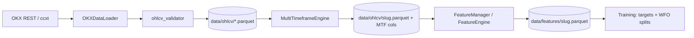

# 3.1 Реализация подсистемы обработки рыночных данных

**Проект:** Intelligent Trading System (IST)  
**Состояние:** по коду репозитория (май 2026)  
**Связанные модули:** `data_layer/`, `synchronization/`, `feature_engineering/`, `orchestration/canonical_pipeline.py`, `orchestration/feature_store.py`

Подсистема готовит **единый табличный датасет** на часовом базовом таймфрейме: OHLCV с биржи OKX → выравнивание MTF → технические признаки → Parquet для обучения и WFO.

---

## Содержание

1. [Назначение и границы подсистемы](#1-назначение-и-границы-подсистемы)
2. [Архитектура потока данных](#2-архитектура-потока-данных)
3. [Загрузка данных](#3-загрузка-данных)
4. [Preprocessing pipeline](#4-preprocessing-pipeline)
5. [Генерация признаков](#5-генерация-признаков)
6. [Формирование датасетов](#6-формирование-датасетов)
7. [Конфигурация](#7-конфигурация)
8. [Команды воспроизведения](#8-команды-воспроизведения)
9. [Ограничения и roadmap](#9-ограничения-и-roadmap)
10. [Рисунки для ВКР (3.1–3.3)](#10-рисунки-для-вкр-31–33)

---

## 1. Назначение и границы подсистемы

| Входит в §3.1 | Не входит (другие разделы ВКР) |
|---------------|--------------------------------|
| Загрузка исторических OHLCV | Обучение моделей (`models/`, `orchestration` WFO) |
| Валидация и нормализация сырых свечей | Regime / ensemble / decision |
| MTF-merge (15m, 4h → 1h) | Backtest, метрики приёмки |
| Индикаторы и MTF-колонки | Live WebSocket / LOB в production |
| Кэш Parquet + manifest признаков | |

**Источник данных в production-research:** биржа **OKX**, REST API через библиотеку **ccxt**. Binance и CSV не являются каноническим путём modular pipeline.

---

## 2. Архитектура потока данных



**Сквозная точка входа:** `orchestration/canonical_pipeline.py`

| Функция | Этап |
|---------|------|
| `download_canonical_ohlcv()` | загрузка base + aux TF, merge MTF, сохранение OHLCV |
| `build_canonical_features()` | индикаторы поверх OHLCV |
| `prepare_canonical_dataset()` | OHLCV → features одной командой |
| `orchestration/feature_store.build_features()` | кэш признаков + `.manifest.json` |

---

## 3. Загрузка данных

### 3.1. Модуль и класс

| Элемент | Путь |
|---------|------|
| Загрузчик | `data_layer/loaders/okx_ohlcv_loader.py` |
| Класс | `OKXDataLoader` |
| Валидация | `data_layer/validators/ohlcv_validator.py` |
| Сохранение | `data_layer/storage.save_ohlcv()` |

### 3.2. Протокол загрузки

1. Парсинг `start_date` / `end_date` (UTC).
2. Пагинация `exchange.fetch_ohlcv(symbol, timeframe, since)` до `end_ts`.
3. Сдвиг `since = last_timestamp + 1` для следующей страницы.
4. Rate limit: `enableRateLimit: true` в ccxt.
5. Сборка DataFrame с колонками: `timestamp`, `open`, `high`, `low`, `close`, `volume`.
6. Индекс — `DatetimeIndex` UTC, сортировка, дедупликация.

### 3.3. Схема OHLCV

```text
OHLCV_t = (timestamp, open, high, low, close, volume)
```

Публичные свечи **не требуют** API-ключей; ключи OKX нужны для sandbox/live execution, не для истории.

### 3.4. Мульти-таймфрейм при загрузке

Профиль `canonical_4model.yaml`:

| Роль | TF |
|------|-----|
| Базовый | **1h** |
| Вспомогательные | **15m**, **4h** |

`download_canonical_ohlcv()`:

1. Сначала загружает aux TF (меньше объём → меньше риск rate limit на финальном 1h).
2. Сохраняет каждый aux в `data/ohlcv/{SYMBOL}_{tf}.parquet`.
3. Загружает base 1h, сохраняет raw-копию `{slug}_ohlcv_raw.parquet`.
4. Вызывает `MultiTimeframeEngine.compute_and_merge(base_df)`.
5. Записывает итоговый merged OHLCV в `data/ohlcv/{slug}.parquet`.

### 3.5. Контроль полноты истории

`canonical_pipeline._validate_ohlcv_coverage()` сравнивает число баров с ожидаемым (~85% от теоретического диапазона `start_date` → `end_date`). При нехватке — явная ошибка с рекомендацией повторить `prepare-symbol --download`.

### 3.6. Пути на диске

| Артефакт | Путь (пример BTC 1h) |
|----------|----------------------|
| OHLCV base/aux | `data/ohlcv/BTC-USDT_1h.parquet`, `BTC-USDT_15m.parquet`, … |
| Slug | `orchestration/symbols.paths_for()` → `BTC-USDT_1h` |

---

## 4. Preprocessing pipeline

Preprocessing — всё, что выполняется **до** обучения моделей: приведение индекса, очистка, MTF-alignment, опциональный drop NA.

### 4.1. Валидация OHLCV (`ohlcv_validator`)

| Шаг | Функция | Действие |
|-----|---------|----------|
| Индекс UTC | `ensure_datetime_index` | `timestamp` → `DatetimeIndex`, sort |
| Дубликаты | `drop_duplicate_timestamps` | keep last |
| Обрезка | `trim_to_end_date` | `index <= end_date` |
| Пропуски | `detect_gaps` | диагностика (не всегда заполнение) |

Точка входа для loader: `validate_ohlcv(df)` после fetch.

### 4.2. Multi-timeframe preprocessing (`synchronization/`)

**Класс:** `MultiTimeframeEngine` (`multi_timeframe_engine.py`)

| Параметр (canonical) | Значение |
|----------------------|----------|
| `base_timeframe` | `1h` |
| `auxiliary_timeframes` | `15m`, `4h` |
| `resample_rule` | `1h` |
| `fill_method` | `ffill` |
| `drop_na_after_merge` | `true` (в features; при download иногда `false` до ffill MTF) |

**Алгоритм merge:**

```text
для каждого aux TF:
    построить MTF-признаки на native TF (rsi, ema_slope, adx, …)
    resample('1h').last()
    ffill по индексу base 1h
join к base OHLCV → единый DataFrame с колонками rsi_15m, ema_slope_15m, rsi_4h, adx_4h
```

Вспомогательные функции: `synchronization/gap_handler.py` (`align_to_base`, `ensure_datetime_index`), `synchronization/mtf_features.py` (`build_features`).

### 4.3. Микроструктура (canonical: выключена)

`FeatureEngineeringConfig.microstructure.mode`:

| mode | Поведение |
|------|-----------|
| **`off`** | canonical — без OBI/spread |
| `simulated` | `simulate_l2_features()` — исследовательский шум |
| `live` | `NotImplementedError` |

Колонки с `order_book` / `obi` **исключаются** из обучения (`orchestration/model_factory.infer_training_feature_columns`).

### 4.4. Scaling

В modular pipeline **нет** глобального `StandardScaler` на этапе FeatureEngine. Признаки — значения индикаторов в натуральных единицах. Нормализация для GRU/CNN — внутри окон модели (без отдельного sklearn-шага в canonical path).

---

## 5. Генерация признаков

### 5.1. Оркестратор признаков

| Компонент | Файл |
|-----------|------|
| `FeatureManager` | `feature_engineering/feature_manager.py` |
| `FeatureEngine` | `feature_engineering/feature_engine.py` |
| Индикаторы | `feature_engineering/indicators.py`, `synchronization/indicators.py` |

**Вызов:**

```python
from feature_engineering.config import FeatureEngineeringConfig
from feature_engineering.feature_manager import FeatureManager

cfg = FeatureEngineeringConfig.from_yaml("config/profiles/canonical_4model.yaml")
df_features = FeatureManager(cfg).transform(df_ohlcv_mtf)
```

### 5.2. Базовые признаки (таймфрейм 1h)

| Колонка | Описание | Параметры (default) |
|---------|----------|---------------------|
| `ema_fast` | быстрая EMA | 20 |
| `ema_slow` | медленная EMA | 50 |
| `ema_slope` | относительное изменение ema_fast | shift(1) |
| `rsi` | RSI | 14 |
| `macd`, `macd_signal`, `macd_hist` | MACD | 12 / 26 / 9 |
| `atr` | ATR | 14 |
| `log_ret` | лог-доходность close | — |
| `volatility` | rolling std(log_ret)×√24 | окно 20 |
| `adx` | ADX | 14 |

### 5.3. MTF-признаки (после sync)

| Колонка | Источник TF |
|---------|-------------|
| `rsi_15m` | 15m |
| `ema_slope_15m` | 15m |
| `rsi_4h` | 4h |
| `adx_4h` | 4h |

### 5.4. Эталонный минимальный набор (8 колонок)

`feature_engineering/config.py` → `DIRECTION_FEATURE_COLUMNS`:

```text
rsi, macd_hist, ema_slope, adx,
rsi_15m, ema_slope_15m, rsi_4h, adx_4h
```

**Фактически в WFO** `infer_training_feature_columns()` берёт **все числовые** engineered-колонки (обычно 15+), исключая сырой OHLCV и leaky-подстроки (`signal`, `target`, `future_`, …).

### 5.5. Обработка пропусков

При `feature_engineering.drop_na: true` (canonical) — `FeatureEngine.get_processed_data()` вызывает `dropna()` после расчёта индикаторов (первые бары с NaN от rolling окон отбрасываются).

---

## 6. Формирование датасетов

### 6.1. Файлы датасета

| Слой | Файл | Содержимое |
|------|------|------------|
| Features | `data/features/{slug}.parquet` | OHLCV + все признаки + `close` |
| Manifest | `data/features/{slug}.manifest.json` | хэш конфига, row_count, columns_hash, пути |
| OHLCV (вход) | `data/ohlcv/{slug}.parquet` | merged MTF + base candles |

Запись: `feature_engineering/storage.save_features()` / `orchestration/feature_store.write_manifest()`.

### 6.2. Кэш признаков

`orchestration/feature_store.py`:

- `build_features(symbol, timeframe)` — пересборка только если parquet отсутствует или **устарел** (`is_stale`: сменился hash секций `feature_engineering` + `synchronization` в YAML).
- Флаг CLI/GUI: `--use-feature-cache` при `report-real` / tune.

### 6.3. Целевая переменная (для ML)

Формируется на этапе **orchestration**, не в FeatureManager:

```python
# orchestration/glue.default_horizon_labels
fwd = close.shift(-horizon)          # horizon = 12 баров (1h → ~12 ч)
y = (fwd > close).astype(float)      # 1 = цена вырастет, 0 = иначе
y.iloc[-horizon:] = np.nan           # хвост без метки
```

| Параметр | Canonical |
|----------|-----------|
| `prediction_horizon` | 12 |
| Классы | бинарная направленность вверх / не вверх |

### 6.4. Матрица признаков для обучения

```python
from orchestration.model_factory import infer_training_feature_columns

feature_cols = infer_training_feature_columns(df_features)
X = df_features[feature_cols]
y = default_horizon_labels(df_features["close"], horizon=12)
```

| Модель | Форма входа |
|--------|-------------|
| LightGBM, XGBoost | `(n_bars, n_features)` |
| GRU, CNN | окно `(window_size=24, n_features)` |

### 6.5. Разбиение для WFO (связь с датасетом)

После формирования `features` + `targets` используется `TrainingOrchestrator.walk_forward_backtest()`:

| Параметр | Значение |
|----------|----------|
| `train_window_size` | 1500 |
| `test_window_size` | 250 |
| `walk_forward_step` | 250 |
| Purge | последние `horizon` баров train |
| Embargo | 5 баров между train и test |

Реализация: `utils/data_leakage_prevention.py` → `safe_walk_forward_split`.

### 6.6. Сводная таблица этапов «датасет»

| Этап | Выход | Модуль |
|------|-------|--------|
| Load | сырой OHLCV Parquet | `data_layer` |
| Preprocess MTF | OHLCV + MTF cols | `synchronization`, `canonical_pipeline` |
| Features | `data/features/*.parquet` | `feature_engineering`, `feature_store` |
| Labels | `Series` aligned index | `orchestration/glue` |
| WFO folds | train/test DataFrames | `TrainingOrchestrator` |

---

## 7. Конфигурация

Эталон: `config/profiles/canonical_4model.yaml`

```yaml
data_collection:
  start_date: "2022-01-01 00:00:00"
  end_date: null                    # до текущего UTC

synchronization:
  base_timeframe: "1h"
  auxiliary_timeframes: ["15m", "4h"]
  resample_rule: "1h"
  fill_method: ffill
  drop_na_after_merge: true

feature_engineering:
  drop_na: true
  microstructure:
    mode: "off"
  base_indicators:
    ema_fast: 20
    ema_slow: 50
    rsi_length: 14
    atr_length: 14
    # … MACD, ADX, vol_window
```

Переопределение по инструменту: `config/symbols/BTC-USDT_1h.yaml`.

---

## 8. Команды воспроизведения

```powershell
cd D:\IST

# Полный цикл: загрузка OKX + MTF + признаки
py -3 -m orchestration prepare-symbol --symbol BTC-USDT --timeframe 1h --download

# Только пересборка признаков из готового OHLCV
py -3 -m orchestration build-features --symbol BTC-USDT --timeframe 1h

# Программно (Python)
from orchestration.canonical_pipeline import prepare_canonical_dataset
ohlcv_path, feat_path = prepare_canonical_dataset(
    "BTC-USDT", "1h",
    config_path="config/profiles/canonical_4model.yaml",
    download=True,
)
```

**GUI:** вкладка «Задачи» → Pipeline → кнопки подготовки / «Признаки» (`gui/README.md`).

**Проверка manifest:**

```powershell
py -3 -m orchestration manifest-show --symbol BTC-USDT --timeframe 1h
```

---

## 9. Ограничения и roadmap

| Тема | Статус |
|------|--------|
| Источник | только OKX REST (не Binance WS) |
| Live LOB → признаки | не реализовано |
| Явные lag-returns (ret_5, ret_20) | roadmap |
| Единая команда «download→features→train» | частично (`prepare-symbol`, `symbol-pipeline`) |
| Scheduler bar-close | вне репозитория (cron / GUI timer) |

---

## Связанная документация

| Документ | Содержание |
|----------|------------|
| `data_layer/README.md` | детали OKX loader |
| `synchronization/README.md` | MTF engine |
| `feature_engineering/README.md` | каталог признаков |
| `docs/vkr/01-architecture-and-data.md` | архитектура + data pipeline для ВКР |
| `orchestration/canonical_pipeline.py` | исходный код сквозного пути |

---

## 10. Рисунки для ВКР (3.1–3.3)

Готовые файлы (сгенерированы из `data/features/BTC-USDT_1h.parquet`):

| Рисунок | Файл | Описание |
|---------|------|----------|
| **3.1** | [figures/fig_3_1_preprocessing_pipeline.png](figures/fig_3_1_preprocessing_pipeline.png) | OKX API → Raw OHLCV → Validation → MTF → Features → Dataset |
| **3.2** | [figures/fig_3_2_ohlcv_ema_rsi.png](figures/fig_3_2_ohlcv_ema_rsi.png) | Свечи BTC-USDT 1h + EMA(20/50) + RSI(14) |
| **3.3** | [figures/fig_3_3_dataset_structure.png](figures/fig_3_3_dataset_structure.png) | Shape датасета + фрагмент таблицы с `target_up_h12` |
| — | [figures/fig_3_3_dataset_sample.csv](figures/fig_3_3_dataset_sample.csv) | CSV-фрагмент для вставки в текст |
| — | [figures/fig_3_1_preprocessing_pipeline.mmd](figures/fig_3_1_preprocessing_pipeline.mmd) | Mermaid-исходник схемы 3.1 |

### Как пересобрать

```powershell
py -3 docs/scripts/generate_thesis_3_1_figures.py
# другой parquet:
py -3 docs/scripts/generate_thesis_3_1_figures.py --features data/features/ETH-USDT_1h.parquet --bars 96
```

### Альтернатива: GUI (рисунок 3.2)

1. `py -3 -m gui.app` (нужны OHLCV + bundle для overlay IST).
2. Вкладка **График** → режим OKX или IST, пара BTC/USDT, TF 1h.
3. Скриншот окна или `py -3 docs/scripts/capture_gui_screenshots.py` (сохраняет в `docs/figures/…`, путь настраивается в скрипте).

Для диплома **рис. 3.2** с явными EMA и RSI удобнее matplotlib-версия из скрипта выше.

### Mermaid / draw.io (рисунок 3.1)

- Открыть [fig_3_1_preprocessing_pipeline.mmd](figures/fig_3_1_preprocessing_pipeline.mmd) на [mermaid.live](https://mermaid.live) → Export PNG/SVG.
- Или скопировать блок из §2 этого README в Word / draw.io.

### Вставка в текст диплома (пример)

```text
Рисунок 3.1 – Общая схема preprocessing pipeline
Рисунок 3.2 – Пример рыночных OHLCV-данных и технических индикаторов (BTC-USDT, 1h)
Рисунок 3.3 – Пример структуры сформированного датасета
```

Пути для Word/LaTeX: `docs/thesis/3_1/figures/fig_3_*.png`.
