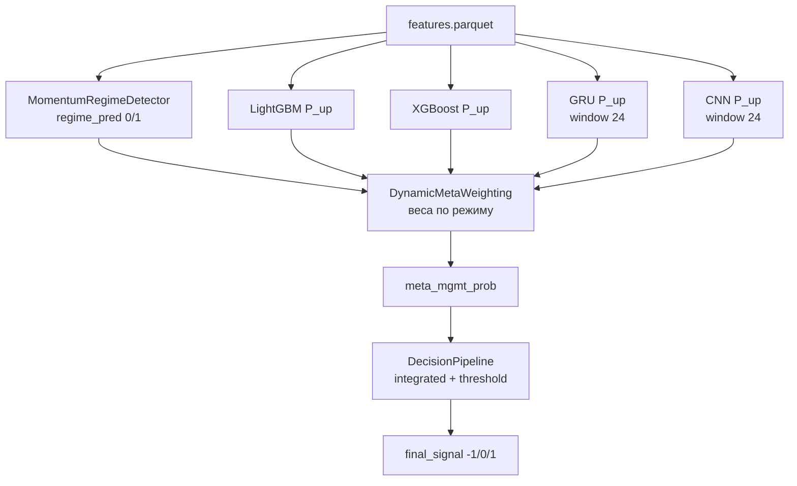

# 3.2 Реализация ансамбля моделей прогнозирования

**Проект:** Intelligent Trading System (IST)  
**Состояние:** по коду репозитория (май 2026)  
**Связанные модули:** `models/`, `meta_learning/`, `orchestration/` (`TrainingOrchestrator`, `InferenceOrchestrator`, `model_factory`), `orchestration/artifact_bundle.py`

Ансамбль — **ядро прогнозного контура**: четыре модели дают P(рост цены), режимно-взвешенная сумма → `meta_mgmt_prob` → decision/risk. Не используется legacy `ModelRouter` (одна модель на режим).

---

## Содержание

1. [Назначение и границы §3.2](#1-назначение-и-границы-32)
2. [Архитектура ансамбля](#2-архитектура-ансамбля)
3. [Обучение моделей](#3-обучение-моделей)
4. [Генерация прогнозов](#4-генерация-прогнозов)
5. [Объединение прогнозов ансамбля](#5-объединение-прогнозов-ансамбля)
6. [Adaptive weighting](#6-adaptive-weighting)
7. [Артефакты и воспроизведение](#7-артефакты-и-воспроизведение)
8. [Ограничения](#8-ограничения)
9. [Рисунки для ВКР](#9-рисунки-для-вкр)

---

## 1. Назначение и границы §3.2

| Входит в §3.2 | Не входит (другие разделы) |
|---------------|----------------------------|
| 4 модели: lgb, gru, xgb, cnn | Подготовка признаков (§3.1) |
| `fit` / `predict` в WFO и bundle | Полный backtest и метрики (§3.3+) |
| `DynamicMetaWeighting` | Финальные торговые правила (§3.8 decision) |
| Режимно-адаптивные веса из YAML | Online-обучение весов по PnL |
| Inference на последнем баре (GUI) | Transformer/LSTM prod (только `ist.py`) |

**Единый target при обучении всех четырёх моделей:** бинарный forward direction, `prediction_horizon: 12` (см. `orchestration/glue.default_horizon_labels`).

---

## 2. Архитектура ансамбля



**Канонический контракт** (`TrainingOrchestrator` / `InferenceOrchestrator`):

```text
features[t]
  → regime_pred[t]
  → {p_lgb, p_gru, p_xgb, p_cnn}[t]
  → meta_mgmt_prob[t] = Σ w_m(t) · p_m(t)
  → direction_soft / final_signal
```

| Компонент | Файл |
|-----------|------|
| Фабрика моделей | `orchestration/model_factory.py` |
| Обучение + WFO | `orchestration/training_orchestrator.py` |
| Inference (prod) | `orchestration/inference_orchestrator.py` |
| Веса ансамбля | `meta_learning/dynamic_meta.py` |
| Сохранение bundle | `orchestration/artifact_bundle.py` |

---

## 3. Обучение моделей

### 3.1. Состав ансамбля

| Key | Класс | Файл | Вход | Выход |
|-----|-------|------|------|-------|
| `lgb` | `LightGBMTabularModel` | `models/tabular/lightgbm_tabular_model.py` | таблица (n×F) | P(up) |
| `xgb` | `XGBoostMeanReversionModel` | `models/mean_reversion/xgboost_model.py` | таблица | P(up) |
| `gru` | `GRUTrendModel` | `models/trend/gru_model.py` | окно 24×F | P(up) |
| `cnn` | `CNNVolatilityModel` | `models/volatility/cnn_model.py` | окно 24×F | P(up) |

Создание: `build_orchestration_models(OrchestratorConfig, df, feature_columns=...)`.

### 3.2. Целевая переменная

```python
fwd = close.shift(-horizon)
y = (fwd > close).astype(float)   # horizon = 12
y.iloc[-horizon:] = np.nan
```

Один и тот же `y` для всех моделей в WFO (специализация — через архитектуру и **веса**, не через разные таргеты).

### 3.3. Признаки

`infer_training_feature_columns(df)` — все числовые колонки, кроме OHLCV и leaky-подстрок (`signal`, `target`, `future_`, …). Обычно 15+ колонок после §3.1.

### 3.4. Процедура обучения (один фолд WFO)

На каждом фолде `TrainingOrchestrator.walk_forward_backtest`:

```python
for model_key, model in self.models.items():
    if hasattr(model, "fit"):
        model.fit(train_features_clean, train_targets_clean)
```

| Модель | Особенности `fit` |
|--------|-------------------|
| LGB | `LGBMClassifier`, class_weight balanced |
| XGB | adapter → `train(df, y)` |
| GRU/CNN | `_DLTrainAdapter`: epochs=5 (profile), temporal val 10%, EarlyStopping |
| Окно DL | `feature_window_size: 24` |

После fit на train — `run_pipeline(test_features)` для OOS без переобучения на test.

### 3.5. Точки входа обучения

| Сценарий | Команда / функция |
|----------|-------------------|
| WFO + метрики | `TrainingOrchestrator.walk_forward_backtest` |
| CLI | `python -m orchestration report-real`, `from-parquet` |
| Финальный bundle | `train-final-symbol`, `symbol-pipeline` |
| Сохранение | `save_orchestrator_bundle` → `artifacts/<slug>/<run_id>/` |

### 3.6. Артефакт bundle

| Файл | Содержание |
|------|------------|
| `manifest.json` | model_keys, feature_columns, schema_hash, train_meta_threshold |
| `artifacts/*.pkl` | сериализованные модели + regime detector |
| `LATEST.txt` | указатель на run_id |

Загрузка: `load_orchestrator_bundle` → `InferenceOrchestrator.initialize(...)`.

---

## 4. Генерация прогнозов

### 4.1. Batch (история / WFO)

```python
predictions = {}
for model_key, model in models.items():
    predictions[model_key] = np.asarray(model.predict(features))
```

`TrainingOrchestrator.collect_predictions(features)` — все ключи за один проход по DataFrame.

### 4.2. Один бар (inference / paper / GUI)

`InferenceOrchestrator.collect_predictions(features)`:

- при наличии `predict_single` — один скаляр;
- иначе `predict(features)` → последний элемент массива.

Точки вызова:

| Контекст | Модуль |
|----------|--------|
| GUI `explain` | `orchestration/introspect.py` |
| Paper step | `execution/paper_loop.py` + bundle |
| Программно | `InferenceOrchestrator.predict(df_tail)` |

### 4.3. Формат прогноза

| Поле | Тип | Смысл |
|------|-----|--------|
| `p_lgb`, … | float ∈ [0,1] | вероятность «цена вверх через horizon» |
| `meta_mgmt_prob` | float | взвешенный ансамбль |
| `confidence` | float | `abs(meta_prob - 0.5) * 2` (inference) |

### 4.4. Regime перед весами

```python
regime_info = regime_detector.get_regime_info(features)
regime_pred = regime_info["regime_pred"]   # 1=trend, 0=range
```

Production: `glue.MomentumRegimeDetector` (close vs SMA(50)). ML `RegimeDetector` в bundle может подставляться, но canonical — rule-based.

---

## 5. Объединение прогнозов ансамбля

### 5.1. Класс

`meta_learning.dynamic_meta.DynamicMetaWeighting`

### 5.2. Формула

Для каждого бара \(t\):

\[
\text{meta\_mgmt\_prob}[t] = \sum_{m \in \{lgb,gru,xgb,cnn\}} w_m(t)\cdot p_m(t)
\]

**Код:**

```python
weights_dict = meta_weighting.get_weights(regime_pred, mode=ensemble_mode)
meta_probabilities = meta_weighting.apply_dynamic_weighting(
    model_predictions, regime_pred, mode=ensemble_mode
)
```

### 5.3. Режимы ensemble (`ensemble_mode`)

| Режим | Поведение |
|-------|-----------|
| `regime_adaptive` | **default** — веса из `trend_weights` или `range_weights` по `regime_pred[t]` |
| `fixed_trend` | всегда trend-таблица |
| `fixed_range` | всегда range-таблица |

### 5.4. Baseline (не prod)

`meta_learning/ensemble.py` — `EnsembleAggregator.simple_average` / `weighted_average` с ключами `lstm`/`trans`; **не** вызывается из `TrainingOrchestrator`.

### 5.5. После ансамбля

```python
direction_signals = np.where(
    meta_prob > direction_threshold, 1,
    np.where(meta_prob < (1 - direction_threshold), -1, 0),
)
# direction_threshold = 0.52

final_signals = DecisionPipeline.generate_signal(
    direction_soft_signal=meta_prob,
    meta_mgmt_prob=meta_prob,
    train_threshold_override=train_only_meta_threshold,  # OOS
)
```

`signal_source: integrated` — фильтр по meta threshold (median на train для OOS).

---

## 6. Adaptive weighting

### 6.1. Терминология для ВКР (честно)

| Утверждение | Верно для IST |
|-------------|---------------|
| Веса **меняются во времени** | **Да**, когда меняется `regime_pred` |
| Веса **фиксированы внутри режима** | **Да** (константы YAML) |
| Веса **обучаются online** по доходности | **Нет** в prod pipeline |
| «Adaptive» в коде | `regime_adaptive` = переключение таблиц |

Корректная формулировка: **режимно-адаптивное взвешивание с заранее заданными весами** (expert tables), не gradient-based meta-learner.

### 6.2. Таблицы весов (canonical)

**Trend** (`regime_pred == 1`):

| lgb | gru | xgb | cnn |
|-----|-----|-----|-----|
| 0.10 | **0.45** | 0.10 | **0.35** |

**Range** (`regime_pred == 0`):

| lgb | gru | xgb | cnn |
|-----|-----|-----|-----|
| **0.55** | 0.10 | 0.25 | 0.10 |

Источник: `config/profiles/canonical_4model.yaml` → `orchestration.trend_weights` / `range_weights`.

### 6.3. Алгоритм `_regime_adaptive_weights`

```python
for model in models:
    weights = np.zeros_like(regime_pred, dtype=float)
    weights[regime_pred == 1] = trend_weights[model]
    weights[regime_pred == 0] = range_weights[model]
    weights_dict[model] = weights
```

### 6.4. Что НЕ используется в prod

| Механизм | Файл | Статус |
|----------|------|--------|
| `WeightUtils.adaptive_weight_update` | `meta_learning/utils/weight_utils.py` | утилита, без вызова из orchestrator |
| `DynamicMetaWeighting.update_weights` | `dynamic_meta.py` | ручной вызов / тюнинг |
| `breakout_weights` в YAML | config | **не** подключены к `regime_pred` (только 0/1) |

### 6.5. Сравнение static vs adaptive (исследование)

Ablation: `ensemble_mode: fixed_trend` / `fixed_range` vs `regime_adaptive` — `scripts/run_ablation.py`, `tune-thesis`.

---

## 7. Артефакты и воспроизведение

### 7.1. Конфигурация

```yaml
orchestration:
  model_keys: [lgb, gru, xgb, cnn]
  ensemble_mode: regime_adaptive
  prediction_horizon: 12
  feature_window_size: 24
  direction_threshold: 0.52
  meta_threshold_mode: median
  trend_weights: { lgb: 0.10, gru: 0.45, xgb: 0.10, cnn: 0.35 }
  range_weights: { lgb: 0.55, gru: 0.10, xgb: 0.25, cnn: 0.10 }
```

### 7.2. Команды

```powershell
# WFO на готовых features (переобучение каждого фолда)
py -3 -m orchestration from-parquet data/features/BTC-USDT_1h.parquet --full-models

# Отчёт WFO + журнал
py -3 -m orchestration report-real --symbol BTC-USDT --timeframe 1h --use-feature-cache

# Финальный bundle (4 модели)
py -3 -m orchestration train-final-symbol --symbol BTC-USDT --timeframe 1h

# Inference / explain (нужен bundle)
py -3 -c "from orchestration.glue import inference_stack_from_bundle; from pathlib import Path; import pandas as pd; b=Path('artifacts/BTC-USDT_1h')/'$(Get-Content artifacts/BTC-USDT_1h/LATEST.txt)'; s=inference_stack_from_bundle(b); o=s['orchestrator']; o.initialize(s['models'], s['regime_detector'], s['meta_weighting']); print(o.predict(pd.read_parquet('data/features/BTC-USDT_1h.parquet').tail(30)))"
```

**GUI:** вкладка **График** → **Решение** (`ExplainSnapshot`: `model_probs`, `active_weights`, `meta_probability`).

### 7.3. Programmatic pipeline (после bundle)

```python
from pathlib import Path
import pandas as pd
from orchestration.glue import inference_stack_from_bundle
from orchestration import TrainingOrchestrator

root = Path("artifacts/BTC-USDT_1h")
run_id = (root / "LATEST.txt").read_text().strip()
stack = inference_stack_from_bundle(root / run_id)
df = pd.read_parquet("data/features/BTC-USDT_1h.parquet").tail(500)

orch = TrainingOrchestrator(stack["config"])
orch.initialize(
    stack["models"],
    stack["regime_detector"],
    stack["meta_weighting"],
    decision_pipeline=None,
)
result = orch.run_pipeline(df)
# result.model_predictions, result.meta_probabilities, result.meta_weights
```

---

## 8. Ограничения

| Тема | Статус |
|------|--------|
| Transformer / LSTM в prod keys | нет (legacy Colab) |
| Разные y для xgb/gru/cnn | нет в WFO |
| Третий режим breakout в весах | не реализован |
| Online weight learning | не в orchestrator |
| Router / одна модель | deprecated |

---

## 9. Рисунки для ВКР

Нумерация в дипломе может идти после §3.1 (например **3.4–3.6**). Файлы в `figures/`:

| Рисунок (предлож.) | Файл | Содержание |
|--------------------|------|------------|
| **3.4** | `fig_3_4_ensemble_pipeline.png` | Схема: 4 модели → meta → decision |
| **3.5** | `fig_3_5_regime_weights.png` | Столбцы весов trend vs range (без подписи «Рисунок…» на PNG) |
| **3.6** | `fig_3_6_model_predictions.png` | P(up) четырёх моделей + meta_mgmt (bundle) |
| **3.7** | `fig_3_7_lgb_feature_importance.png` | Feature importance, LightGBM (`feature_importances_`) |
| **3.8** | `fig_3_8_xgb_feature_importance.png` | Feature importance, XGBoost |

### Пересборка

```powershell
py -3 docs/scripts/generate_thesis_3_2_figures.py
```

Требуется: `data/features/BTC-USDT_1h.parquet` и bundle в `artifacts/BTC-USDT_1h/` (после `train-final-symbol`).

### Mermaid

`figures/fig_3_4_ensemble_pipeline.mmd` — для mermaid.live.

---

## Связанная документация

| Документ | Тема |
|----------|------|
| [docs/vkr/02-ml-ensemble-decision-features.md](../../vkr/02-ml-ensemble-decision-features.md) | сводка для защиты |
| [meta_learning/README.md](../../../meta_learning/README.md) | meta-слой |
| [models/README.md](../../../models/README.md) | каталог моделей |
| [orchestration/README.md](../../../orchestration/README.md) | orchestrator |
| [3_1/README.md](../3_1/README.md) | данные и признаки (§3.1) |
