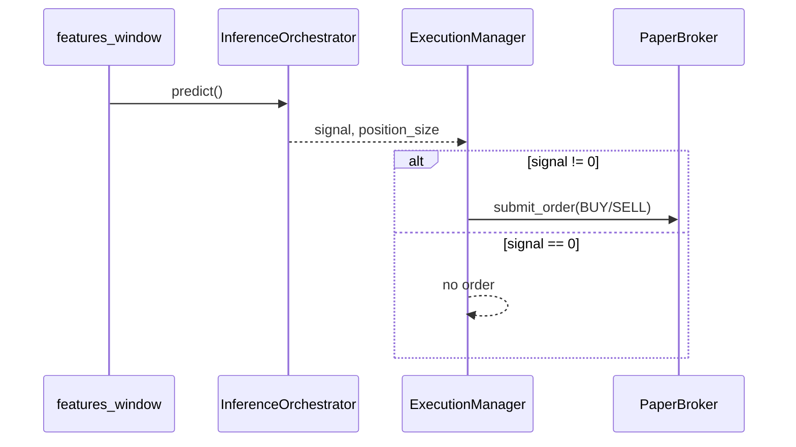

# 3.3 Реализация системы принятия торговых решений

**Проект:** Intelligent Trading System (IST)  
**Состояние:** по коду репозитория (май 2026)  
**Связанные модули:** `decision/`, `meta_learning/`, `orchestration/` (`TrainingOrchestrator`, `InferenceOrchestrator`), `execution/`, `risk_management/`, `backtesting/`

Подсистема превращает выход ансамбля (§3.2) в **дискретное торговое решение** {-1, 0, 1}, с фильтрацией по уверенности, и передаёт его в риск-менеджмент, бэктест или paper/live-исполнение.

---

## Содержание

1. [Назначение и границы §3.3](#1-назначение-и-границы-33)
2. [Архитектура контура решений](#2-архитектура-контура-решений)
3. [Confidence filtering](#3-confidence-filtering)
4. [Торговые сигналы](#4-торговые-сигналы)
5. [Логика исполнения решений](#5-логика-исполнения-решений)
6. [Конфигурация](#6-конфигурация)
7. [Команды воспроизведения](#7-команды-воспроизведения)
8. [Ограничения](#8-ограничения)
9. [Рисунки для ВКР](#9-рисунки-для-вкр)

---

## 1. Назначение и границы §3.3

| Входит в §3.3 | Не входит (другие разделы) |
|---------------|----------------------------|
| Пороги направления и мета-уверенности | Обучение моделей и веса ансамбля (§3.2) |
| `DecisionPipeline` / `final_signal` | Загрузка OHLCV и признаков (§3.1) |
| Доп. фильтры orchestrator (margin, ATR, trade_mode) | Полная WFO-методология (§3.4+) |
| Метрика `confidence` для GUI / introspect | Live OKX без sandbox (операционно) |
| `ExecutionManager.execute_signal` | Детальный RL-слой |

**Production-контракт** (одинаковый для WFO, bundle inference и GUI):

```text
meta_mgmt_prob[t]  (режимно-взвешенный ансамбль)
  → direction_soft[t]  (= meta_mgmt_prob как непрерывная «мягкая» вероятность)
  → DecisionPipeline (integrated): порог направления + meta-threshold
  → post-filters: min_signal_margin, trade_mode, volatility (ATR)
  → final_signal[t] ∈ {-1, 0, 1}
  → position_sizes[t]  (risk bridge)
  → Backtester | ExecutionManager
```

---

## 2. Архитектура контура решений

```mermaid
flowchart TB
    E[meta_mgmt_prob\n§3.2] --> DP[DecisionPipeline\nsignal_source: integrated]
    DP --> FS[final_signal\n-1 / 0 / 1]
    FS --> M[min_signal_margin\ntrade_mode\nvolatility_filter]
    M --> R[Risk: OrchestratorRiskBridge\nATR position size]
    R --> BT[Backtester.run]
    R --> EX[ExecutionManager\npaper | live]
    INF[InferenceOrchestrator.predict] --> EX
    PL[paper_loop.run_inference_execution_step] --> EX
```

| Слой | Файл | Роль |
|------|------|------|
| Правила сигнала | `decision/signal_rules.py` | `compute_integrated_signal`, `compute_final_signal` |
| Фасад | `decision/decision_pipeline.py` | Выбор варианта A/B, safe thresholds |
| Сборка (legacy) | `meta_learning/signal_assembler.py` | Тот же контракт meta ∧ direction |
| Оркестрация | `orchestration/training_orchestrator.py` | `run_pipeline`, WFO, post-filters |
| Один бар (prod) | `orchestration/inference_orchestrator.py` | `InferenceResult` |
| Исполнение | `execution/execution_manager.py`, `execution/paper_loop.py` | Ордер через брокера |

**Рекомендуемый вариант:** `signal_source: integrated` — фильтрация по `meta_mgmt_prob`, а не отдельной legacy-модели `LogisticMetaFilter`.

---

## 3. Confidence filtering

Под «уверенностью» в IST понимается **не отдельная ML-модель confidence**, а совокупность порогов и фильтров над `meta_mgmt_prob` (и производной метрикой для UI).

### 3.1. Мета-порог (основной confidence gate)

**Идея:** торговать только когда ансамблевая вероятность **выше адаптивного порога** на текущей истории (отсекаем «слабые» бары).

В `compute_integrated_signal` (`decision/signal_rules.py`):

```python
meta_pass = meta_mgmt_prob > meta_threshold   # поэлементно
integrated_signal = np.where(
    meta_pass & (direction_signal != 0),
    direction_signal,
    0,
)
```

| Режим `meta_threshold_mode` | Поведение |
|----------------------------|-----------|
| `median` (default) | Порог = медиана; в **safe_mode** — каузальное rolling/expanding окно (`utils.data_leakage_prevention.compute_safe_threshold`) |
| `mean` | Среднее (только safe rolling) |
| `fixed` | Константа из конфига |
| WFO OOS | Порог калибруется **только на train** фолда (`_calibrate_test_meta_threshold` → `train_threshold_override`) |

Параметры в `canonical_4model.yaml`: `meta_threshold_mode: median`, `safe_threshold_mode: true`, `threshold_rolling_window: 100`.

**Смысл для диплома:** это **confidence filtering** в смысле «торгуем, когда модель уверена относительно своей недавней истории», без подглядывания в будущее на test.

### 3.2. Порог направления (direction threshold)

Непрерывная вероятность сначала дискретизируется:

```python
direction_signal = np.where(
    direction_soft_signal > 0.52, 1,
    np.where(direction_soft_signal < 0.48, -1, 0),
)
```

Симметричные границы **0.52 / 0.48** задают «мёртвую зону» около 0.5 — слабое направление не проходит даже при высоком meta.

### 3.3. Минимальный отступ от 0.5 (`min_signal_margin`)

После `DecisionPipeline` orchestrator может обнулить сигнал, если **|meta_mgmt − 0.5| < margin**:

```387:398:orchestration/training_orchestrator.py
    def _apply_signal_margin(
        self, signals: np.ndarray, meta_probabilities: np.ndarray
    ) -> np.ndarray:
        margin = float(getattr(self.config, "min_signal_margin", 0.0) or 0.0)
        if margin <= 0:
            return np.asarray(signals, dtype=float).reshape(-1)
        s = np.asarray(signals, dtype=float).reshape(-1)
        p = np.asarray(meta_probabilities, dtype=float).reshape(-1)
        weak = np.abs(p - 0.5) < margin
        s = s.copy()
        s[weak] = 0.0
        return s
```

В каноническом профиле `min_signal_margin: 0.0` (выкл.); в thesis reference — **0.06**.

### 3.4. Фильтр волатильности (ATR)

При `volatility_filter_percentile > 0` на train фолда считается перцентиль ATR; на test обнуляются сигналы, где ATR выше порога (избегание экстремальной волатильности).

### 3.5. Режим торговли (`trade_mode`)

| Значение | Эффект |
|----------|--------|
| `both` | Long и short |
| `long_only` | Short → 0 |
| `short_only` | Long → 0 |

### 3.6. Скаляр `confidence` для мониторинга

Для одного бара inference:

```257:262:orchestration/inference_orchestrator.py
        confidence = abs(meta_probability - 0.5) * 2  # Normalize to 0-1
        return InferenceResult(
            signal=int(final_signal),
            confidence=float(confidence),
```

Используется в GUI (`explain_card`, `gui/api/types.py`), **не** как отдельный gate в `DecisionPipeline`.

### 3.7. Legacy и вспомогательные механизмы

| Компонент | Статус |
|-----------|--------|
| `SignalAssembler.assemble_signal` | Дублирует meta ∧ direction + optional `regime_filter` |
| `SignalUtils.filter_low_confidence` | Утилита: `signals[confidence < thr] = 0` |
| `LogisticMetaFilter` | Legacy meta-модель (вариант A, `meta_prob`) |
| `InferenceEngine` | Deprecated; пороги 0.6/0.4 |

---

## 4. Торговые сигналы

### 4.1. Цепочка формирования

1. **Ансамбль** → `meta_mgmt_prob[t]` (`DynamicMetaWeighting`, §3.2).
2. **Мягкое направление** → в orchestrator `soft = meta_probabilities` (та же величина).
3. **DecisionPipeline** → дискретный сигнал с meta-gate (см. §3).
4. **Post-filters** → итоговый `final_signals` в `TrainingResult`.

Фрагмент `run_pipeline`:

```197:225:orchestration/training_orchestrator.py
        direction_signals = np.where(
            meta_probabilities > self.config.direction_threshold,
            1,
            np.where(meta_probabilities < (1 - self.config.direction_threshold), -1, 0)
        )
        soft = meta_probabilities.astype(float)
        if self.decision_pipeline is not None:
            final_signals = self.decision_pipeline.generate_signal(
                direction_soft_signal=soft,
                meta_mgmt_prob=soft,
                train_threshold_override=self._runtime_train_meta_threshold,
            )
        ...
        final_signals = self._apply_signal_margin(final_signals, meta_probabilities)
        final_signals = self._apply_trade_mode(final_signals)
        final_signals = self._apply_volatility_filter(final_signals, features)
```

`direction_signals` сохраняются в результате для метрик; **торговый ряд** для бэктеста — `final_signals`.

### 4.2. Семантика значений

| Значение | Смысл |
|----------|--------|
| `1` | Открыть / удерживать long (в paper evidence — наращивание доли) |
| `-1` | Short (или сокращение long в long-only сценариях) |
| `0` | Нет нового направления; в replay при `signal=0` позиция может сохраняться |

### 4.3. Варианты A и B (`DecisionPipeline`)

| Вариант | `signal_source` | Вероятность для gate |
|---------|-----------------|----------------------|
| A | `final` | `meta_prob` (LogisticMetaFilter) |
| B | **`integrated`** (prod) | `meta_mgmt_prob` |

Конфигурация по умолчанию при `apply_decision_pipeline: true` — **integrated** (`_build_decision_pipeline`).

### 4.4. Альтернативная стратегия сигнала

`signal_strategy: momentum_confirm` — long только если `close > SMA` и meta > threshold; short при `trade_mode: both` и обратном тренде. В каноническом профиле — `ensemble`.

---

## 5. Логика исполнения решений

Исполнение **отделено** от обучения: decision выдаёт намерение, execution и risk — размер и ордер.

### 5.1. Research / WFO (offline)

```text
walk_forward_backtest:
  fit models on train → run_pipeline(train) → calibrate meta threshold
  → run_pipeline(test) → final_signals + position_sizes
  → Backtester.run(close, final_signals, position_size=...)
```

`OrchestratorRiskBridge` (`use_risk_bridge: true`): ATR-based `final_pos_size` → доля капитала для `Backtester`.

### 5.2. Online (один бар)

```text
features_window (N баров)
  → InferenceOrchestrator.predict()
  → InferenceResult { signal, confidence, position_size, meta_probability, ... }
  → ExecutionManager.execute_signal(signal, symbol, position_size, price, risk_multiplier)
  → OrderManager → PaperBroker | OKXBroker
```

`execution/paper_loop.py`:

```38:50:execution/paper_loop.py
    inf = orchestrator.predict(features_window)
    signal = int(inf.signal)
    base_size = float(inf.position_size)
    if base_size == 0.0 and signal != 0:
        base_size = 1.0

    order = execution_manager.execute_signal(
        signal=signal,
        symbol=symbol,
        position_size=base_size,
        current_price=current_price,
        risk_multiplier=rl_risk_multiplier,
    )
```

### 5.3. `execute_signal` (ядро)

| Шаг | Действие |
|-----|----------|
| 1 | `signal == 0` → без ордера |
| 2 | `final_size = position_size * risk_multiplier` (RL) |
| 3 | Cap `max_order_size` |
| 4 | `signal > 0` → BUY, `signal < 0` → SELL |
| 5 | `OrderRequest` → `OrderManager.submit_order` |

Режимы: `ExecutionConfig.mode = paper | live`; paper — симуляция с комиссией и проскальзыванием из конфига.

### 5.4. Paper evidence / GUI

`orchestration/paper_evidence.py` — пошаговый replay решений с целевой долей капитала и частичным rebalance через `execute_signal(±1, qty)`.

GUI: вкладки **Решение** (snapshot inference), **Практика** — reconcile paper vs backtest (`gui/api/paper_evidence_api.py`).

### 5.5. Схема потоков



---

## 6. Конфигурация

Фрагмент `config/profiles/canonical_4model.yaml` (orchestration):

| Параметр | Значение (канон) | Назначение |
|----------|------------------|------------|
| `apply_decision_pipeline` | `true` | Включить `DecisionPipeline` |
| `direction_threshold` | `0.52` | Порог long/short по вероятности |
| `meta_threshold_mode` | `median` | Адаптивный meta-порог |
| `min_signal_margin` | `0.0` | Отступ от 0.5 (confidence margin) |
| `trade_mode` | `both` | Long/short |
| `signal_strategy` | `ensemble` | Базовая логика сигнала |
| `use_risk_bridge` | `true` | ATR sizing в orchestrator |
| `safe_threshold_mode` | `true` | Каузальные пороги |
| `threshold_rolling_window` | `100` | Окно rolling median |

Блок `decision:` в отдельном YAML (см. `decision/README.md`) дублирует параметры для standalone-запуска `DecisionPipeline`.

---

## 7. Команды воспроизведения

### 7.1. Pipeline на хвосте признаков (signals)

```python
from pathlib import Path
import pandas as pd
from orchestration.glue import inference_stack_from_bundle
from orchestration import TrainingOrchestrator

root = Path("artifacts/BTC-USDT_1h")
run_id = (root / "LATEST.txt").read_text(encoding="utf-8").strip()
stack = inference_stack_from_bundle(root / run_id)
df = pd.read_parquet("data/features/BTC-USDT_1h.parquet").tail(500)

orch = TrainingOrchestrator(stack["config"])
orch.initialize(stack["models"], stack["regime_detector"], stack["meta_weighting"])
r = orch.run_pipeline(df)
# r.final_signals, r.meta_probabilities, r.position_sizes
```

### 7.2. Один бар (inference + confidence)

```python
from orchestration import InferenceOrchestrator
# ... initialize from bundle ...
res = inference_orchestrator.predict(df.tail(24))
print(res.signal, res.confidence, res.meta_probability)
```

### 7.3. Paper step

```python
from execution.paper_loop import run_inference_execution_step
run_inference_execution_step(orch, df.tail(24), exec_mgr, "BTC/USDT", float(df["close"].iloc[-1]))
```

### 7.4. Рисунки §3.3

```powershell
py -3 docs/scripts/generate_thesis_3_3_figures.py
```

---

## 8. Ограничения

| Тема | Статус |
|------|--------|
| Асимметричные пороги long/short | Заготовка в `DecisionPipeline`, `use_asymmetric_thresholds: false` |
| Отдельная модель «confidence» | Нет; только пороги над `meta_mgmt_prob` |
| `signal=0` в paper replay | Позиция может не закрываться (by design) |
| Live trading | Требует ключи OKX; по умолчанию sandbox |
| MetaFilter (вариант A) | Не в prod bundle path |

---

## 9. Рисунки для ВКР

Нумерация продолжает §3.1–3.2 (**3.9–3.12**). Файлы в `figures/`:

| Рисунок (предлож.) | Файл | Содержание |
|--------------------|------|------------|
| **3.9** | `fig_3_9_decision_pipeline.png` | Контур: meta_mgmt → DecisionPipeline → filters → risk → backtest/execution |
| **3.10** | `fig_3_10_confidence_filtering.png` | meta_mgmt, rolling threshold, зона margin |
| **3.11** | `fig_3_11_execution_logic.png` | **Логика исполнения:** Signal → Position Sizing → ExecutionManager → Broker (схема по коду IST) |
| **3.12** | `fig_3_12_trading_signals_example.png` | *(опционально)* пример ряда `final_signal` + `meta_mgmt_prob` |

### Пересборка

```powershell
py -3 docs/scripts/generate_thesis_3_3_figures.py
```

Требуется: `data/features/BTC-USDT_1h.parquet` и bundle `artifacts/BTC-USDT_1h/LATEST.txt`.

### Mermaid

`figures/fig_3_9_decision_pipeline.mmd`, `figures/fig_3_11_execution_logic.mmd` — для [mermaid.live](https://mermaid.live).

**Рис. 3.11** — не скриншот GUI, а **архитектурная схема** по production-пути: `InferenceOrchestrator` → `OrchestratorRiskBridge` / `RiskPipeline` → `ExecutionManager.execute_signal` → `PaperBroker` или `OKXBroker` (см. `execution/execution_manager.py`, `execution/paper_loop.py`). Отдельный рисунок уместен: в Word вставляется PNG из `generate_thesis_3_3_figures.py`.

### Подписи для Word (пример)

```text
Рисунок 3.9 – Контур принятия торгового решения в IST
Рисунок 3.10 – Фильтрация по уверенности (meta-порог и margin)
Рисунок 3.11 – Логика исполнения торговых решений
Рисунок 3.12 – Пример торговых сигналов на исторических данных (при необходимости)
```

---

## Связанная документация

| Документ | Тема |
|----------|------|
| [docs/vkr/02-ml-ensemble-decision-features.md](../../vkr/02-ml-ensemble-decision-features.md) | ML + decision сводка |
| [decision/README.md](../../../decision/README.md) | Правила final / integrated |
| [execution/README.md](../../../execution/README.md) | Брокеры и ордера |
| [orchestration/README.md](../../../orchestration/README.md) | Training / Inference |
| [3_2/README.md](../3_2/README.md) | Ансамбль (§3.2) |
| [3_1/README.md](../3_1/README.md) | Данные (§3.1) |
