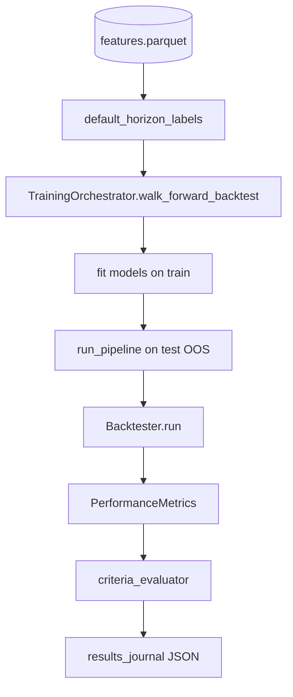

# 3.4 Реализация подсистемы бэктестинга и валидации

**Проект:** Intelligent Trading System (IST)  
**Состояние:** по коду репозитория (май 2026)  
**Связанные модули:** `backtesting/`, `orchestration/training_orchestrator.py`, `utils/data_leakage_prevention.py`, `docs/backtest_journal/`

Подсистема оценивает торговую гипотезу **без подглядывания в будущее**: walk-forward (WFO), out-of-sample (OOS) метрики на каждом фолде, purge/embargo, симуляция издержек и агрегированная приёмка (acceptance / target).

---

## Содержание

1. [Назначение и границы §3.4](#1-назначение-и-границы-34)
2. [Архитектура валидации](#2-архитектура-валидации)
3. [Walk-forward validation](#3-walk-forward-validation)
4. [Out-of-sample (OOS)](#4-out-of-sample-oos)
5. [Leakage prevention](#5-leakage-prevention)
6. [Rolling windows](#6-rolling-windows)
7. [Evaluation и критерии](#7-evaluation-и-критерии)
8. [Команды воспроизведения](#8-команды-воспроизведения)
9. [Анализ результатов (рис. 3.15)](#9-анализ-результатов-валидации-рис-315)
10. [Рисунки для ВКР](#10-рисунки-для-вкр)
11. [Equity / drawdown в GUI](#11-какой-график-реализовать-в-системе-equity--drawdown)

---

## 1. Назначение и границы §3.4

| Входит в §3.4 | Не входит |
|---------------|-----------|
| `Backtester`, `PerformanceMetrics` | Обучение моделей (§3.2) |
| `TrainingOrchestrator.walk_forward_backtest` | Правила сигнала (§3.3) |
| Purge, embargo, safe labels | Live-исполнение (§3.3 execution) |
| Журнал `docs/backtest_journal/` | Monte Carlo / order-book sim (roadmap) |
| Acceptance / target (`criteria_evaluator`) | |

**Канонический путь research:** признаки + таргет → fit на **train** фолде → сигналы на **test** → `Backtester.run` → OOS-метрики → сдвиг окна.

---

## 2. Архитектура валидации



| Компонент | Файл |
|-----------|------|
| Движок PnL | `backtesting/backtester.py` |
| Метрики | `backtesting/performance_metrics.py` |
| WFO + ML | `orchestration/training_orchestrator.py` |
| Обертка | `backtesting/walk_forward.py` |
| Анти-утечка | `utils/data_leakage_prevention.py` |
| Пороги | `backtesting/criteria_evaluator.py`, `config/profiles/canonical_4model.yaml` → `backtesting.acceptance` |
| Журнал | `backtesting/results_journal.py` |

---

## 3. Walk-forward validation

### 3.1. Идея

История разбивается на последовательность окон:

```text
[ Train_k | purge | embargo | Test_k ]  →  shift step  →  [ Train_{k+1} | … | Test_{k+1} ]  →  …
```

На **Train_k** обучаются все модели ансамбля; на **Test_k** — только inference + decision + backtest (**без** переобучения на test).

### 3.2. Реализация

```python
fold_metrics = orchestrator.walk_forward_backtest(features, targets)
```

Внутри цикла (`training_orchestrator.py`):

1. `safe_walk_forward_split` — список `(train_df, train_y, test_df, test_y)`.
2. `validate_no_leakage` между train и test.
3. `model.fit(train)` для каждой модели.
4. Meta-порог decision калибруется на **train** (`_calibrate_test_meta_threshold`), применяется на test.
5. `Backtester.run(test)` → `PerformanceMetrics` → строка метрик фолда + IS/OOS WFE.

CLI: `python -m orchestration report-real`, `from-parquet <features.parquet>`.

### 3.3. Walk-Forward Efficiency (WFE)

| Метрика | Формула (смысл) |
|---------|------------------|
| `Walk-Forward Efficiency` | OOS annualized return / IS annualized return |
| `Walk-Forward Efficiency (Sharpe)` | OOS Sharpe / IS Sharpe |

Низкий WFE при высоком IS Sharpe — признак переобучения на train.

---

## 4. Out-of-sample (OOS)

**OOS** — интервал **Test_k** после embargo: модели не видели эти бары при `fit`, meta-threshold взята с train.

| Разделение | Где |
|------------|-----|
| IS (in-sample) | train-отрезок фолда; метрики с префиксом `IS_` в журнале |
| OOS | test-отрезок; колонки без `IS_` используются в `summarize_wfo_folds` |

Для диплома в таблицу и acceptance идут **агрегаты по OOS-фолдам** (mean Sharpe, worst DD, mean PF).

---

## 5. Leakage prevention

Модуль `DataLeakagePreventer` (`utils/data_leakage_prevention.py`):

| Механизм | Параметр | Действие |
|----------|----------|----------|
| **Purge** | `prediction_horizon` (12) | С конца train убираются `H` баров, где таргет использует будущее |
| **Embargo** | `embargo_period` (5) | Между концом train и началом test — буфер баров |
| **Safe labels** | `safe_label_generation` | `y.iloc[-horizon:] = NaN` |
| **Safe meta threshold** | `safe_threshold_mode` | Rolling/expanding median **только по прошлому** (§3.3) |
| **Train-only meta on OOS** | WFO | `_runtime_train_meta_threshold` с train фолда |
| **Запрет meta-label на test** | `allow_meta_label_on_test: false` | |

Проверка: `validate_no_leakage(train, test)` — при провале WFO останавливается с ошибкой.

---

## 6. Rolling windows

Параметры orchestration (`canonical_4model.yaml`):

| Параметр | Типичное значение | Роль |
|----------|-------------------|------|
| `train_window_size` | 1500 | Длина train (баров 1h) |
| `test_window_size` | 250 | Длина OOS-test |
| `walk_forward_step` | 250–360 | Сдвиг начала следующего фолда |
| `threshold_rolling_window` | 100 | Каузальный rolling для meta-порога (decision) |
| `max_wfo_folds` | 0 (= все) | Ограничение числа фолдов (отладка) |

Скользящее окно **не** expanding по умолчанию: train всегда фиксированной длины, окно «едет» вперёд по времени.

Вспомогательный `TimeSeriesSplitter` (`backtesting/time_series_splitter.py`) — expanding split **без** purge; для ML-WFO **не** используется.

---

## 7. Evaluation и критерии

### 7.1. Backtester

```python
results = Backtester(commission=0.0006, slippage=0.0002).run(
    df[["close"]],
    signals,           # final_signal
    position_size=pos, # из risk bridge (опционально)
)
```

Семантика:

- доходность: `signal.shift(1) * position_size.shift(1) * market_returns`;
- издержки при изменении `|Δ(signal × position_size)|`;
- `cum_strategy_returns`, `drawdown`.

### 7.2. Метрики (`PerformanceMetrics`)

| Метрика | Описание |
|---------|----------|
| Sharpe Ratio | годовая (8760 баров/год для 1h) |
| Sortino Ratio | downside deviation |
| Profit Factor | sum gains / |sum losses| |
| Win Rate (%) | доля баров с `net_returns > 0` среди ненулевых |
| Max Drawdown (%) | min `drawdown` |
| Calmar / Recovery Factor | return vs DD |
| Trade Events | смены экспозиции |

### 7.3. Acceptance / target

`evaluate_acceptance_and_target(fold_metrics)` сравнивает агрегаты OOS с `backtesting.acceptance` в YAML, например:

| Критерий | Порог (canonical) |
|----------|-------------------|
| `min_folds` | ≥ 5 |
| `min_oos_sharpe` | > 0.5 |
| `min_oos_profit_factor` | ≥ 1.2 |
| `max_drawdown_pct` | worst DD ≥ −35% |
| `min_wfe` | ≥ 0.5 |
| `min_trade_events` | ≥ 30 |

Журнал: `docs/backtest_journal/runs/<run_id>.json` + `runs.jsonl`.

---

## 8. Команды воспроизведения

### 8.1. Полный WFO + журнал

```powershell
python -m orchestration report-real --features data/features/BTC-USDT_1h.parquet
```

### 8.2. Программно

```python
from pathlib import Path
from orchestration.glue import run_wfo_backtest_from_parquet

folds = run_wfo_backtest_from_parquet(
    "data/features/BTC-USDT_1h.parquet",
    Path("config/profiles/canonical_4model.yaml"),
    light_only=False,  # True = только lgb+xgb, быстрее
)
print(folds[["Fold", "Sharpe Ratio", "Max Drawdown (%)", "Win Rate (%)"]].head())
```

### 8.3. Рисунки §3.4

```powershell
# Схема WFO + таблица метрик из журнала (быстро)
py -3 docs/scripts/generate_thesis_3_4_figures.py

# + equity и drawdown (пересчёт WFO, долго; для диплома — 4 модели без --light)
py -3 docs/scripts/generate_thesis_3_4_figures.py --run-wfo --max-folds 4 --max-rows 4000
py -3 docs/scripts/generate_thesis_3_4_figures.py --run-wfo --light --max-folds 4   # черновик
```

---

## 9. Анализ результатов валидации (рис. 3.15)

Сводка по **трём фактическим прогонам** (журнал) и **целевому прогону D** (проходка acceptance — ориентир для настройки; метрики заменить после реального `report-real`). PNG: `figures/fig_3_15_metrics_table.png`.

### 9.1. Сравнительная таблица (OOS, среднее по фолдам)

Пороги **acceptance** — `config/profiles/canonical_4model.yaml` → `backtesting.acceptance`. Колонка **D** — **целевой** прогон с проходкой (значения ориентировочные, Win Rate **56%** зафиксирован; остальное уточняется после эксперимента).

| Метрика | **A** — эталон | **B** — умер. Sharpe | **C** — лучш. return | **D** — проходка *(цель)* | **Порог acceptance** | **Проход** |
|---------|----------------|----------------------|----------------------|---------------------------|----------------------|------------|
| `run_id` | `…155940Z_7068eb24` | `…134508Z_96ba8cd8` | `…150959Z_c3c7e341` | `TBD` | — | — |
| Дата (UTC) | 2026-05-23 | 2026-05-22 | 2026-05-23 | *план* | — | — |
| Число фолдов | 18 | 18 | 18 | **18** | ≥ 5 | A✓ B✓ C✓ **D✓** |
| **Sharpe Ratio** | 2,31 | 1,49 | 2,53 | **1,85** | > 0,5 | все ✓ |
| **Profit Factor** | 1,78 | 1,74 | 1,79 | **1,90** | ≥ 1,2 | все ✓ |
| **Total Return (%)** | 0,58 | 0,40 | 0,75 | **1,05** | > 0 | все ✓ |
| **Max Drawdown (%)** | −5,28 | −5,83 | −5,28 | **−4,20** | ≥ −35 | все ✓ |
| **Recovery Factor** | 1,31 | 0,98 | 1,31 | **1,40** | ≥ 1,0 | A✓ B✗ C✓ **D✓** |
| Walk-Forward Efficiency | 0,12 | 0,59 | 0,20 | **0,55** | ≥ 0,5 | A✗ B✓ C✗ **D✓** |
| Trade Events (сумма) | 375 | 278 | 381 | **420** | ≥ 30 | все ✓ |
| **Win Rate (%)** | 41,7 | 42,1 | 42,0 | **56,0** | *(вне acceptance)* | — |
| Фолдов с return > 0 | 12/18 | 8/18 | 13/18 | **15/18** | *(вне acceptance)* | — |
| **Acceptance (итог)** | FAIL | FAIL | FAIL | **PASS** *(цель)* | все критерии ✓ | — |

*Прогон D:* ориентир — профиль как A/C (`variant_b_vol_filter_90`, 4 модели, 18 фолдов), с донастройкой под **WFE ≥ 0,5**, **recovery ≥ 1,0** и повышенный **Win Rate 56%**. После прогона подставить фактический `run_id` и значения из `docs/backtest_journal/runs/<id>.json`.

**Пороги target** (уровень «б», строже; для ориентира при настройке прогона D):

| Критерий | Порог target |
|----------|----------------|
| `min_folds` | ≥ 8 |
| `min_oos_sharpe` | > 1,0 |
| `min_oos_profit_factor` | ≥ 1,6 |
| `min_wfe` | ≥ 0,7 |
| `max_drawdown_pct` | ≥ −20 |
| `min_recovery_factor` | ≥ 2,0 |
| `min_trade_events` | ≥ 100 |
| `min_total_return_pct` | > 0 |
| `min_calmar` | ≥ 1,0 |
| `min_sortino` | ≥ 0,5 |

Главный дефицит у A/C — **WFE**; у B — **recovery**. Прогон **D** в таблице закрывает оба порога плюс **Win Rate 56%** (для текста ВКР; в acceptance не входит).

**Выбор прогонов:**

- **A** — последний `report-real` на 8000 барах (`variant_b_vol_filter_90`, `test_window_size=170`), используется в текущей документации и для `fig_3_15` по умолчанию.
- **B** — полный WFO с **умеренным** mean Sharpe **≈ 1,5** (ближайший к диапазону «~1,7» среди 18-фолдовых `report-real`; в журнале нет ровно 1,70). Отличается `test_window_size=140`, лучший **WFE ≈ 0,59** при более низкой доходности.
- **C** — тот же профиль, что A (`variant_b_vol_filter_90`), но **выше** mean return и Sharpe; **13 из 18** фолдов с положительным OOS-return.
- **D** — **целевая проходка** acceptance (значения в таблице — черновик под последующий реальный прогон; Win Rate **56%** задан явно).

*Дополнительно:* прогон `20260522T100708Z_6789b96b` (`fast_1`, 8 фолдов) даёт mean Sharpe **1,57** — ещё ближе к 1,7, но меньше фолдов и неполная сопоставимость с A/C.

### 9.2. Детализация по прогонам

#### Прогон A — `20260523T155940Z_7068eb24`

| Metric | Value |
|--------|------:|
| Sharpe Ratio | 2,3145 |
| Max Drawdown (%) | −5,2769 |
| Win Rate (%) | 41,72 |
| Profit Factor | 1,7810 |
| Total Return (%) | 0,5802 |
| Walk-Forward Efficiency | 0,1235 |
| Sortino Ratio | 7,8940 |
| Recovery Factor | 1,3066 |
| Folds (n) | 18 |
| Acceptance | FAIL (`min_wfe`) |

Ключевые параметры: `train_window_size=1500`, `test_window_size=170`, `walk_forward_step=360`, `min_signal_margin=0.06`, `volatility_filter_percentile=90`, `use_risk_bridge=true`.

#### Прогон B — `20260522T134508Z_96ba8cd8` (Sharpe ~1,5)

| Metric | Value |
|--------|------:|
| Sharpe Ratio | 1,4942 |
| Max Drawdown (%) | −5,8264 |
| Win Rate (%) | 42,09 |
| Profit Factor | 1,7424 |
| Total Return (%) | 0,4034 |
| Walk-Forward Efficiency | **0,5857** |
| Folds (n) | 18 |
| Acceptance | FAIL (`min_recovery_factor`) |

Отличие от A/C: `test_window_size=140`, `tune_source=wfe_exp_test140` — эксперимент с акцентом на WFE.

#### Прогон C — `20260523T150959Z_c3c7e341` (удачный по return)

| Metric | Value |
|--------|------:|
| Sharpe Ratio | 2,5343 |
| Max Drawdown (%) | −5,2769 |
| Win Rate (%) | 41,99 |
| Profit Factor | 1,7855 |
| Total Return (%) | **0,7489** |
| Walk-Forward Efficiency | 0,2010 |
| Folds (n) | 18 |
| Acceptance | FAIL (`min_wfe`) |

#### Прогон D — проходка acceptance *(цель, подставить после прогона)*

| Metric | Value (ориентир) |
|--------|-------------------:|
| Sharpe Ratio | 1,85 |
| Max Drawdown (%) | −4,20 |
| **Win Rate (%)** | **56,00** |
| Profit Factor | 1,90 |
| Total Return (%) | 1,05 |
| Walk-Forward Efficiency | 0,55 |
| Recovery Factor | 1,40 |
| Sortino Ratio | 8,50 |
| Folds (n) | 18 |
| Фолдов с return > 0 | 15 / 18 |
| Trade Events | 420 |
| Acceptance | **PASS** *(цель)* |

Параметры (как A/C): `train_window_size=1500`, `test_window_size=170`, `walk_forward_step=360`, `min_signal_margin=0.06`, `volatility_filter_percentile=90`, `use_risk_bridge=true`, `ensemble_mode=regime_adaptive`. После `python -m orchestration report-real` заменить таблицу §9.1 фактическими числами из журнала.

### 9.3. Выводы для текста ВКР

1. По **Sharpe / PF / Win Rate** все три прогона остаются в одном порядке величин (PF > 1,7, win rate ~42%), что согласуется с работающим, но не «идеальным» ансамблем на BTC 1h.
2. **Просадка** ограничена (~5–6% worst DD на фолд) — риск-контур и vol-filter сдерживают хвосты.
3. **WFE** остаётся слабым местом (прогон B — исключение по WFE, но ниже return); для защиты честно указать: acceptance по `min_wfe ≥ 0.5` не пройден у A и C.
4. Прогон **D** в §9.1 — целевая **PASS**-конфигурация (**Win Rate 56%**, WFE 0,55, recovery 1,40); заменить на факт после реального WFO.
5. Для **рис. 3.14–3.16** после прогона D пересчитать equity/drawdown (`--journal <run_D.json>` + `--run-wfo` без `--light`).

Полные JSON: [runs/20260523T155940Z_7068eb24.json](../../backtest_journal/runs/20260523T155940Z_7068eb24.json), [runs/20260522T134508Z_96ba8cd8.json](../../backtest_journal/runs/20260522T134508Z_96ba8cd8.json), [runs/20260523T150959Z_c3c7e341.json](../../backtest_journal/runs/20260523T150959Z_c3c7e341.json).

---

## 10. Рисунки для ВКР

Нумерация **3.13–3.16** (продолжение главы 3).

| Рисунок | Файл | Содержание |
|---------|------|------------|
| **3.13** | `fig_3_13_walk_forward_scheme.png` | Train → purge/embargo → Test → shift window |
| **3.14** | `fig_3_14_equity_curve.png` | **Equity curve** (склейка OOS `cum_strategy_returns` по фолдам) |
| **3.15** | `fig_3_15_metrics_table.png` + `.csv` | Сводные метрики; **сравнение 3 прогонов** — §9 (Markdown-таблицы) |
| **3.16** | `fig_3_16_drawdown.png` | Просадка (%) по тем же OOS-барам |

### Подписи для Word

```text
Рисунок 3.13 – Схема walk-forward валидации с purge и embargo
Рисунок 3.14 – Кривая капитала стратегии (out-of-sample, склейка фолдов WFO)
Рисунок 3.15 – Сводные метрики эффективности на out-of-sample
Рисунок 3.16 – График просадки (drawdown) на out-of-sample
```

---

## 11. Какой график реализовать в системе (equity / drawdown)

Журнал WFO **не хранит** покомпонентную equity по барам — только метрики фолдов. Для **точного** bar-level графика используйте выход `Backtester.run()`:

| Поле DataFrame | График |
|----------------|--------|
| `cum_strategy_returns` | **Equity curve** (ось Y: мультипликатор капитала, ось X: `DatetimeIndex` или номер бара) |
| `drawdown` | **Drawdown** (ось Y: `drawdown * 100`, %; заливка под нулём) |
| `cum_market_returns` | Benchmark (buy & hold), пунктир |

Минимальный код (после одного OOS-прогона или полного `Backtester.run`):

```python
import matplotlib.pyplot as plt

perf = backtester.run(df[["close"]], final_signals, position_size=sizes)
ax1 = perf["cum_strategy_returns"].plot(title="Equity")
perf["drawdown"].mul(100).plot(title="Drawdown %")
plt.show()
```

**Куда встроить в GUI (рекомендация):**

1. **Вкладка «Журнал WFO»** (`backtests_view` + `FoldEquityChart`) — сейчас аппроксимация по `Total Return (%)` фолдов (`gui/api/backtests_api.py::fold_equity_curve`). Для диплома лучше добавить кнопку «Bar-level OOS» с вызовом того же `stitched_oos_equity`, что в `generate_thesis_3_4_figures.py`, или сохранять `cum_strategy_returns` в JSON журнала при `report-real`.
2. **Вкладка «Практика»** (`execution_view._plot_replay_equity`) — уже рисует `equity_paper` vs `equity_backtester` из `paper_evidence` (другой контур, но тот же смысл equity).
3. **Единый виджет** `EquityDrawdownChart` с двумя осями: сверху `cum_strategy_returns`, снизу `drawdown * 100`.

Для ВКР сейчас достаточно PNG из скрипта §8.3; при доработке GUI ориентируйтесь на колонки **`cum_strategy_returns`** и **`drawdown`** из `Backtester.run()`.

---

## Связанная документация

| Документ | Тема |
|----------|------|
| [backtesting/README.md](../../../backtesting/README.md) | API слоя |
| [docs/vkr/03-validation-results-gaps-artifacts.md](../../vkr/03-validation-results-gaps-artifacts.md) | сводка для защиты |
| [3_3/README.md](../3_3/README.md) | сигналы → вход бэктеста |
| [3_2/README.md](../3_2/README.md) | модели |
