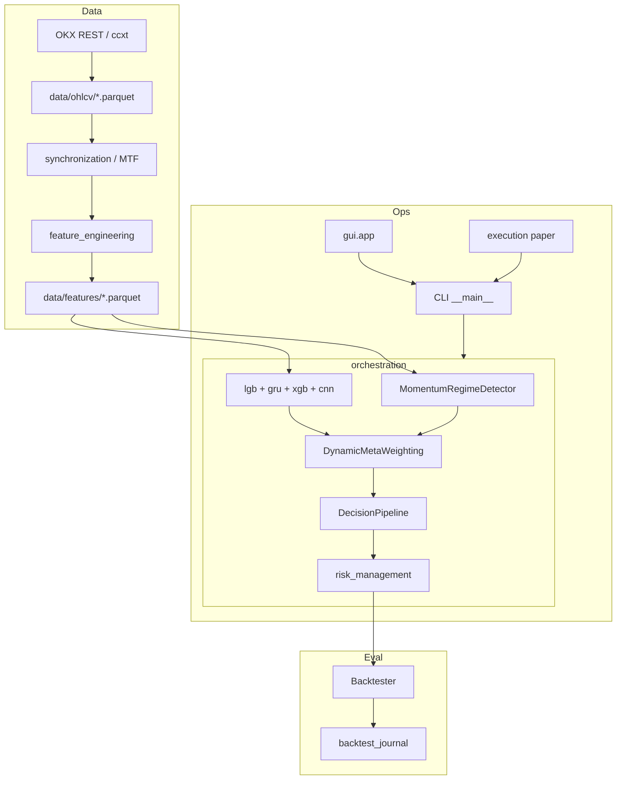

# 1. Архитектура · 9. Data pipeline · 16. Библиотеки

---

## 1. Общая архитектура системы

### 1.1. Назначение

**IST (Intelligent Trading System)** — модульная Python-система для исследования и торговли криптофьючерсами: загрузка OHLCV → MTF-признаки → четыре ML-модели → режимно-взвешенный ансамбль → правила сигналов → риск → бэктест / paper.

Центральный spine: пакет **`orchestration/`** (обучение, WFO, inference, CLI, артефакты).

### 1.2. Дерево проекта (рабочие каталоги)

```text
D:/IST/
├── config.yaml
├── config/
│   ├── profiles/canonical_4model.yaml    # эталон: 4 модели + WFO + веса
│   └── symbols/BTC-USDT_1h.yaml          # override по паре
├── data/
│   ├── ohlcv/                            # Parquet OHLCV
│   ├── features/                         # инженерные признаки
│   └── synced/                           # MTF merge (опционально)
├── artifacts/                            # pickle-бандлы + manifest.json
├── docs/
│   ├── vkr/                              # этот комплект
│   ├── backtest_journal/                 # runs.jsonl + runs/*.json
│   └── figures/                          # PNG для глав диплома
├── data_layer/                           # OKX/ccxt → Parquet
├── synchronization/                      # MTF 15m/4h → 1h
├── feature_engineering/                  # индикаторы, FeatureManager
├── models/                               # lgb, xgb, gru, cnn, regime ML
├── meta_learning/                        # DynamicMetaWeighting, thresholds
├── decision/                             # DecisionPipeline, signal_rules
├── risk_management/                      # ATR sizing, trailing, bridge
├── rl_layer/                             # DQN risk multiplier (не направление)
├── backtesting/                          # Backtester, WFO, metrics, journal
├── orchestration/                        # ★ центр: train / infer / CLI
├── execution/                            # PaperBroker, paper_loop
├── gui/                                  # PyQt6 + gui/api
├── utils/                                # leakage prevention, logging
├── tests/                                # pytest
└── ist.py                                # legacy Colab (~2500 строк)
```

### 1.3. Основные модули и взаимодействие



| Пакет | Роль | Ключевые точки входа |
|-------|------|----------------------|
| `data_layer` | Загрузка свечей | `OKXDataLoader`, `python -m data_layer` |
| `synchronization` | MTF merge | `MultiTimeframeEngine`, `mtf_features` |
| `feature_engineering` | Индикаторы | `FeatureManager.transform()` |
| `models` | Предикторы | `LightGBMTabularModel`, `GRUTrendModel`, … |
| `meta_learning` | Ансамбль | `DynamicMetaWeighting.apply_dynamic_weighting()` |
| `decision` | Сигналы −1/0/1 | `DecisionPipeline.generate_signal()` |
| `risk_management` | Размер позиции | `OrchestratorRiskBridge`, `RiskPipeline` |
| `backtesting` | PnL, метрики | `Backtester.run()`, `walk_forward_backtest` |
| `orchestration` | Склейка всего | `TrainingOrchestrator`, `symbol_pipeline`, `glue` |
| `execution` | Paper шаг | `paper_loop.run_inference_execution_step` |
| `gui` | Мониторинг | `IstGuiClient`, PyQt6 views |

### 1.4. Канонический контракт pipeline

Зафиксирован в `TrainingOrchestrator` / `InferenceOrchestrator`:

```text
features[t]
  → regime_pred[t]              # 0 = range, 1 = trend (SMA rule)
  → {p_lgb, p_gru, p_xgb, p_cnn}[t]   # P(цена вверх через horizon)
  → meta_mgmt_prob[t]           # взвешенный ансамбль
  → direction_soft[t]           # порог по meta_mgmt (0.52)
  → final_signal[t] ∈ {-1,0,1} # DecisionPipeline (integrated)
  → position_size[t]            # risk bridge
  → Backtester / execution
```

**Отличие от legacy:** `models/router/ModelRouter` + `InferenceEngine` выбирали **одну** модель на режим. Canonical path вызывает **все четыре** модели на каждом баре.

### 1.5. Точки входа (CLI)

| Команда | Назначение |
|---------|------------|
| `python -m data_layer` | Скачать OHLCV OKX → Parquet |
| `python -m orchestration prepare-symbol` | MTF + features + опционально train |
| `python -m orchestration symbol-pipeline` | End-to-end по символу |
| `python -m orchestration from-parquet <path>` | WFO на готовых features |
| `python -m orchestration report-real` | Отчёт WFO + журнал |
| `python -m orchestration train-final-symbol` | Финальный bundle в `artifacts/` |
| `python -m gui.app` | Desktop GUI |

Сквозной glue без OKX: `orchestration/glue.py` — `load_feature_table_from_parquet` → `run_wfo_backtest_from_parquet`.

---

## 9. Data pipeline

### 9.1. Источник данных

| Источник | Используется? | Детали |
|----------|---------------|--------|
| **OKX** (REST) | **Да, primary** | `data_layer/loaders/okx_ohlcv_loader.py`, библиотека **ccxt** |
| Binance | Нет в modular path | только упоминания в legacy `ist.py` |
| CSV ручной | Опционально | любой Parquet с OHLCV → `FeatureManager` |
| WebSocket live | Зависимости есть (`websockets`) | **не** основной путь загрузки истории |

Конфиг (`canonical_4model.yaml`):

```yaml
data_collection:
  start_date: "2022-01-01 00:00:00"
data_layer:
  connectors:
    okx:
      sandbox: true
      rate_limit: 20
```

### 9.2. Цепочка обработки

```text
OKX/ccxt (paginated OHLCV)
    → validate (ohlcv_validator)
    → data/ohlcv/{SYMBOL}_{TF}.parquet
    → MultiTimeframeEngine (base 1h + aux 15m, 4h)
    → FeatureEngine.add_indicators()
    → dropna (опционально)
    → data/features/{SYMBOL}_{TF}.parquet
```

- **Базовый TF:** 1h (`synchronization.base_timeframe`)
- **Вспомогательные:** 15m, 4h → ресемпл на 1h, `ffill` (`fill_method: ffill`)
- **Микроструктура:** `feature_engineering.microstructure.mode: off` в canonical profile (без LOB-колонок в train)

### 9.3. Хранение

- **Формат:** Parquet (`pyarrow`), сжатие snappy
- **Пути:** `data/ohlcv/`, `data/features/`, опционально `data/synced/`
- **Артефакты моделей:** `artifacts/<symbol_tf>/<run_id>/` + `manifest.json`

### 9.4. Target для обучения

```python
# orchestration/glue.default_horizon_labels
fwd = close.shift(-horizon)   # horizon = 12 баров (1h → ~12 ч)
y = (fwd > close).astype(float)   # бинарный «вверх / не вверх»
y.iloc[-horizon:] = np.nan
```

При split последние `horizon` баров train **удаляются** (purge), плюс **embargo** между train и test (`embargo_period: 5`).

---

## 16. Библиотеки (реально в `requirements.txt`)

### 16.1. Используются в прод-path

| Библиотека | Назначение в IST |
|------------|------------------|
| **pandas** ≥2.0 | DataFrame, WFO, backtest |
| **numpy** ≥1.24 | массивы, метрики |
| **pyarrow** | Parquet |
| **ccxt** ≥4.0 | OKX OHLCV |
| **scikit-learn** ≥1.3 | метрики, вспомогательные утилиты |
| **lightgbm** ≥4.0 | модель `lgb` |
| **xgboost** ≥2.0 | модель `xgb` |
| **tensorflow** 2.15–2.19 | GRU, CNN (Keras) |
| **pydantic** + **PyYAML** | конфиги |
| **pytest** | тесты |

### 16.2. В зависимостях, но не ядро ML

| Библиотека | Статус |
|------------|--------|
| aiohttp, websockets | сеть / async (не основной data path) |
| asyncpg, psycopg2 | БД — не обязательны для локального Parquet pipeline |
| structlog, prometheus-client | логирование / мониторинг |
| cryptography, PyJWT | OKX API keys |

### 16.3. Не используются в modular canonical path

| Технология | Где упоминается |
|------------|-----------------|
| **PyTorch** | нет в `requirements.txt` |
| **TensorFlow** | да — единственный DL-фреймворк для GRU/CNN |
| **matplotlib** | не в core requirements; графики — `docs/figures/`, скрипты |
| **Binance API** | legacy `ist.py` |
| **Transformer (Keras)** | только `ist.py` / Colab |

GUI (отдельно): `requirements-gui.txt` — **PyQt6**, **pyqtgraph**.

### 16.4. Версии Python

Проект ориентирован на **Python 3.11** (кэши `cpython-311` в репозитории).
